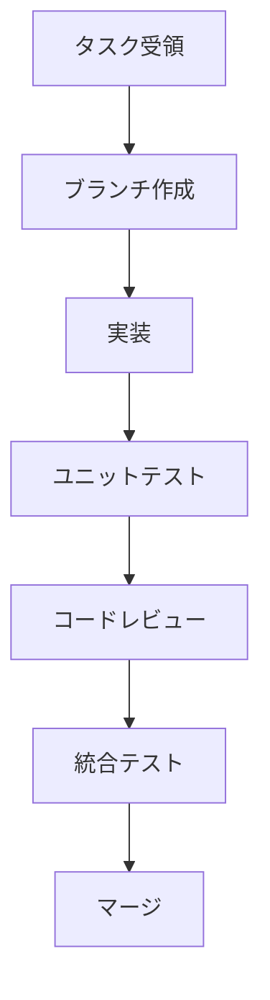

# Agent タスクアサインメント - 並列開発指示書

**発行日**: 2025-11-11
**発行者**: MangaAnime-CTO Agent
**対象**: 全開発Agent
**プロジェクト**: MangaAnime情報配信システム Phase 2-3開発

---

## 概要

本文書は、6体のSubAgentによる並列開発のタスクアサインメントを定義します。各Agentは独立して作業可能ですが、インターフェース契約を遵守し、相互依存を管理してください。

---

## Agent 1: MangaAnime-DevUI

### 基本情報

- **役割**: フロントエンド開発者
- **目標**: Web管理画面の本格実装
- **優先度**: HIGH
- **推定工数**: 2週間
- **依存**: MangaAnime-DevAPI（REST API）

### 詳細タスク

#### タスク 1.1: フレームワーク選定とセットアップ
**期限**: 2日
**成果物**:
- 技術選定ドキュメント
- プロジェクト初期化

**推奨技術スタック:**
```json
{
  "framework": "React 18+",
  "language": "TypeScript",
  "state_management": "Zustand or Redux Toolkit",
  "styling": "Tailwind CSS",
  "ui_library": "Material-UI or shadcn/ui",
  "build_tool": "Vite",
  "testing": "Vitest + React Testing Library"
}
```

**ディレクトリ構造:**
```
frontend/
├── src/
│   ├── components/
│   │   ├── Dashboard/
│   │   ├── ReleaseList/
│   │   ├── WorksManagement/
│   │   └── Settings/
│   ├── hooks/
│   ├── services/
│   │   └── api.ts
│   ├── types/
│   ├── utils/
│   └── App.tsx
├── public/
├── tests/
├── package.json
├── tsconfig.json
└── vite.config.ts
```

#### タスク 1.2: ダッシュボード実装
**期限**: 5日
**成果物**:
- 統計ダッシュボード
- リアルタイム更新機能
- レスポンシブデザイン

**必須コンポーネント:**
```typescript
// components/Dashboard/Dashboard.tsx
export interface DashboardProps {
  stats: SystemStats;
  recentReleases: Release[];
  collectionHealth: HealthStatus;
}

export const Dashboard: React.FC<DashboardProps> = ({ stats, recentReleases, collectionHealth }) => {
  return (
    <div className="dashboard">
      <StatsCards stats={stats} />
      <HealthIndicator status={collectionHealth} />
      <RecentReleasesChart data={recentReleases} />
    </div>
  );
};
```

#### タスク 1.3: 作品・リリース管理UI
**期限**: 4日
**成果物**:
- 作品一覧・検索・フィルタ
- CRUD操作UI
- 詳細表示モーダル

**APIインターフェース:**
```typescript
// services/api.ts
export class MangaAnimeAPI {
  async getWorks(params: GetWorksParams): Promise<Work[]> {
    return axios.get('/api/works', { params });
  }

  async createWork(data: CreateWorkData): Promise<Work> {
    return axios.post('/api/works', data);
  }

  async updateWork(id: number, data: UpdateWorkData): Promise<Work> {
    return axios.put(`/api/works/${id}`, data);
  }

  async deleteWork(id: number): Promise<void> {
    return axios.delete(`/api/works/${id}`);
  }
}
```

#### タスク 1.4: 設定画面実装
**期限**: 2日
**成果物**:
- システム設定UI
- NGワード管理
- スケジュール設定

#### タスク 1.5: テスト・ドキュメント
**期限**: 2日
**成果物**:
- ユニットテスト（80%カバレッジ）
- Storybook
- README

### 品質基準

- **TypeScript Strict Mode**: 有効
- **ESLint**: エラー0
- **アクセシビリティ**: WCAG 2.1 AA
- **パフォーマンス**: Lighthouse 90+
- **レスポンシブ**: Mobile/Tablet/Desktop対応

### 連携インターフェース

**Backend API依存:**
- `GET /api/releases/recent` - 最新リリース取得
- `GET /api/works` - 作品一覧取得
- `POST /api/works` - 作品作成
- `PUT /api/works/{id}` - 作品更新
- `DELETE /api/works/{id}` - 作品削除
- `GET /api/stats` - 統計情報取得

**データ型定義（TypeScript）:**
```typescript
export interface Work {
  id: number;
  title: string;
  title_kana?: string;
  title_en?: string;
  type: 'anime' | 'manga';
  official_url?: string;
  description?: string;
  genres?: string[];
  tags?: string[];
  image_url?: string;
  created_at: string;
  updated_at: string;
}

export interface Release {
  id: number;
  work_id: number;
  work_title: string;
  release_type: 'episode' | 'volume' | 'special';
  number?: string;
  title?: string;
  platform?: string;
  release_date: string;
  release_time?: string;
  notified: boolean;
  created_at: string;
}
```

---

## Agent 2: MangaAnime-DevAPI

### 基本情報

- **役割**: バックエンドAPI開発者
- **目標**: REST API拡張とOpenAPI仕様作成
- **優先度**: HIGH
- **推定工数**: 1週間
- **依存**: modules/db.py（既存）

### 詳細タスク

#### タスク 2.1: Flask REST API設計
**期限**: 2日
**成果物**:
- API設計ドキュメント
- OpenAPI 3.0仕様書

**API設計:**
```yaml
# api/openapi.yaml
openapi: 3.0.0
info:
  title: MangaAnime API
  version: 1.0.0
  description: アニメ・マンガ情報配信システム REST API

paths:
  /api/releases/recent:
    get:
      summary: 最新リリース情報取得
      parameters:
        - name: limit
          in: query
          schema:
            type: integer
            default: 50
        - name: offset
          in: query
          schema:
            type: integer
            default: 0
      responses:
        '200':
          description: 成功
          content:
            application/json:
              schema:
                type: array
                items:
                  $ref: '#/components/schemas/Release'

components:
  schemas:
    Work:
      type: object
      properties:
        id: { type: integer }
        title: { type: string }
        type: { type: string, enum: [anime, manga] }
        # ...
```

#### タスク 2.2: エンドポイント実装
**期限**: 3日
**成果物**:
- Flask アプリケーション
- CRUD エンドポイント

**実装例:**
```python
# api/routes.py
from flask import Flask, jsonify, request
from modules.db import DatabaseManager

app = Flask(__name__)
db = DatabaseManager()

@app.route('/api/releases/recent', methods=['GET'])
def get_recent_releases():
    """最新リリース情報取得"""
    limit = request.args.get('limit', 50, type=int)
    offset = request.args.get('offset', 0, type=int)

    releases = db.get_recent_releases(limit=limit, offset=offset)
    return jsonify(releases)

@app.route('/api/works', methods=['GET'])
def get_works():
    """作品一覧取得"""
    work_type = request.args.get('type')
    search_query = request.args.get('q')

    works = db.search_works(work_type=work_type, query=search_query)
    return jsonify(works)

@app.route('/api/works', methods=['POST'])
def create_work():
    """作品作成"""
    data = request.json
    work_id = db.create_work(**data)
    return jsonify({'id': work_id}), 201

@app.route('/api/works/<int:work_id>', methods=['PUT'])
def update_work(work_id):
    """作品更新"""
    data = request.json
    success = db.update_work(work_id, **data)
    return jsonify({'success': success})

@app.route('/api/works/<int:work_id>', methods=['DELETE'])
def delete_work(work_id):
    """作品削除"""
    success = db.delete_work(work_id)
    return jsonify({'success': success})

@app.route('/api/stats', methods=['GET'])
def get_stats():
    """統計情報取得"""
    stats = db.get_work_stats()
    return jsonify(stats)
```

#### タスク 2.3: 認証・認可
**期限**: 1日
**成果物**:
- JWT認証実装
- CORS設定

**実装:**
```python
# api/auth.py
from functools import wraps
from flask import request, jsonify
import jwt

def token_required(f):
    @wraps(f)
    def decorated(*args, **kwargs):
        token = request.headers.get('Authorization')
        if not token:
            return jsonify({'message': 'Token is missing'}), 401

        try:
            data = jwt.decode(token, app.config['SECRET_KEY'], algorithms=["HS256"])
        except:
            return jsonify({'message': 'Token is invalid'}), 401

        return f(*args, **kwargs)

    return decorated
```

#### タスク 2.4: Swagger UI統合
**期限**: 1日
**成果物**:
- Swagger UI
- Postman Collection

---

## Agent 3: MangaAnime-QA

### 基本情報

- **役割**: 品質保証担当
- **目標**: テストカバレッジ90%達成、品質監査
- **優先度**: MEDIUM
- **推定工数**: 1週間
- **依存**: 全モジュール

### 詳細タスク

#### タスク 3.1: テストカバレッジ向上
**期限**: 3日
**目標**: 90%カバレッジ達成

**対象モジュール:**
```bash
# 優先度順
1. modules/db.py - 目標95%
2. modules/anime_anilist.py - 目標90%
3. modules/mailer.py - 目標85%
4. modules/calendar.py - 目標85%
5. modules/filter_logic.py - 目標95%
```

**テスト例:**
```python
# tests/test_db_comprehensive.py
import pytest
from modules.db import DatabaseManager

@pytest.fixture
def db():
    db = DatabaseManager(':memory:')
    yield db
    db.close()

def test_connection_pooling(db):
    """Connection Pool動作確認"""
    connections = []
    for _ in range(10):
        with db.get_connection() as conn:
            connections.append(conn)

    assert db._pool_hits > 0
    assert db._pool_misses <= 5  # Max pool size

def test_transaction_rollback(db):
    """トランザクションロールバック確認"""
    try:
        with db.get_connection() as conn:
            conn.execute("INSERT INTO works (title, type) VALUES (?, ?)", ("Test", "anime"))
            raise Exception("Force rollback")
    except:
        pass

    with db.get_connection() as conn:
        result = conn.execute("SELECT COUNT(*) FROM works").fetchone()
        assert result[0] == 0  # Rollback成功
```

#### タスク 3.2: セキュリティ監査
**期限**: 2日
**成果物**: セキュリティレポート

**チェック項目:**
- SQLインジェクション脆弱性
- XSS脆弱性
- CSRF対策
- 認証・認可の適切性
- 機密情報の取り扱い

**ツール:**
```bash
# 自動スキャン
bandit -r modules/ -f json -o security_report.json
safety check
pip-audit
```

#### タスク 3.3: パフォーマンステスト
**期限**: 2日
**成果物**: パフォーマンスレポート

**テストシナリオ:**
```python
# tests/test_performance_load.py
from locust import HttpUser, task, between

class MangaAnimeUser(HttpUser):
    wait_time = between(1, 3)

    @task(3)
    def get_recent_releases(self):
        self.client.get("/api/releases/recent")

    @task(1)
    def search_works(self):
        self.client.get("/api/works?q=test")

# 実行: locust -f tests/test_performance_load.py --host=http://localhost:5000
```

---

## Agent 4: MangaAnime-Tester

### 基本情報

- **役割**: 自動テストエンジニア
- **目標**: E2E自動テスト構築、CI/CD統合
- **優先度**: MEDIUM
- **推定工数**: 1週間
- **依存**: MangaAnime-DevUI（Web UI）

### 詳細タスク

#### タスク 4.1: Playwright統合
**期限**: 2日
**成果物**: E2Eテスト環境

**セットアップ:**
```bash
npm init playwright@latest
```

**設定:**
```typescript
// playwright.config.ts
import { defineConfig, devices } from '@playwright/test';

export default defineConfig({
  testDir: './tests/e2e',
  fullyParallel: true,
  forbidOnly: !!process.env.CI,
  retries: process.env.CI ? 2 : 0,
  workers: process.env.CI ? 1 : undefined,
  reporter: 'html',
  use: {
    baseURL: 'http://localhost:5000',
    trace: 'on-first-retry',
  },
  projects: [
    {
      name: 'chromium',
      use: { ...devices['Desktop Chrome'] },
    },
    {
      name: 'firefox',
      use: { ...devices['Desktop Firefox'] },
    },
  ],
});
```

#### タスク 4.2: E2Eテストシナリオ作成
**期限**: 3日
**成果物**: テストスイート

**シナリオ例:**
```typescript
// tests/e2e/release_workflow.spec.ts
import { test, expect } from '@playwright/test';

test('新リリース通知フロー', async ({ page }) => {
  // 1. ダッシュボードアクセス
  await page.goto('/');
  await expect(page.locator('h1')).toContainText('Dashboard');

  // 2. データ収集実行
  await page.click('button:has-text("データ収集実行")');
  await expect(page.locator('.notification.success')).toBeVisible();

  // 3. リリース一覧確認
  await page.click('a:has-text("リリース一覧")');
  const releaseCount = await page.locator('.release-item').count();
  expect(releaseCount).toBeGreaterThan(0);

  // 4. 詳細表示
  await page.click('.release-item:first-child');
  await expect(page.locator('.release-detail')).toBeVisible();
});

test('作品管理CRUD操作', async ({ page }) => {
  await page.goto('/works');

  // Create
  await page.click('button:has-text("新規作成")');
  await page.fill('input[name="title"]', 'テスト作品');
  await page.selectOption('select[name="type"]', 'anime');
  await page.click('button:has-text("保存")');

  // Read
  await expect(page.locator('text=テスト作品')).toBeVisible();

  // Update
  await page.click('text=テスト作品');
  await page.click('button:has-text("編集")');
  await page.fill('input[name="title"]', 'テスト作品（更新）');
  await page.click('button:has-text("保存")');

  // Delete
  await page.click('button:has-text("削除")');
  await page.click('button:has-text("確認")');
  await expect(page.locator('text=テスト作品')).not.toBeVisible();
});
```

#### タスク 4.3: CI/CD統合
**期限**: 2日
**成果物**: GitHub Actions ワークフロー

```yaml
# .github/workflows/e2e-tests.yml
name: E2E Tests

on:
  push:
    branches: [ main, develop ]
  pull_request:
    branches: [ main ]

jobs:
  test:
    runs-on: ubuntu-latest
    steps:
      - uses: actions/checkout@v3

      - name: Setup Node.js
        uses: actions/setup-node@v3
        with:
          node-version: '18'

      - name: Setup Python
        uses: actions/setup-python@v4
        with:
          python-version: '3.11'

      - name: Install dependencies
        run: |
          npm ci
          pip install -r requirements.txt

      - name: Start backend
        run: |
          python release_notifier.py --dry-run &
          sleep 5

      - name: Install Playwright
        run: npx playwright install --with-deps

      - name: Run E2E tests
        run: npx playwright test

      - name: Upload report
        if: always()
        uses: actions/upload-artifact@v3
        with:
          name: playwright-report
          path: playwright-report/
```

---

## Agent 5: MangaAnime-DataCollector

### 基本情報

- **役割**: データソース統合担当
- **目標**: しょぼいカレンダーAPI統合、RSS拡充
- **優先度**: HIGH
- **推定工数**: 1週間
- **依存**: modules/db.py

### 詳細タスク

#### タスク 5.1: しょぼいカレンダーAPI統合
**期限**: 4日
**成果物**: modules/syoboi_calendar.py

**API仕様:**
```python
# modules/syoboi_calendar.py
"""
しょぼいカレンダー（Syoboi Calendar）API統合モジュール

API Endpoint: https://cal.syoboi.jp/
Documentation: https://sites.google.com/site/syobocal/
"""

import requests
import logging
from datetime import datetime, timedelta
from typing import List, Dict, Any, Optional
from .models import Work, Release, WorkType, ReleaseType

class SyoboiCalendarCollector:
    """しょぼいカレンダーAPI統合クラス"""

    API_BASE_URL = "https://cal.syoboi.jp/json.php"

    def __init__(self, config: Dict[str, Any]):
        self.config = config
        self.logger = logging.getLogger(__name__)
        self.session = requests.Session()

    def collect_anime_schedule(
        self,
        start_date: Optional[datetime] = None,
        end_date: Optional[datetime] = None
    ) -> List[Dict[str, Any]]:
        """
        TV放送スケジュール取得

        Args:
            start_date: 開始日（デフォルト: 今日）
            end_date: 終了日（デフォルト: 7日後）

        Returns:
            放送スケジュールリスト
        """
        if not start_date:
            start_date = datetime.now()
        if not end_date:
            end_date = start_date + timedelta(days=7)

        params = {
            'Req': 'ProgramByDate',
            'Start': start_date.strftime('%Y%m%d'),
            'End': end_date.strftime('%Y%m%d'),
            'Limit': 1000
        }

        try:
            response = self.session.get(self.API_BASE_URL, params=params, timeout=30)
            response.raise_for_status()
            data = response.json()

            programs = data.get('Programs', {})
            results = []

            for prog_id, program in programs.items():
                normalized = self._normalize_program_data(program)
                if normalized:
                    results.append(normalized)

            self.logger.info(f"しょぼいカレンダー: {len(results)} 件取得")
            return results

        except Exception as e:
            self.logger.error(f"しょぼいカレンダーAPI エラー: {e}")
            return []

    def _normalize_program_data(self, program: Dict) -> Optional[Dict[str, Any]]:
        """プログラムデータの正規化"""
        try:
            return {
                'title': program.get('Title'),
                'title_en': program.get('TitleEN'),
                'type': 'anime',
                'release_type': 'episode',
                'number': program.get('Count'),
                'platform': f"{program.get('ChName')} (TV)",
                'release_date': program.get('StTime'),
                'source': 'syoboi_calendar',
                'source_url': f"https://cal.syoboi.jp/tid/{program.get('TID')}"
            }
        except Exception as e:
            self.logger.error(f"データ正規化エラー: {e}")
            return None

    def collect(self) -> List[Dict[str, Any]]:
        """メイン収集メソッド（既存アーキテクチャとの統合用）"""
        return self.collect_anime_schedule()
```

#### タスク 5.2: RSS Feed設定拡充
**期限**: 2日
**成果物**: 更新されたconfig.json

**RSS調査リスト:**
```json
{
  "apis": {
    "rss_feeds": {
      "feeds": [
        {
          "name": "dアニメストア",
          "url": "https://anime.dmkt-sp.jp/animestore/CF/rss/",
          "type": "anime"
        },
        {
          "name": "BookWalker新刊コミック",
          "url": "https://bookwalker.jp/series/rss/",
          "type": "manga"
        },
        {
          "name": "マガポケ",
          "url": "https://pocket.shonenmagazine.com/rss",
          "type": "manga"
        },
        {
          "name": "少年ジャンプ+",
          "url": "https://shonenjumpplus.com/rss",
          "type": "manga"
        },
        {
          "name": "楽天Kobo新刊",
          "url": "https://books.rakuten.co.jp/rss/genre/001001/",
          "type": "manga"
        }
      ]
    }
  }
}
```

#### タスク 5.3: 統合テスト
**期限**: 1日

---

## Agent 6: MangaAnime-Scheduler

### 基本情報

- **役割**: スケジューリング改善担当
- **目標**: Windowsタスクスケジューラ対応、クロスプラットフォーム化
- **優先度**: HIGH
- **推定工数**: 3日
- **依存**: なし

### 詳細タスク

#### タスク 6.1: クロスプラットフォームスケジューラ実装
**期限**: 2日
**成果物**: modules/scheduler.py

```python
# modules/scheduler.py
"""
クロスプラットフォームスケジューリングモジュール

対応プラットフォーム:
- Windows: タスクスケジューラ
- Linux: cron
- macOS: launchd
"""

import os
import sys
import platform
import subprocess
import logging
from typing import Optional, List
from pathlib import Path

class CrossPlatformScheduler:
    """クロスプラットフォームスケジューラ"""

    def __init__(self):
        self.platform = platform.system()
        self.logger = logging.getLogger(__name__)

    def setup_schedule(
        self,
        script_path: str,
        schedule_time: str = "08:00",
        frequency: str = "daily"
    ) -> bool:
        """
        スケジュール設定

        Args:
            script_path: 実行スクリプトパス
            schedule_time: 実行時刻（HH:MM形式）
            frequency: 実行頻度（daily, weekly, monthly）

        Returns:
            設定成功の場合True
        """
        if self.platform == "Windows":
            return self._setup_windows_task(script_path, schedule_time, frequency)
        elif self.platform == "Linux":
            return self._setup_cron(script_path, schedule_time, frequency)
        elif self.platform == "Darwin":  # macOS
            return self._setup_launchd(script_path, schedule_time, frequency)
        else:
            self.logger.error(f"未対応プラットフォーム: {self.platform}")
            return False

    def _setup_windows_task(
        self,
        script_path: str,
        schedule_time: str,
        frequency: str
    ) -> bool:
        """Windowsタスクスケジューラ設定"""
        try:
            # Python実行パス取得
            python_exe = sys.executable

            # タスク名
            task_name = "MangaAnimeInfoDelivery"

            # schtasksコマンド構築
            command = [
                "schtasks",
                "/Create",
                "/TN", task_name,
                "/TR", f'"{python_exe}" "{script_path}"',
                "/SC", frequency.upper(),
                "/ST", schedule_time,
                "/F"  # 既存タスク上書き
            ]

            result = subprocess.run(
                command,
                capture_output=True,
                text=True,
                check=True
            )

            self.logger.info(f"Windowsタスクスケジューラ設定完了: {task_name}")
            return True

        except subprocess.CalledProcessError as e:
            self.logger.error(f"Windowsタスクスケジューラ設定エラー: {e.stderr}")
            return False

    def _setup_cron(
        self,
        script_path: str,
        schedule_time: str,
        frequency: str
    ) -> bool:
        """Linux cron設定"""
        try:
            # 時刻解析
            hour, minute = schedule_time.split(':')

            # cron式生成
            if frequency == "daily":
                cron_expr = f"{minute} {hour} * * *"
            elif frequency == "weekly":
                cron_expr = f"{minute} {hour} * * 0"  # 日曜日
            else:
                cron_expr = f"{minute} {hour} 1 * *"  # 月初

            # Python実行パス
            python_exe = sys.executable

            # crontab エントリ
            cron_entry = f"{cron_expr} {python_exe} {script_path}\n"

            # 既存crontab取得
            result = subprocess.run(
                ["crontab", "-l"],
                capture_output=True,
                text=True
            )
            existing_crontab = result.stdout if result.returncode == 0 else ""

            # 重複チェック
            if "MangaAnimeInfoDelivery" not in existing_crontab:
                new_crontab = existing_crontab + f"# MangaAnimeInfoDelivery\n{cron_entry}"

                # crontab更新
                process = subprocess.Popen(
                    ["crontab", "-"],
                    stdin=subprocess.PIPE,
                    text=True
                )
                process.communicate(input=new_crontab)

                self.logger.info("cron設定完了")
                return True
            else:
                self.logger.info("cron設定済み")
                return True

        except Exception as e:
            self.logger.error(f"cron設定エラー: {e}")
            return False

    def _setup_launchd(
        self,
        script_path: str,
        schedule_time: str,
        frequency: str
    ) -> bool:
        """macOS launchd設定"""
        try:
            # plistファイル生成
            plist_content = f"""<?xml version="1.0" encoding="UTF-8"?>
<!DOCTYPE plist PUBLIC "-//Apple//DTD PLIST 1.0//EN" "http://www.apple.com/DTDs/PropertyList-1.0.dtd">
<plist version="1.0">
<dict>
    <key>Label</key>
    <string>com.mangaanime.infodelivery</string>
    <key>ProgramArguments</key>
    <array>
        <string>{sys.executable}</string>
        <string>{script_path}</string>
    </array>
    <key>StartCalendarInterval</key>
    <dict>
        <key>Hour</key>
        <integer>{schedule_time.split(':')[0]}</integer>
        <key>Minute</key>
        <integer>{schedule_time.split(':')[1]}</integer>
    </dict>
    <key>StandardOutPath</key>
    <string>/tmp/mangaanime.log</string>
    <key>StandardErrorPath</key>
    <string>/tmp/mangaanime_error.log</string>
</dict>
</plist>
"""

            # plistファイル保存
            plist_path = Path.home() / "Library/LaunchAgents/com.mangaanime.infodelivery.plist"
            plist_path.parent.mkdir(parents=True, exist_ok=True)
            plist_path.write_text(plist_content)

            # launchd登録
            subprocess.run(["launchctl", "load", str(plist_path)], check=True)

            self.logger.info("launchd設定完了")
            return True

        except Exception as e:
            self.logger.error(f"launchd設定エラー: {e}")
            return False

    def remove_schedule(self) -> bool:
        """スケジュール削除"""
        if self.platform == "Windows":
            return self._remove_windows_task()
        elif self.platform == "Linux":
            return self._remove_cron()
        elif self.platform == "Darwin":
            return self._remove_launchd()
        return False
```

#### タスク 6.2: セットアップスクリプト作成
**期限**: 1日
**成果物**: setup_scheduler.py

```python
# setup_scheduler.py
"""
スケジューラー自動セットアップスクリプト
"""

import sys
import argparse
from pathlib import Path
from modules.scheduler import CrossPlatformScheduler

def main():
    parser = argparse.ArgumentParser(description="MangaAnime スケジューラー設定")
    parser.add_argument(
        '--time',
        default='08:00',
        help='実行時刻 (HH:MM形式, デフォルト: 08:00)'
    )
    parser.add_argument(
        '--frequency',
        choices=['daily', 'weekly', 'monthly'],
        default='daily',
        help='実行頻度 (デフォルト: daily)'
    )
    parser.add_argument(
        '--remove',
        action='store_true',
        help='スケジュール削除'
    )

    args = parser.parse_args()

    scheduler = CrossPlatformScheduler()

    if args.remove:
        print("スケジュール削除中...")
        if scheduler.remove_schedule():
            print("✅ スケジュール削除完了")
        else:
            print("❌ スケジュール削除失敗")
            sys.exit(1)
    else:
        script_path = str(Path(__file__).parent / "release_notifier.py")

        print(f"スケジュール設定中...")
        print(f"  実行スクリプト: {script_path}")
        print(f"  実行時刻: {args.time}")
        print(f"  実行頻度: {args.frequency}")

        if scheduler.setup_schedule(script_path, args.time, args.frequency):
            print("✅ スケジュール設定完了")
        else:
            print("❌ スケジュール設定失敗")
            sys.exit(1)

if __name__ == "__main__":
    main()
```

---

## 並列開発ガイドライン

### 1. 開発フロー



### 2. ブランチ戦略

```bash
main
├── develop
│   ├── feature/devui-dashboard
│   ├── feature/devapi-rest
│   ├── feature/datacollector-syoboi
│   ├── feature/scheduler-crossplatform
│   ├── test/e2e-playwright
│   └── qa/coverage-improvement
```

### 3. コミットメッセージ規約

```bash
# Format
<type>(<scope>): <subject>

# Types
feat: 新機能
fix: バグ修正
docs: ドキュメント
style: フォーマット
refactor: リファクタリング
test: テスト追加
chore: ビルド・設定

# Example
feat(devui): ダッシュボードコンポーネント実装
fix(devapi): CORS設定修正
test(tester): E2Eテスト追加
```

### 4. コードレビュー基準

**必須項目:**
- [ ] ユニットテスト追加（80%カバレッジ）
- [ ] ドキュメント更新
- [ ] Lint エラー0
- [ ] 型ヒント追加（Python）
- [ ] TypeScript Strict Mode準拠（Frontend）

### 5. 定期ミーティング

**週次レビュー:**
- 毎週金曜 15:00
- 進捗報告
- ブロッカー共有
- 次週計画

---

## 連絡先・サポート

**CTO Agent:**
- レポート参照: `CTO_COMPREHENSIVE_ARCHITECTURE_REPORT.md`
- 技術判断相談: GitHub Discussions

**緊急連絡:**
- セキュリティ問題: SECURITY.md参照
- ビルド失敗: CI/CDログ確認

---

**発行承認**: MangaAnime-CTO Agent
**次回レビュー**: 2週間後（2025-11-25）
