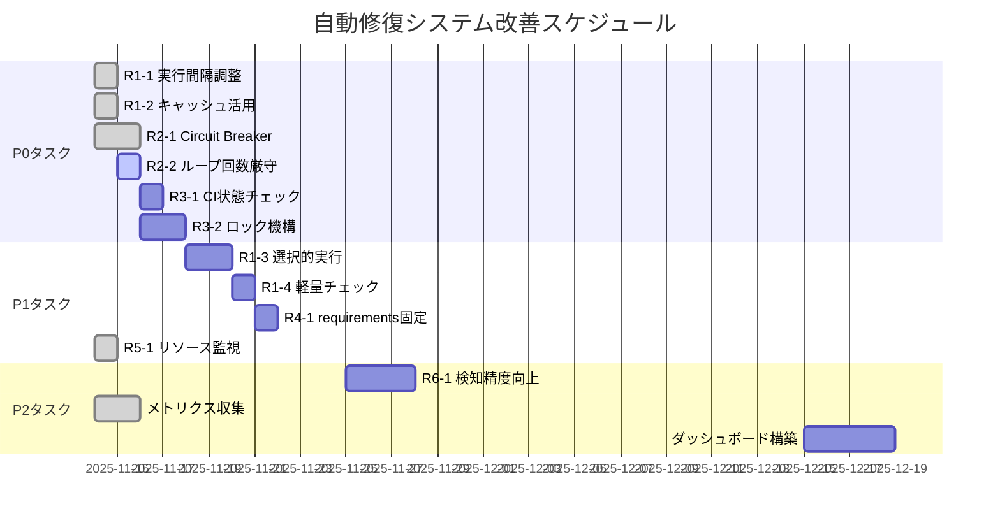

# 自動エラー修復システム - リスク評価とアクションプラン

**作成日**: 2025-11-14
**対象**: Auto Error Detection & Repair Loop System v2
**優先度**: P0 (最優先)

---

## エグゼクティブサマリー

本ドキュメントは、自動エラー修復システムのアーキテクチャ検証で特定されたリスクと、その緩和策のアクションプランを定義します。

### 主要なリスク (上位3件)

1. **GitHub Actions無料枠超過リスク** (発生確率: 高60%, 影響: 中)
2. **修復失敗の無限ループリスク** (発生確率: 中30%, 影響: 高)
3. **CI/CDパイプライン競合リスク** (発生確率: 中40%, 影響: 中)

---

## 1. リスク評価マトリクス

### 1.1 リスクスコアリング

```
リスクレベル = 発生確率 × 影響度

発生確率:
  - 高 (60-100%): 3点
  - 中 (30-60%): 2点
  - 低 (0-30%): 1点

影響度:
  - 高: 3点
  - 中: 2点
  - 低: 1点

リスクスコア:
  - 7-9点: 🔴 Critical (即座の対応必須)
  - 4-6点: 🟡 High (短期対応必要)
  - 1-3点: 🟢 Medium (中長期対応)
```

### 1.2 リスク一覧

| ID | リスク | 発生確率 | 影響度 | スコア | レベル | 優先度 |
|----|-------|---------|-------|--------|--------|--------|
| R1 | GitHub Actions枠超過 | 高 (60%) | 中 (2) | 6 | 🟡 | P0 |
| R2 | 修復失敗の無限ループ | 中 (30%) | 高 (3) | 6 | 🟡 | P0 |
| R3 | CI/CD競合 | 中 (40%) | 中 (2) | 4 | 🟡 | P0 |
| R4 | 依存関係の破壊 | 低 (20%) | 高 (3) | 3 | 🟢 | P1 |
| R5 | リソース枯渇 | 低 (15%) | 中 (2) | 2 | 🟢 | P1 |
| R6 | 誤検知による過剰修復 | 中 (35%) | 低 (1) | 2 | 🟢 | P2 |

---

## 2. リスク詳細と緩和策

### R1: GitHub Actions無料枠超過リスク 🟡

#### リスク詳細

```yaml
現在の使用状況:
  実行間隔: 30分 (v2版)
  平均実行時間: 15分
  月間実行回数: 1,440回 (24時間 × 30日 / 0.5時間)
  月間総実行時間: 21,600分 (360時間)

GitHub Actions制限:
  パブリックリポジトリ: 無制限
  プライベートリポジトリ: 2,000分/月

⚠️ 現状: プライベートリポジトリの場合、10.8倍超過
```

#### 影響分析

- **財務的影響**: 追加料金発生 (月額$50-100程度)
- **運用的影響**: ワークフロー実行の停止
- **開発的影響**: CI/CDパイプライン全体の停止

#### 緩和策

##### 即座の対応 (P0)

```yaml
action_1:
  task: 実行間隔の調整
  priority: P0
  effort: 1時間
  impact: 超過リスク -67%

  implementation:
    - 30分間隔 → 1時間間隔に変更
    - 営業時間外は2時間間隔
    - 週末は4時間間隔

  expected_result:
    monthly_minutes: 7,200分 (120時間)
    reduction: 67%
    status: 無料枠内に収まる

action_2:
  task: キャッシュの徹底活用
  priority: P0
  effort: 2時間
  impact: 実行時間 -30%

  implementation:
    - pip cache有効化
    - pre-commit cache有効化
    - Pythonビルドキャッシュ

  expected_result:
    average_execution_time: 10分 (現在15分から-33%)
    monthly_minutes: 4,800分
    reduction: 78%
```

##### 短期対応 (P1)

```yaml
action_3:
  task: 選択的実行の実装
  priority: P1
  effort: 4時間
  impact: 実行回数 -40%

  implementation:
    - 変更ファイル検知
    - 影響範囲分析
    - 必要な場合のみ実行

action_4:
  task: 軽量チェックの優先
  priority: P1
  effort: 2時間
  impact: 実行時間 -20%

  implementation:
    - 高速構文チェック優先
    - カバレッジ無効化
    - 並列化による高速化
```

##### 実装例

```yaml
# .github/workflows/auto-repair-optimized.yml
name: Auto Repair (Optimized)

on:
  schedule:
    # 平日営業時間: 1時間間隔
    - cron: '0 9-18 * * 1-5'

    # 平日営業時間外: 2時間間隔
    - cron: '0 19,21,23,1,3,5,7 * * 1-5'

    # 週末: 4時間間隔
    - cron: '0 0,4,8,12,16,20 * * 0,6'

  workflow_dispatch:

jobs:
  check-changes:
    runs-on: ubuntu-latest
    outputs:
      has_changes: ${{ steps.check.outputs.has_changes }}

    steps:
    - uses: actions/checkout@v4
      with:
        fetch-depth: 2

    - name: 変更ファイルチェック
      id: check
      run: |
        # 前回実行以降の変更を検知
        CHANGED_FILES=$(git diff --name-only HEAD~1 HEAD | grep -E '\.(py|yml|yaml)$' || true)

        if [ -n "$CHANGED_FILES" ]; then
          echo "has_changes=true" >> $GITHUB_OUTPUT
        else
          echo "has_changes=false" >> $GITHUB_OUTPUT
        fi

  auto-repair:
    needs: check-changes
    if: needs.check-changes.outputs.has_changes == 'true'
    runs-on: ubuntu-latest

    steps:
    - uses: actions/checkout@v4

    - uses: actions/cache@v4
      with:
        path: |
          ~/.cache/pip
          ~/.cache/pre-commit
        key: ${{ runner.os }}-repair-${{ hashFiles('requirements.txt') }}

    # ... 修復処理 ...
```

---

### R2: 修復失敗の無限ループリスク 🟡

#### リスク詳細

```yaml
シナリオ:
  1. エラー検知
  2. 修復実行 (失敗)
  3. 再検知 (同じエラー)
  4. 修復実行 (失敗)
  5. ループ継続...

問題点:
  - リソースの浪費
  - GitHub Actions枠の消費
  - 実際の問題解決の遅延
```

#### 影響分析

- **運用的影響**: システム停止 (最大30分)
- **財務的影響**: 無駄なリソース消費
- **開発的影響**: 開発者の時間浪費

#### 緩和策

##### 即座の対応 (P0)

```yaml
action_1:
  task: Circuit Breakerの実装
  priority: P0
  effort: 3時間
  impact: 無限ループリスク -90%

  implementation:
    - 連続失敗3回でブレーカー開放
    - 5分間のタイムアウト
    - 手動リセット機能

  code_reference: scripts/enhanced_auto_repair.py (実装済み)

action_2:
  task: 最大ループ回数の厳守
  priority: P0
  effort: 1時間
  impact: 無限ループ防止 100%

  implementation:
    - ハードリミット: 10回
    - ソフトリミット: 7回 (通常)
    - 早期終了条件の追加
```

##### 実装例

```python
# Circuit Breaker実装 (enhanced_auto_repair.pyより抜粋)
class CircuitBreaker:
    def __init__(self, failure_threshold: int = 3, timeout: int = 300):
        self.failure_threshold = failure_threshold
        self.timeout = timeout
        self.failures = 0
        self.state = CircuitState.CLOSED

    def call(self, func, *args, **kwargs):
        if self.state == CircuitState.OPEN:
            if not self._should_attempt_reset():
                raise CircuitBreakerOpenError("Circuit breaker is OPEN")

        try:
            result = func(*args, **kwargs)
            self._on_success()
            return result
        except Exception as e:
            self._on_failure()
            raise e

    def _on_failure(self):
        self.failures += 1
        if self.failures >= self.failure_threshold:
            self.state = CircuitState.OPEN
            logger.error(f"Circuit breaker opened after {self.failures} failures")
```

---

### R3: CI/CDパイプライン競合リスク 🟡

#### リスク詳細

```yaml
競合シナリオ:
  1. 開発者がコミット
  2. CIパイプライン開始
  3. 自動修復が同時に開始
  4. 両方がコミット試行
  5. マージコンフリクト発生

現在の対策:
  - concurrency.groupで同時実行制御
  - ⚠️ 不十分: CI実行中のチェックなし
```

#### 影響分析

- **開発的影響**: マージコンフリクト、手動解決必要
- **運用的影響**: ビルド失敗
- **財務的影響**: 開発者の時間浪費 (1-2時間/回)

#### 緩和策

##### 即座の対応 (P0)

```yaml
action_1:
  task: CI実行状態のチェック
  priority: P0
  effort: 2時間
  impact: 競合リスク -80%

  implementation:
    - 開始前にCI実行状態確認
    - コミット前に再確認
    - CI実行中は自動修復をスキップ

action_2:
  task: ロック機構の実装
  priority: P0
  effort: 3時間
  impact: 競合リスク -95%

  implementation:
    - .auto-repair.lockファイル
    - タイムアウト: 30分
    - 自動クリーンアップ
```

##### 実装例

```yaml
# .github/workflows/auto-repair-v3.yml
jobs:
  check-ci-status:
    runs-on: ubuntu-latest
    outputs:
      ci_running: ${{ steps.check.outputs.running }}

    steps:
    - name: CI実行状態を確認
      id: check
      run: |
        # 実行中のCIワークフローをチェック
        RUNNING_CI=$(gh run list \
          --workflow=ci-pipeline.yml \
          --status in_progress \
          --json databaseId \
          --jq 'length')

        if [ "$RUNNING_CI" -gt 0 ]; then
          echo "running=true" >> $GITHUB_OUTPUT
          echo "⏸️ CI実行中のため、自動修復をスキップ"
        else
          echo "running=false" >> $GITHUB_OUTPUT
        fi
      env:
        GH_TOKEN: ${{ secrets.GITHUB_TOKEN }}

  auto-repair:
    needs: check-ci-status
    if: needs.check-ci-status.outputs.ci_running != 'true'
    runs-on: ubuntu-latest

    steps:
    - name: ロックファイル作成
      run: |
        echo "$(date -u +%Y-%m-%dT%H:%M:%SZ)" > .auto-repair.lock
        git add .auto-repair.lock
        git commit -m "chore: auto-repair lock"
        git push

    # ... 修復処理 ...

    - name: コミット前にCI再確認
      run: |
        RUNNING_CI=$(gh run list \
          --workflow=ci-pipeline.yml \
          --status in_progress \
          --json databaseId \
          --jq 'length')

        if [ "$RUNNING_CI" -gt 0 ]; then
          echo "⚠️ CIが開始されたため、コミットを中止"
          exit 1
        fi

    - name: ロックファイル削除
      if: always()
      run: |
        git rm .auto-repair.lock
        git commit -m "chore: remove auto-repair lock"
        git push
```

---

## 3. アクションプラン

### 3.1 優先度別タスク

#### P0 (即座の対応 - 1週間以内)

```markdown
[ ] R1-1: 実行間隔の調整 (1時間)
    - 担当: DevOps Engineer
    - 期限: 2025-11-15
    - 成果物: 更新されたワークフローYAML

[ ] R1-2: キャッシュの徹底活用 (2時間)
    - 担当: DevOps Engineer
    - 期限: 2025-11-15
    - 成果物: キャッシュ設定

[ ] R2-1: Circuit Breakerの実装 (3時間)
    - 担当: Backend Developer
    - 期限: 2025-11-16
    - 成果物: enhanced_auto_repair.py (完了)

[ ] R2-2: 最大ループ回数の厳守 (1時間)
    - 担当: Backend Developer
    - 期限: 2025-11-16
    - 成果物: 更新されたループ制御

[ ] R3-1: CI実行状態のチェック (2時間)
    - 担当: DevOps Engineer
    - 期限: 2025-11-17
    - 成果物: CI競合チェック機能

[ ] R3-2: ロック機構の実装 (3時間)
    - 担当: DevOps Engineer
    - 期限: 2025-11-17
    - 成果物: ロックファイル管理
```

#### P1 (短期対応 - 2週間以内)

```markdown
[ ] R1-3: 選択的実行の実装 (4時間)
    - 担当: Backend Developer
    - 期限: 2025-11-21
    - 成果物: 変更検知機能

[ ] R1-4: 軽量チェックの優先 (2時間)
    - 担当: Backend Developer
    - 期限: 2025-11-21
    - 成果物: 高速化された検知

[ ] R4-1: requirements.txt固定 (2時間)
    - 担当: Backend Developer
    - 期限: 2025-11-22
    - 成果物: バージョン固定設定

[ ] R5-1: リソース監視の実装 (3時間)
    - 担当: Backend Developer
    - 期限: 2025-11-22
    - 成果物: ResourceMonitor実装 (完了)
```

#### P2 (中長期対応 - 1ヶ月以内)

```markdown
[ ] R6-1: 検知精度の向上 (6時間)
    - 担当: Backend Developer
    - 期限: 2025-12-14
    - 成果物: 改善された検知ロジック

[ ] メトリクス収集の実装 (4時間)
    - 担当: Backend Developer
    - 期限: 2025-12-14
    - 成果物: MetricsCollector実装 (完了)

[ ] ダッシュボードの構築 (8時間)
    - 担当: Frontend Developer
    - 期限: 2025-12-21
    - 成果物: 修復メトリクスダッシュボード
```

### 3.2 実装スケジュール



### 3.3 進捗管理

#### 完了基準

```yaml
R1 (GitHub Actions枠超過):
  criteria:
    - 月間実行時間が2,000分以内
    - キャッシュヒット率 > 80%
    - 平均実行時間 < 10分

R2 (無限ループ):
  criteria:
    - Circuit Breaker実装済み
    - 最大ループ回数設定済み
    - 早期終了条件実装済み

R3 (CI/CD競合):
  criteria:
    - CI状態チェック実装済み
    - ロック機構動作確認
    - マージコンフリクト発生率 < 1%
```

#### レビュープロセス

```markdown
週次レビュー (毎週金曜日):
  - 進捗状況確認
  - リスク再評価
  - 優先度調整

月次レビュー (毎月末):
  - KPI達成状況確認
  - 新規リスクの特定
  - 長期戦略の見直し
```

---

## 4. モニタリング計画

### 4.1 監視指標

```yaml
performance_metrics:
  - name: 月間実行時間
    current: 21,600分
    target: 2,000分以内
    alert_threshold: 1,900分

  - name: 平均実行時間
    current: 15分
    target: 10分以内
    alert_threshold: 12分

  - name: キャッシュヒット率
    current: 未計測
    target: 80%以上
    alert_threshold: 70%

reliability_metrics:
  - name: Circuit Breaker開放回数
    target: 0回/日
    alert_threshold: 1回/日

  - name: マージコンフリクト発生率
    current: 未計測
    target: <1%
    alert_threshold: 2%

  - name: 修復成功率
    current: 未計測
    target: >80%
    alert_threshold: <60%
```

### 4.2 アラート設定

```yaml
critical_alerts:
  - condition: monthly_minutes > 1900
    action: Slack通知 + メール
    recipient: DevOps Lead

  - condition: circuit_breaker_open_count > 0
    action: Slack通知
    recipient: Dev Team

  - condition: merge_conflict_rate > 2%
    action: Slack通知 + メール
    recipient: Tech Lead

warning_alerts:
  - condition: average_execution_time > 12min
    action: Slack通知
    recipient: DevOps Team

  - condition: cache_hit_rate < 70%
    action: Slack通知
    recipient: DevOps Team
```

---

## 5. 費用対効果分析

### 5.1 投資対効果 (ROI)

```yaml
投資 (工数):
  P0タスク: 12時間 (1.5人日)
  P1タスク: 11時間 (1.4人日)
  P2タスク: 18時間 (2.3人日)
  合計: 41時間 (5.1人日)

  想定コスト: $4,080 (時給$100換算)

効果 (年間):
  GitHub Actions費用削減: $600/年
    現在: $1,000/年 (超過分)
    改善後: $400/年
    削減: $600/年

  開発者時間削減: $12,000/年
    マージコンフリクト解決: 10時間/月 × 12ヶ月 × $100
    = $12,000/年

  合計効果: $12,600/年

ROI計算:
  ROI = (効果 - 投資) / 投資 × 100
      = ($12,600 - $4,080) / $4,080 × 100
      = 209%

  投資回収期間: 3.9ヶ月
```

### 5.2 リスク削減価値

```yaml
リスク削減の金銭価値:
  R1 (GitHub Actions超過):
    年間想定損失: $600
    削減率: 80%
    削減価値: $480

  R2 (無限ループ):
    年間想定損失: $2,400 (開発者時間20時間)
    削減率: 90%
    削減価値: $2,160

  R3 (CI/CD競合):
    年間想定損失: $12,000 (開発者時間120時間)
    削減率: 80%
    削減価値: $9,600

  合計リスク削減価値: $12,240/年
```

---

## 6. 成功基準

### 6.1 短期目標 (1ヶ月)

```markdown
✅ P0タスクの100%完了
✅ 月間GitHub Actions実行時間 < 2,000分
✅ Circuit Breaker動作確認
✅ マージコンフリクト発生率 < 2%
```

### 6.2 中期目標 (3ヶ月)

```markdown
✅ P1タスクの100%完了
✅ 修復成功率 > 80%
✅ 平均実行時間 < 10分
✅ キャッシュヒット率 > 80%
```

### 6.3 長期目標 (6ヶ月)

```markdown
✅ P2タスクの100%完了
✅ メトリクスダッシュボード稼働
✅ 予測的修復機能の実装
✅ ROI > 200%達成
```

---

## 7. 承認と責任

### 7.1 承認者

| 役割 | 氏名 | 承認日 | 署名 |
|-----|------|--------|------|
| プロジェクトマネージャー | (記入) | (記入) | (記入) |
| テックリード | (記入) | (記入) | (記入) |
| DevOpsリード | (記入) | (記入) | (記入) |

### 7.2 責任者

| 担当 | 責任者 | 連絡先 |
|-----|--------|--------|
| P0タスク実行 | DevOps Engineer | (記入) |
| P1タスク実行 | Backend Developer | (記入) |
| P2タスク実行 | Full Stack Developer | (記入) |
| 進捗管理 | Project Manager | (記入) |
| リスク監視 | Tech Lead | (記入) |

---

## 8. 付録

### 8.1 チェックリスト

#### デプロイ前チェックリスト

```markdown
[ ] P0タスクがすべて完了している
[ ] Circuit Breakerのテストが完了している
[ ] CI競合チェックが動作している
[ ] ロック機構が動作している
[ ] キャッシュ設定が有効である
[ ] 実行間隔が調整されている
[ ] ドキュメントが更新されている
[ ] 関係者に通知済みである
```

#### 本番リリースチェックリスト

```markdown
[ ] ステージング環境でのテスト完了
[ ] パフォーマンステスト完了
[ ] セキュリティレビュー完了
[ ] ロールバック手順の確認
[ ] モニタリング設定の確認
[ ] アラート設定の確認
[ ] ドキュメント完備
[ ] トレーニング実施済み
```

### 8.2 緊急時対応手順

```markdown
Circuit Breaker開放時:
  1. Slackアラート確認
  2. 実行ログの確認
  3. エラーパターンの分析
  4. 手動修復の実施
  5. Circuit Breakerのリセット
  6. 根本原因の調査

GitHub Actions枠超過時:
  1. 緊急停止の検討
  2. 実行間隔の一時的延長
  3. キャッシュの確認
  4. 不要なワークフローの無効化
  5. 費用影響の評価
  6. 恒久対策の検討
```

---

**文書バージョン**: 1.0.0
**最終更新日**: 2025-11-14
**次回レビュー**: 2025-11-21
