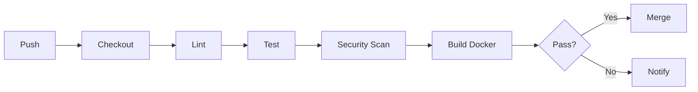

# MangaAnime Info Delivery System - DevOps Guide

[](https://github.com/your-org/MangaAnime-Info-delivery-system/actions)
[](https://github.com/your-org/MangaAnime-Info-delivery-system/actions)
[](https://www.docker.com/)

アニメ・マンガの最新情報を自動収集し、Gmail通知とGoogleカレンダー統合により配信する完全自動化システムのDevOpsガイドです。

---

## 🚀 クイックスタート

### 3ステップで起動

```bash
# 1. クローン
git clone https://github.com/your-org/MangaAnime-Info-delivery-system.git
cd MangaAnime-Info-delivery-system

# 2. 環境変数設定
cp env.example .env
nano .env  # 必須項目を編集

# 3. Docker起動
docker-compose up -d
```

詳細は [クイックスタートガイド](./docs/QUICKSTART_DEVOPS.md) を参照してください。

---

## 📋 目次

- [システム概要](#システム概要)
- [技術スタック](#技術スタック)
- [ディレクトリ構造](#ディレクトリ構造)
- [セットアップ](#セットアップ)
- [デプロイ](#デプロイ)
- [CI/CD](#cicd)
- [モニタリング](#モニタリング)
- [トラブルシューティング](#トラブルシューティング)
- [ドキュメント](#ドキュメント)

---

## システム概要

### 主要機能

- **情報収集**: AniList API、しょぼいカレンダー、各種RSSフィードから最新情報を取得
- **フィルタリング**: NGワードによる自動フィルタリング
- **通知**: Gmail APIによるHTMLメール送信
- **カレンダー統合**: Google Calendar APIで予定を自動登録
- **スケジューリング**: GitHub Actionsまたはcronによる定期実行

### アーキテクチャ

```
┌─────────────────────────────────────────────┐
│          Data Sources                        │
│  AniList API | Syoboi | RSS Feeds           │
└─────────────────┬───────────────────────────┘
                  │
                  ▼
┌─────────────────────────────────────────────┐
│        Scraping Layer                        │
│  anime_anilist.py | manga_rss.py            │
└─────────────────┬───────────────────────────┘
                  │
                  ▼
┌─────────────────────────────────────────────┐
│      Filtering Layer                         │
│        filter_logic.py                       │
└─────────────────┬───────────────────────────┘
                  │
                  ▼
┌─────────────────────────────────────────────┐
│       Database Layer                         │
│         SQLite (db.py)                       │
└─────────────────┬───────────────────────────┘
                  │
                  ▼
┌─────────────────────────────────────────────┐
│     Notification Layer                       │
│  mailer.py | calendar.py                    │
└─────────────────────────────────────────────┘
```

---

## 技術スタック

### Backend
- **Python 3.11**
- **SQLite** - データベース
- **Flask** - Web UI（オプション）

### APIs & Services
- **AniList GraphQL API** - アニメ情報
- **Syoboi Calendar** - 放送スケジュール
- **Gmail API** - メール送信
- **Google Calendar API** - カレンダー統合

### DevOps
- **Docker** - コンテナ化
- **Docker Compose** - オーケストレーション
- **GitHub Actions** - CI/CD
- **Trivy** - セキュリティスキャン
- **Pytest** - テスト

---

## ディレクトリ構造

```
MangaAnime-Info-delivery-system/
├── app/                          # アプリケーションコード
│   ├── main.py                  # エントリーポイント
│   ├── scheduler.py             # スケジューラ
│   └── web.py                   # Web UI
├── modules/                      # 機能モジュール
│   ├── anime_anilist.py         # AniListスクレイパー
│   ├── manga_rss.py             # RSSスクレイパー
│   ├── filter_logic.py          # フィルタリング
│   ├── db.py                    # データベース
│   ├── mailer.py                # メール送信
│   └── calendar.py              # カレンダー統合
├── tests/                        # テストコード
├── config/                       # 設定ファイル
├── data/                         # データファイル
├── logs/                         # ログファイル
├── scripts/                      # スクリプト
│   ├── deploy.sh                # デプロイ
│   └── rollback.sh              # ロールバック
├── docs/                         # ドキュメント
├── .github/workflows/            # GitHub Actions
├── Dockerfile                    # Dockerイメージ定義
├── docker-compose.yml            # 開発環境
└── docker-compose.prod.yml       # 本番環境
```

---

## セットアップ

### 前提条件

- Docker & Docker Compose
- Git
- Google Cloud Platform アカウント（Gmail/Calendar API用）

### 環境変数

`.env`ファイルに以下を設定:

```bash
# Google API
GMAIL_CLIENT_ID=your_client_id
GMAIL_CLIENT_SECRET=your_client_secret
CALENDAR_API_KEY=your_api_key

# 通知先
NOTIFICATION_EMAIL=your-email@example.com

# データベース
DATABASE_URL=sqlite:///data/production.db
```

### 初回起動

```bash
# 依存関係インストール（ローカル開発の場合）
pip install -r requirements.txt

# Dockerで起動（推奨）
docker-compose up -d

# ログ確認
docker-compose logs -f
```

---

## デプロイ

### 方法1: GitHub Actionsによる自動デプロイ（推奨）

```bash
# タグを作成
git tag v1.0.0

# プッシュ（自動デプロイが開始）
git push origin v1.0.0
```

### 方法2: 手動デプロイ

```bash
# サーバーにSSH接続
ssh user@your-server.example.com

# デプロイスクリプト実行
cd /opt/mangaanime-system
sudo ./scripts/deploy.sh
```

### ロールバック

```bash
# バックアップ一覧から選択
sudo ./scripts/rollback.sh

# または直接指定
sudo ./scripts/rollback.sh backup-20251206-143022
```

詳細は [デプロイメントガイド](./docs/operations/DEPLOYMENT_GUIDE.md) を参照してください。

---

## CI/CD

### GitHub Actions ワークフロー

| ワークフロー | トリガー | 実行内容 |
|------------|---------|---------|
| **CI Main** | Push/PR | Lint, Test, Build |
| **Security Scan** | 週次/Push | 脆弱性スキャン |
| **Deploy Production** | タグプッシュ | 本番デプロイ |
| **Daily Scraping** | 毎日08:00 JST | 情報収集 |

### CI パイプライン



### GitHub Secrets設定

リポジトリの `Settings > Secrets` で以下を設定:

```
# 必須
GMAIL_CLIENT_ID
GMAIL_CLIENT_SECRET
CALENDAR_API_KEY
NOTIFICATION_EMAIL

# デプロイ用
DEPLOY_HOST
DEPLOY_USER
DEPLOY_SSH_KEY
PRODUCTION_URL

# オプション
SLACK_WEBHOOK
SENTRY_DSN
```

---

## モニタリング

### ヘルスチェック

```bash
# ローカル
curl http://localhost:8000/health

# 本番
curl https://your-production-url.com/health
```

### ログ確認

```bash
# Dockerログ
docker-compose logs -f

# アプリケーションログ
tail -f logs/app.log

# エラーログのみ
grep ERROR logs/app.log
```

### リソース監視

```bash
# コンテナ統計
docker stats

# ディスク使用量
df -h

# メモリ使用量
free -h
```

---

## トラブルシューティング

### よくある問題

#### 1. コンテナが起動しない

```bash
# ログ確認
docker-compose logs

# 再ビルド
docker-compose up -d --build --force-recreate
```

#### 2. ポート競合

```bash
# ポート確認
sudo lsof -i :8000

# .envでポート変更
APP_PORT=8080
```

#### 3. 環境変数が反映されない

```bash
# .envファイル確認
cat .env

# コンテナ再作成
docker-compose down
docker-compose up -d
```

詳細は [デプロイメントガイド](./docs/operations/DEPLOYMENT_GUIDE.md#トラブルシューティング) を参照してください。

---

## ドキュメント

### DevOps関連

| ドキュメント | 説明 |
|------------|------|
| [クイックスタート](./docs/QUICKSTART_DEVOPS.md) | 最短セットアップガイド |
| [デプロイメントガイド](./docs/operations/DEPLOYMENT_GUIDE.md) | 詳細なデプロイ手順 |
| [実装ロードマップ](./docs/operations/IMPLEMENTATION_ROADMAP.md) | 6週間の実装計画 |
| [分析レポート](./docs/operations/DEVOPS_CICD_ANALYSIS_REPORT.md) | 現状分析と最適化提案 |
| [成果物サマリー](./docs/operations/DEVOPS_DELIVERABLES_SUMMARY.md) | 作成ファイル一覧 |

### 開発関連

- [システム仕様書](./CLAUDE.md)
- [API仕様](./docs/API_SPECIFICATION.md)
- [テストガイド](./docs/TESTING_GUIDE.md)

---

## 🤝 コントリビューション

1. このリポジトリをフォーク
2. 機能ブランチを作成 (`git checkout -b feature/amazing-feature`)
3. 変更をコミット (`git commit -m 'Add amazing feature'`)
4. ブランチにプッシュ (`git push origin feature/amazing-feature`)
5. Pull Requestを作成

---

## 📊 ステータス

### 実装状況

| 機能 | 状態 |
|------|------|
| Docker化 | ✅ 完了 |
| CI/CD | ✅ 完了 |
| セキュリティスキャン | ✅ 完了 |
| 自動デプロイ | ✅ 完了 |
| モニタリング | ⏳ 実装中 |
| テストカバレッジ | ⏳ 向上中 |

### メトリクス

- **デプロイ頻度**: 目標毎日
- **デプロイ時間**: 5分以内
- **テストカバレッジ**: 目標75%
- **稼働率**: 目標99.9%

---

## 📄 ライセンス

このプロジェクトは MIT ライセンスの下で公開されています。

---

## 📞 サポート

- **Issues**: [GitHub Issues](https://github.com/your-org/MangaAnime-Info-delivery-system/issues)
- **Discussions**: [GitHub Discussions](https://github.com/your-org/MangaAnime-Info-delivery-system/discussions)
- **Email**: dev-team@example.com
- **Slack**: #mangaanime-support

---

## 🙏 謝辞

- [AniList](https://anilist.co/) - アニメ情報API
- [しょぼいカレンダー](https://cal.syoboi.jp/) - 放送スケジュール
- Claude Code Agents - 自動化された開発支援

---

**作成日**: 2025-12-06
**最終更新**: 2025-12-06
**メンテナー**: DevOps Engineer Agent

---

*このプロジェクトは Claude Agent による並列開発で構築されています。*
