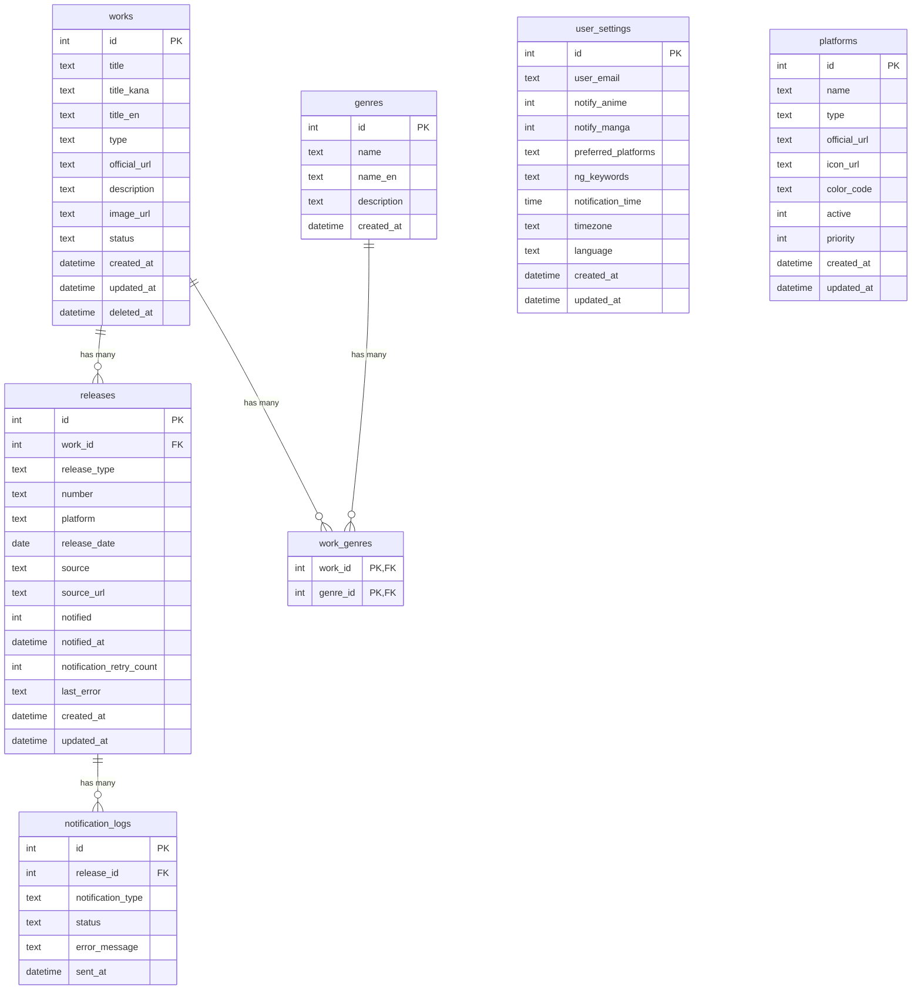

# データベーススキーマER図

**作成日**: 2025-12-06
**対象システム**: MangaAnime-Info-delivery-system
**データベース**: SQLite 3.x

---

## ER図（テキスト形式）

```
┌─────────────────────────────────────┐
│             works                   │
├─────────────────────────────────────┤
│ * id (PK)                          │
│   title (NOT NULL)                 │
│   title_kana                       │
│   title_en                         │
│   type (CHECK: anime|manga)        │
│   official_url                     │
│   description                      │
│   image_url                        │
│   status (upcoming|ongoing|...)    │
│   created_at                       │
│   updated_at                       │
│   deleted_at                       │
└─────────────────────────────────────┘
            │ 1
            │
            │ *
┌─────────────────────────────────────┐
│           releases                  │
├─────────────────────────────────────┤
│ * id (PK)                          │
│   work_id (FK → works.id)          │
│   release_type (episode|volume)    │
│   number                           │
│   platform                         │
│   release_date                     │
│   source                           │
│   source_url                       │
│   notified (0|1)                   │
│   notified_at                      │
│   notification_retry_count         │
│   last_error                       │
│   created_at                       │
│   updated_at                       │
│   UNIQUE(work_id, release_type,    │
│          number, platform,         │
│          release_date)             │
└─────────────────────────────────────┘
            │ 1
            │
            │ *
┌─────────────────────────────────────┐
│      notification_logs              │
├─────────────────────────────────────┤
│ * id (PK)                          │
│   release_id (FK → releases.id)    │
│   notification_type (email|calendar)│
│   status (success|failed|pending)  │
│   error_message                    │
│   sent_at                          │
└─────────────────────────────────────┘


┌─────────────────────────────────────┐
│         user_settings               │
├─────────────────────────────────────┤
│ * id (PK)                          │
│   user_email (UNIQUE)              │
│   notify_anime (0|1)               │
│   notify_manga (0|1)               │
│   preferred_platforms (JSON)       │
│   ng_keywords (JSON)               │
│   notification_time                │
│   timezone                         │
│   language                         │
│   created_at                       │
│   updated_at                       │
└─────────────────────────────────────┘


┌─────────────────────────────────────┐
│           platforms                 │
├─────────────────────────────────────┤
│ * id (PK)                          │
│   name (UNIQUE)                    │
│   type (anime|manga|both)          │
│   official_url                     │
│   icon_url                         │
│   color_code                       │
│   active (0|1)                     │
│   priority                         │
│   created_at                       │
│   updated_at                       │
└─────────────────────────────────────┘


┌─────────────────────────────────────┐
│            genres                   │
├─────────────────────────────────────┤
│ * id (PK)                          │
│   name (UNIQUE)                    │
│   name_en                          │
│   description                      │
│   created_at                       │
└─────────────────────────────────────┘
            │ *
            │
            │ * (中間テーブル)
┌─────────────────────────────────────┐
│         work_genres                 │
├─────────────────────────────────────┤
│ * work_id (PK, FK → works.id)      │
│ * genre_id (PK, FK → genres.id)    │
└─────────────────────────────────────┘
            │ *
            │
            │ 1
┌─────────────────────────────────────┐
│             works                   │
│         (上記参照)                   │
└─────────────────────────────────────┘
```

---

## テーブル関連図（Mermaid形式）



---

## テーブル詳細

### 1. works（作品）

アニメ・マンガ作品の基本情報を管理するマスターテーブル。

| カラム名 | 型 | 制約 | 説明 |
|---------|---|------|------|
| id | INTEGER | PK, AUTOINCREMENT | 作品ID |
| title | TEXT | NOT NULL | 作品タイトル |
| title_kana | TEXT | - | かな読み（五十音順ソート用） |
| title_en | TEXT | - | 英語タイトル |
| type | TEXT | CHECK(anime\|manga) | 作品タイプ |
| official_url | TEXT | - | 公式サイトURL |
| description | TEXT | - | 作品概要 |
| image_url | TEXT | - | サムネイル画像URL |
| status | TEXT | CHECK(upcoming\|ongoing\|completed\|cancelled) | 作品ステータス |
| created_at | DATETIME | DEFAULT CURRENT_TIMESTAMP | 作成日時 |
| updated_at | DATETIME | DEFAULT CURRENT_TIMESTAMP | 更新日時 |
| deleted_at | DATETIME | - | 論理削除日時 |

**主要インデックス:**
- `idx_works_title` (title)
- `idx_works_type` (type)
- `idx_works_type_created` (type, created_at DESC)

---

### 2. releases（リリース情報）

各作品のエピソード配信・巻発売情報を管理するトランザクションテーブル。

| カラム名 | 型 | 制約 | 説明 |
|---------|---|------|------|
| id | INTEGER | PK, AUTOINCREMENT | リリースID |
| work_id | INTEGER | NOT NULL, FK → works.id | 作品ID |
| release_type | TEXT | CHECK(episode\|volume) | リリースタイプ |
| number | TEXT | - | エピソード番号/巻数 |
| platform | TEXT | - | 配信プラットフォーム名 |
| release_date | DATE | - | 配信/発売日 |
| source | TEXT | - | 情報ソース（API名） |
| source_url | TEXT | - | ソースURL |
| notified | INTEGER | DEFAULT 0 | 通知済みフラグ |
| notified_at | DATETIME | - | 通知日時 |
| notification_retry_count | INTEGER | DEFAULT 0 | 通知リトライ回数 |
| last_error | TEXT | - | 最終エラーメッセージ |
| created_at | DATETIME | DEFAULT CURRENT_TIMESTAMP | 作成日時 |
| updated_at | DATETIME | DEFAULT CURRENT_TIMESTAMP | 更新日時 |

**UNIQUE制約:** (work_id, release_type, number, platform, release_date)

**主要インデックス:**
- `idx_releases_work_id` (work_id)
- `idx_releases_date` (release_date)
- `idx_releases_notified_date` (notified, release_date DESC)
- `idx_releases_work_date` (work_id, release_date DESC)

---

### 3. notification_logs（通知ログ）

メール・カレンダー通知の履歴を記録するログテーブル。

| カラム名 | 型 | 制約 | 説明 |
|---------|---|------|------|
| id | INTEGER | PK, AUTOINCREMENT | ログID |
| release_id | INTEGER | NOT NULL, FK → releases.id | リリースID |
| notification_type | TEXT | CHECK(email\|calendar) | 通知タイプ |
| status | TEXT | CHECK(success\|failed\|pending) | 通知ステータス |
| error_message | TEXT | - | エラーメッセージ |
| sent_at | DATETIME | DEFAULT CURRENT_TIMESTAMP | 送信日時 |

**主要インデックス:**
- `idx_notification_logs_release` (release_id)
- `idx_notification_logs_status` (status)
- `idx_notification_logs_type_status` (notification_type, status)

---

### 4. user_settings（ユーザー設定）

ユーザー別の通知設定を管理するマスターテーブル。

| カラム名 | 型 | 制約 | 説明 |
|---------|---|------|------|
| id | INTEGER | PK, AUTOINCREMENT | 設定ID |
| user_email | TEXT | NOT NULL, UNIQUE | ユーザーメールアドレス |
| notify_anime | INTEGER | DEFAULT 1 | アニメ通知有効 |
| notify_manga | INTEGER | DEFAULT 1 | マンガ通知有効 |
| preferred_platforms | TEXT | - | 優先プラットフォーム（JSON配列） |
| ng_keywords | TEXT | - | NGキーワード（JSON配列） |
| notification_time | TIME | DEFAULT '08:00:00' | 通知時刻 |
| timezone | TEXT | DEFAULT 'Asia/Tokyo' | タイムゾーン |
| language | TEXT | DEFAULT 'ja' | 言語設定 |
| created_at | DATETIME | DEFAULT CURRENT_TIMESTAMP | 作成日時 |
| updated_at | DATETIME | DEFAULT CURRENT_TIMESTAMP | 更新日時 |

---

### 5. platforms（プラットフォーム）

配信プラットフォームのマスター情報。

| カラム名 | 型 | 制約 | 説明 |
|---------|---|------|------|
| id | INTEGER | PK, AUTOINCREMENT | プラットフォームID |
| name | TEXT | NOT NULL, UNIQUE | プラットフォーム名 |
| type | TEXT | CHECK(anime\|manga\|both) | 対応タイプ |
| official_url | TEXT | - | 公式URL |
| icon_url | TEXT | - | アイコンURL |
| color_code | TEXT | - | カレンダー表示色 |
| active | INTEGER | DEFAULT 1 | 有効フラグ |
| priority | INTEGER | DEFAULT 0 | 表示優先度 |
| created_at | DATETIME | DEFAULT CURRENT_TIMESTAMP | 作成日時 |
| updated_at | DATETIME | DEFAULT CURRENT_TIMESTAMP | 更新日時 |

---

### 6. genres（ジャンル）

作品ジャンルのマスター情報。

| カラム名 | 型 | 制約 | 説明 |
|---------|---|------|------|
| id | INTEGER | PK, AUTOINCREMENT | ジャンルID |
| name | TEXT | NOT NULL, UNIQUE | ジャンル名 |
| name_en | TEXT | - | 英語ジャンル名 |
| description | TEXT | - | ジャンル説明 |
| created_at | DATETIME | DEFAULT CURRENT_TIMESTAMP | 作成日時 |

---

### 7. work_genres（作品-ジャンル中間テーブル）

作品とジャンルの多対多関連を管理。

| カラム名 | 型 | 制約 | 説明 |
|---------|---|------|------|
| work_id | INTEGER | PK, FK → works.id | 作品ID |
| genre_id | INTEGER | PK, FK → genres.id | ジャンルID |

---

## ビュー定義

### v_pending_notifications（未通知リリース一覧）

通知処理で使用する未通知レコード抽出ビュー。

```sql
CREATE VIEW v_pending_notifications AS
SELECT
  r.id as release_id,
  r.release_type,
  r.number,
  r.platform,
  r.release_date,
  r.source,
  r.source_url,
  w.id as work_id,
  w.title as work_title,
  w.type as work_type,
  w.image_url as work_image_url
FROM releases r
INNER JOIN works w ON r.work_id = w.id
WHERE r.notified = 0
  AND r.release_date <= DATE('now')
  AND w.deleted_at IS NULL
ORDER BY r.release_date, w.title;
```

### v_latest_releases（作品別最新リリース）

各作品の最新リリース情報を取得するビュー。

```sql
CREATE VIEW v_latest_releases AS
SELECT
  w.id as work_id,
  w.title,
  w.type,
  r.id as release_id,
  r.release_type,
  r.number,
  r.platform,
  r.release_date,
  r.notified
FROM works w
INNER JOIN (
  SELECT work_id, MAX(release_date) as max_date
  FROM releases
  GROUP BY work_id
) latest ON w.id = latest.work_id
INNER JOIN releases r ON r.work_id = latest.work_id
  AND r.release_date = latest.max_date
WHERE w.deleted_at IS NULL;
```

### v_notification_stats_daily（日別通知統計）

通知の成功/失敗状況を日別に集計するビュー。

```sql
CREATE VIEW v_notification_stats_daily AS
SELECT
  DATE(sent_at) as date,
  notification_type,
  status,
  COUNT(*) as count
FROM notification_logs
GROUP BY DATE(sent_at), notification_type, status
ORDER BY date DESC;
```

---

## トリガー定義

### updated_at自動更新トリガー

各テーブルのupdated_atカラムを自動更新。

```sql
-- worksテーブル
CREATE TRIGGER update_works_timestamp
AFTER UPDATE ON works
FOR EACH ROW
BEGIN
  UPDATE works SET updated_at = CURRENT_TIMESTAMP WHERE id = NEW.id;
END;

-- releasesテーブル
CREATE TRIGGER update_releases_timestamp
AFTER UPDATE ON releases
FOR EACH ROW
BEGIN
  UPDATE releases SET updated_at = CURRENT_TIMESTAMP WHERE id = NEW.id;
END;

-- user_settingsテーブル
CREATE TRIGGER update_user_settings_timestamp
AFTER UPDATE ON user_settings
FOR EACH ROW
BEGIN
  UPDATE user_settings SET updated_at = CURRENT_TIMESTAMP WHERE id = NEW.id;
END;

-- platformsテーブル
CREATE TRIGGER update_platforms_timestamp
AFTER UPDATE ON platforms
FOR EACH ROW
BEGIN
  UPDATE platforms SET updated_at = CURRENT_TIMESTAMP WHERE id = NEW.id;
END;
```

---

## インデックス戦略サマリー

### 高優先度インデックス（必須）
1. `idx_works_title` - タイトル検索
2. `idx_works_type` - タイプ別フィルタ
3. `idx_releases_work_id` - JOIN最適化
4. `idx_releases_date` - 日付検索
5. `idx_releases_notified_date` - 通知処理最適化

### 中優先度インデックス（推奨）
6. `idx_releases_platform` - プラットフォーム検索
7. `idx_releases_work_date` - 作品別最新取得
8. `idx_works_type_created` - 新着リスト

### パーティャルインデックス（容量節約）
9. `idx_releases_unnotified_only` - 未通知レコードのみ
10. `idx_works_kana_exists` - かな読み有りレコードのみ

---

## データフロー

```
┌─────────────────┐
│  API/RSS取得   │
└────────┬────────┘
         │
         ▼
┌─────────────────┐
│  データ正規化   │
└────────┬────────┘
         │
         ▼
┌─────────────────┐
│  worksテーブル  │ ◄──┐
│  releasesテーブル│    │
└────────┬────────┘    │
         │             │ 参照
         ▼             │
┌─────────────────┐    │
│  通知処理       │    │
│  (未通知抽出)   │────┘
└────────┬────────┘
         │
         ├─────────────┬──────────────┐
         ▼             ▼              ▼
┌──────────────┐ ┌──────────┐ ┌────────────────┐
│ Gmail送信    │ │カレンダー│ │notification_logs│
│              │ │登録      │ │                │
└──────────────┘ └──────────┘ └────────────────┘
```

---

## パフォーマンスチューニング設定

```sql
-- WALモード有効化
PRAGMA journal_mode = WAL;

-- 同期モード
PRAGMA synchronous = NORMAL;

-- キャッシュサイズ（10MB）
PRAGMA cache_size = -10000;

-- 一時ファイルをメモリに
PRAGMA temp_store = MEMORY;

-- 外部キー制約有効化
PRAGMA foreign_keys = ON;

-- 自動VACUUM
PRAGMA auto_vacuum = INCREMENTAL;
```

---

## バックアップ戦略

- **日次**: ANALYZE実行（統計情報更新）
- **週次**: VACUUM実行（データベース最適化）
- **月次**: フルバックアップ（SQLiteファイル + SQLダンプ）
- **リアルタイム**: WALファイルバックアップ

詳細は `/scripts/db_maintenance.sh` 参照。

---

**参照:**
- 最適化提案書: `/docs/technical/database-optimization-report.md`
- 分析スクリプト: `/scripts/analyze_database.py`
- マイグレーション: `/migrations/*.sql`
