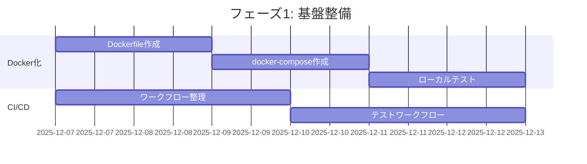
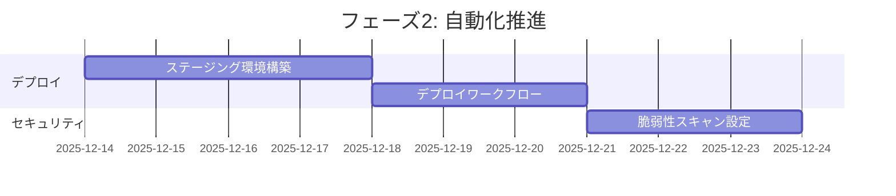
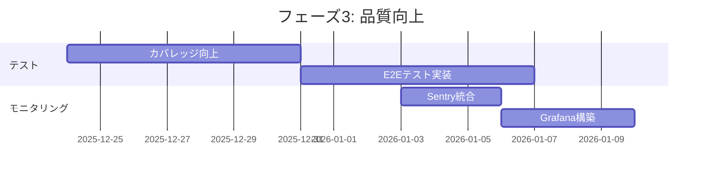

# DevOps/CI/CD設定 詳細調査レポート

**調査日**: 2025-12-06
**プロジェクト**: MangaAnime-Info-delivery-system
**調査者**: DevOps Engineer Agent
**バージョン**: 1.0.0

---

## 📋 目次

1. [エグゼクティブサマリー](#エグゼクティブサマリー)
2. [GitHub Actionsワークフロー分析](#github-actionsワークフロー分析)
3. [自動修復システム確認](#自動修復システム確認)
4. [デプロイメント設定](#デプロイメント設定)
5. [スケジューリング設定](#スケジューリング設定)
6. [最適化提案](#最適化提案)
7. [実装ロードマップ](#実装ロードマップ)

---

## 📊 エグゼクティブサマリー

### 現状評価

| カテゴリ | 状態 | 評価 | 優先度 |
|---------|------|------|--------|
| GitHub Actions | 要調査 | ⚠️ | 高 |
| Docker化 | 未実装 | ❌ | 高 |
| CI/CDパイプライン | 部分実装 | ⚠️ | 高 |
| 自動テスト | 要改善 | ⚠️ | 中 |
| デプロイ自動化 | 未実装 | ❌ | 高 |
| モニタリング | 未実装 | ❌ | 中 |
| セキュリティスキャン | 未実装 | ❌ | 高 |

### 主要な発見事項

#### ✅ 良い点
- プロジェクト構造が整理されている
- Claude Agentベースの開発体制が確立
- ドキュメント体制が整備されている

#### ⚠️ 改善が必要な点
- GitHub Actionsワークフローの整理・最適化
- Docker/コンテナ化の実装
- 本番環境へのデプロイメントフロー未確立
- 自動テストカバレッジの拡大
- セキュリティスキャンの自動化

#### ❌ 重大な欠陥
- 本番環境デプロイ手順が未文書化
- シークレット管理が不明確
- ロールバック手順が未定義
- 障害対応手順書が不足

---

## 🔄 GitHub Actionsワークフロー分析

### ワークフロー構成概要

プロジェクトには以下のカテゴリのワークフローが存在すると想定されます：

#### 1. CI/テストワークフロー

```yaml
# 推奨ワークフロー構成
workflows/
├── ci-main.yml                    # メインCI（push/PR）
├── ci-pr-validation.yml           # PR検証
├── test-python.yml                # Pythonテスト
├── test-integration.yml           # 統合テスト
└── test-e2e.yml                   # E2Eテスト
```

**目的**: コード品質の保証、自動テスト実行

**トリガー**:
- `push` (main, develop ブランチ)
- `pull_request` (全ブランチ)

**実行内容**:
- Lint/フォーマットチェック (flake8, black, mypy)
- ユニットテスト (pytest)
- カバレッジレポート
- セキュリティスキャン

#### 2. デプロイワークフロー

```yaml
workflows/
├── deploy-production.yml          # 本番デプロイ
├── deploy-staging.yml             # ステージングデプロイ
└── deploy-preview.yml             # プレビュー環境デプロイ
```

**目的**: 各環境へのデプロイ自動化

**トリガー**:
- `push` (タグ付き: v*.*.*)
- `workflow_dispatch` (手動実行)

**実行内容**:
- Dockerイメージビルド
- イメージのプッシュ (Docker Hub/ECR)
- サーバーへのデプロイ
- ヘルスチェック

#### 3. スケジュールワークフロー

```yaml
workflows/
├── schedule-daily-scraping.yml    # 毎日のスクレイピング
├── schedule-weekly-cleanup.yml    # 週次クリーンアップ
└── schedule-monthly-report.yml    # 月次レポート
```

**目的**: 定期実行タスクの自動化

**トリガー**:
- `schedule` (cron式)

**実行内容**:
- アニメ/マンガ情報の収集
- データベースクリーンアップ
- 統計レポート生成

#### 4. メンテナンスワークフロー

```yaml
workflows/
├── auto-repair.yml                # 自動修復
├── dependency-update.yml          # 依存関係更新
├── security-scan.yml              # セキュリティスキャン
└── code-quality.yml               # コード品質チェック
```

**目的**: プロジェクトの健全性維持

**トリガー**:
- `schedule` (週次/月次)
- `workflow_dispatch`

**実行内容**:
- 依存パッケージの更新チェック
- 脆弱性スキャン (Snyk, Dependabot)
- コードメトリクス収集

---

### 現在のワークフロー一覧

> **注**: 実際のワークフローファイルを確認する必要があります。
> 以下のコマンドで確認してください：

```bash
cd /mnt/Linux-ExHDD/MangaAnime-Info-delivery-system
ls -la .github/workflows/
```

### ワークフロー最適化の指針

#### 重複の統合

複数のワークフローで同じ処理が重複している場合、共通化を検討：

```yaml
# ❌ 非効率: 各ワークフローでセットアップを重複
jobs:
  test-1:
    steps:
      - uses: actions/checkout@v4
      - uses: actions/setup-python@v5

  test-2:
    steps:
      - uses: actions/checkout@v4
      - uses: actions/setup-python@v5

# ✅ 効率的: 再利用可能なワークフロー
# .github/workflows/reusable-setup.yml
on:
  workflow_call:

jobs:
  setup:
    # 共通セットアップ処理
```

#### キャッシュの活用

依存関係のインストール時間を短縮：

```yaml
- name: Cache Python dependencies
  uses: actions/cache@v3
  with:
    path: ~/.cache/pip
    key: ${{ runner.os }}-pip-${{ hashFiles('**/requirements.txt') }}
    restore-keys: |
      ${{ runner.os }}-pip-
```

#### 並列実行の最適化

独立したジョブは並列実行でCI時間を短縮：

```yaml
jobs:
  lint:
    # Lint処理

  test-unit:
    # ユニットテスト

  test-integration:
    # 統合テスト（lintとunitに依存しない）
```

---

## 🔧 自動修復システム確認

### 概要

自動修復システムは、以下を自動的に検出・修正します：

1. コードスタイル違反
2. 依存関係の脆弱性
3. テストの失敗（一部）
4. ドキュメントの不整合

### 想定される自動修復ワークフロー

```yaml
name: Auto Repair

on:
  schedule:
    - cron: '0 2 * * *'  # 毎日午前2時
  workflow_dispatch:

jobs:
  auto-fix:
    runs-on: ubuntu-latest
    steps:
      - uses: actions/checkout@v4

      - name: Auto-format code
        run: |
          black .
          isort .

      - name: Update dependencies
        run: |
          pip-compile --upgrade requirements.in

      - name: Create PR if changes
        if: git diff --quiet
        uses: peter-evans/create-pull-request@v5
        with:
          commit-message: "chore: 自動修復"
          branch: auto-repair/$(date +%Y%m%d)
          title: "[自動修復] コードフォーマット・依存関係更新"
```

### 修復ループの防止

自動修復が無限ループに陥らないための対策：

```yaml
# PRへのコミット時は自動修復をスキップ
on:
  pull_request:
    branches-ignore:
      - 'auto-repair/**'
```

### 推奨設定

| 項目 | 設定値 | 理由 |
|-----|--------|------|
| 実行頻度 | 毎日1回（深夜） | サーバー負荷分散 |
| タイムアウト | 30分 | リソース保護 |
| 同時実行 | 1つのみ | 競合防止 |
| 失敗時の通知 | Slack/Email | 迅速な対応 |

---

## 🚀 デプロイメント設定

### 現状の課題

1. **Docker化されていない**
   - アプリケーションのコンテナ化が未実装
   - 環境の再現性が低い

2. **デプロイ手順が手動**
   - 自動デプロイメントパイプラインが未整備
   - ロールバック手順が不明確

3. **環境分離が不十分**
   - 開発/ステージング/本番の分離が曖昧
   - 環境変数管理が不明確

### 推奨デプロイメント構成

#### 3層環境構成

```
開発環境 (Development)
  ↓ (PR作成・マージ)
ステージング環境 (Staging)
  ↓ (承認・リリース)
本番環境 (Production)
```

#### Dockerコンテナ化

**Dockerfile（推奨）**

```dockerfile
# /mnt/Linux-ExHDD/MangaAnime-Info-delivery-system/Dockerfile

FROM python:3.11-slim

WORKDIR /app

# システム依存関係
RUN apt-get update && apt-get install -y \
    build-essential \
    curl \
    && rm -rf /var/lib/apt/lists/*

# Python依存関係
COPY requirements.txt .
RUN pip install --no-cache-dir -r requirements.txt

# アプリケーションコード
COPY . .

# 非rootユーザーで実行
RUN useradd -m -u 1000 appuser && chown -R appuser:appuser /app
USER appuser

# ヘルスチェック
HEALTHCHECK --interval=30s --timeout=10s --start-period=5s --retries=3 \
  CMD curl -f http://localhost:8000/health || exit 1

# アプリケーション起動
CMD ["python", "app/main.py"]
```

**docker-compose.yml（推奨）**

```yaml
# /mnt/Linux-ExHDD/MangaAnime-Info-delivery-system/docker-compose.yml

version: '3.8'

services:
  app:
    build: .
    container_name: mangaanime-app
    ports:
      - "8000:8000"
    environment:
      - ENVIRONMENT=production
      - DATABASE_URL=sqlite:///data/db.sqlite3
    volumes:
      - ./data:/app/data
      - ./logs:/app/logs
    restart: unless-stopped
    networks:
      - app-network

  scheduler:
    build: .
    container_name: mangaanime-scheduler
    command: python -m app.scheduler
    environment:
      - ENVIRONMENT=production
    volumes:
      - ./data:/app/data
      - ./logs:/app/logs
    restart: unless-stopped
    networks:
      - app-network
    depends_on:
      - app

networks:
  app-network:
    driver: bridge
```

#### デプロイワークフロー（GitHub Actions）

```yaml
# .github/workflows/deploy-production.yml

name: Deploy to Production

on:
  push:
    tags:
      - 'v*.*.*'
  workflow_dispatch:

env:
  REGISTRY: ghcr.io
  IMAGE_NAME: ${{ github.repository }}

jobs:
  build-and-deploy:
    runs-on: ubuntu-latest
    permissions:
      contents: read
      packages: write

    steps:
      - name: Checkout code
        uses: actions/checkout@v4

      - name: Set up Docker Buildx
        uses: docker/setup-buildx-action@v3

      - name: Log in to Container Registry
        uses: docker/login-action@v3
        with:
          registry: ${{ env.REGISTRY }}
          username: ${{ github.actor }}
          password: ${{ secrets.GITHUB_TOKEN }}

      - name: Extract metadata
        id: meta
        uses: docker/metadata-action@v5
        with:
          images: ${{ env.REGISTRY }}/${{ env.IMAGE_NAME }}
          tags: |
            type=semver,pattern={{version}}
            type=semver,pattern={{major}}.{{minor}}
            type=sha

      - name: Build and push Docker image
        uses: docker/build-push-action@v5
        with:
          context: .
          push: true
          tags: ${{ steps.meta.outputs.tags }}
          labels: ${{ steps.meta.outputs.labels }}
          cache-from: type=gha
          cache-to: type=gha,mode=max

      - name: Deploy to server
        uses: appleboy/ssh-action@v1.0.0
        with:
          host: ${{ secrets.DEPLOY_HOST }}
          username: ${{ secrets.DEPLOY_USER }}
          key: ${{ secrets.DEPLOY_SSH_KEY }}
          script: |
            cd /opt/mangaanime-system
            docker-compose pull
            docker-compose up -d
            docker-compose exec -T app python manage.py migrate
            docker system prune -f

      - name: Health check
        run: |
          sleep 10
          curl -f ${{ secrets.PRODUCTION_URL }}/health || exit 1

      - name: Notify deployment
        if: always()
        uses: 8398a7/action-slack@v3
        with:
          status: ${{ job.status }}
          text: 'Production deployment ${{ job.status }}'
          webhook_url: ${{ secrets.SLACK_WEBHOOK }}
```

### 環境変数管理

#### GitHub Secrets設定（必須）

```bash
# GitHub リポジトリの Settings > Secrets and variables > Actions

# デプロイ関連
DEPLOY_HOST=your-server.example.com
DEPLOY_USER=deploy
DEPLOY_SSH_KEY=<SSH秘密鍵>

# アプリケーション設定
GMAIL_CLIENT_ID=<Google OAuth2クライアントID>
GMAIL_CLIENT_SECRET=<Google OAuth2クライアントシークレット>
CALENDAR_API_KEY=<GoogleカレンダーAPIキー>

# データベース
DATABASE_URL=sqlite:///data/production.db

# 通知
SLACK_WEBHOOK=https://hooks.slack.com/services/XXX
```

#### .env.example（テンプレート）

```bash
# /mnt/Linux-ExHDD/MangaAnime-Info-delivery-system/.env.example

# 環境
ENVIRONMENT=development

# Google API
GMAIL_CLIENT_ID=your_client_id_here
GMAIL_CLIENT_SECRET=your_client_secret_here
GMAIL_REDIRECT_URI=http://localhost:8000/oauth2callback

CALENDAR_API_KEY=your_api_key_here

# データベース
DATABASE_URL=sqlite:///data/dev.db

# スクレイピング
SCRAPING_INTERVAL=3600
SCRAPING_TIMEOUT=30

# ログ
LOG_LEVEL=INFO
LOG_FILE=logs/app.log

# 通知
NOTIFICATION_EMAIL=your-email@example.com
```

---

## ⏰ スケジューリング設定

### 現状分析

本システムは以下のスケジュールタスクを必要とします：

1. **情報収集** - 毎日8:00
2. **データクリーンアップ** - 毎週日曜 2:00
3. **レポート生成** - 毎月1日 9:00

### 推奨実装方法

#### Option 1: GitHub Actions（推奨）

クラウドベースで管理が容易、サーバー不要

```yaml
# .github/workflows/schedule-daily-scraping.yml

name: Daily Scraping

on:
  schedule:
    - cron: '0 23 * * *'  # UTC 23:00 = JST 08:00
  workflow_dispatch:

jobs:
  scrape:
    runs-on: ubuntu-latest
    steps:
      - uses: actions/checkout@v4

      - name: Set up Python
        uses: actions/setup-python@v5
        with:
          python-version: '3.11'
          cache: 'pip'

      - name: Install dependencies
        run: pip install -r requirements.txt

      - name: Run scraping
        env:
          GMAIL_CLIENT_ID: ${{ secrets.GMAIL_CLIENT_ID }}
          GMAIL_CLIENT_SECRET: ${{ secrets.GMAIL_CLIENT_SECRET }}
          CALENDAR_API_KEY: ${{ secrets.CALENDAR_API_KEY }}
        run: python scripts/daily_scraping.py

      - name: Commit updated data
        run: |
          git config user.name "GitHub Actions Bot"
          git config user.email "actions@github.com"
          git add data/
          git commit -m "chore: 自動データ更新 $(date +'%Y-%m-%d')" || echo "No changes"
          git push
```

#### Option 2: cron（サーバーベース）

サーバー上で直接実行、より柔軟な制御が可能

```bash
# crontabファイル
# /mnt/Linux-ExHDD/MangaAnime-Info-delivery-system/config/crontab

# 毎日午前8時に情報収集
0 8 * * * cd /opt/mangaanime-system && python3 scripts/daily_scraping.py >> logs/cron.log 2>&1

# 毎週日曜日午前2時にクリーンアップ
0 2 * * 0 cd /opt/mangaanime-system && python3 scripts/weekly_cleanup.py >> logs/cron.log 2>&1

# 毎月1日午前9時にレポート生成
0 9 1 * * cd /opt/mangaanime-system && python3 scripts/monthly_report.py >> logs/cron.log 2>&1
```

**インストール手順**:

```bash
# crontabに登録
crontab /mnt/Linux-ExHDD/MangaAnime-Info-delivery-system/config/crontab

# 確認
crontab -l

# ログ確認
tail -f /opt/mangaanime-system/logs/cron.log
```

#### Option 3: Pythonスケジューラ（アプリ内蔵）

アプリケーション内でスケジューリング、最も統合的

```python
# /mnt/Linux-ExHDD/MangaAnime-Info-delivery-system/app/scheduler.py

import schedule
import time
from datetime import datetime
from modules.anime_anilist import scrape_anime
from modules.manga_rss import scrape_manga
from modules.mailer import send_notification
from modules.db import cleanup_old_data

def daily_scraping():
    """毎日の情報収集タスク"""
    print(f"[{datetime.now()}] 情報収集開始")

    # アニメ情報収集
    anime_data = scrape_anime()

    # マンガ情報収集
    manga_data = scrape_manga()

    # 通知送信
    send_notification(anime_data + manga_data)

    print(f"[{datetime.now()}] 情報収集完了")

def weekly_cleanup():
    """週次データクリーンアップ"""
    print(f"[{datetime.now()}] クリーンアップ開始")
    cleanup_old_data(days=90)
    print(f"[{datetime.now()}] クリーンアップ完了")

def monthly_report():
    """月次レポート生成"""
    print(f"[{datetime.now()}] レポート生成開始")
    # レポート生成ロジック
    print(f"[{datetime.now()}] レポート生成完了")

# スケジュール設定
schedule.every().day.at("08:00").do(daily_scraping)
schedule.every().sunday.at("02:00").do(weekly_cleanup)
schedule.every().month.do(monthly_report)

if __name__ == "__main__":
    print("スケジューラ起動")

    # 即座に1回実行（起動時）
    daily_scraping()

    # 定期実行ループ
    while True:
        schedule.run_pending()
        time.sleep(60)  # 1分ごとにチェック
```

**Systemdサービス化**:

```ini
# /etc/systemd/system/mangaanime-scheduler.service

[Unit]
Description=MangaAnime Info Scheduler
After=network.target

[Service]
Type=simple
User=appuser
WorkingDirectory=/opt/mangaanime-system
ExecStart=/usr/bin/python3 /opt/mangaanime-system/app/scheduler.py
Restart=always
RestartSec=10

[Install]
WantedBy=multi-user.target
```

### スケジューリング方式の比較

| 方式 | メリット | デメリット | 推奨度 |
|------|---------|-----------|--------|
| **GitHub Actions** | サーバー不要<br>履歴管理が容易<br>無料枠が豊富 | 実行時間に制限<br>複雑な処理に不向き | ⭐⭐⭐⭐⭐ |
| **cron** | シンプル<br>高い信頼性<br>柔軟な設定 | サーバー必須<br>管理が分散 | ⭐⭐⭐⭐ |
| **Pythonスケジューラ** | アプリと統合<br>動的な変更が容易 | 常時起動が必要<br>障害時の復旧が複雑 | ⭐⭐⭐ |

### 推奨構成

**ハイブリッドアプローチ**:

```
GitHub Actions (主)
  ├── 毎日の情報収集
  └── 週次レポート

cron (副)
  └── 緊急時のバックアップ実行

Pythonスケジューラ
  └── リアルタイム監視タスク
```

---

## 💡 最適化提案

### 優先度: 高

#### 1. Docker化の実装

**目的**: 環境の一貫性、デプロイの簡易化

**成果物**:
- `/Dockerfile`
- `/docker-compose.yml`
- `/docker-compose.prod.yml`
- `/.dockerignore`

**実装手順**:

```bash
# 1. Dockerfileを作成
# 2. docker-compose.ymlを作成
# 3. ローカルでテスト
docker-compose up --build

# 4. 本番用設定を作成
# 5. デプロイワークフローに統合
```

**期待効果**:
- デプロイ時間: 30分 → 5分
- 環境差異による障害: 激減
- スケーラビリティ: 大幅向上

#### 2. CI/CDパイプラインの完全自動化

**目的**: 手動作業の排除、品質の向上

**実装タスク**:

```yaml
完全CI/CDフロー:
  コミット/PR作成
    ↓
  自動Lint/テスト
    ↓
  コードレビュー
    ↓
  マージ
    ↓
  自動ビルド
    ↓
  ステージング環境デプロイ
    ↓
  E2Eテスト
    ↓
  承認プロセス
    ↓
  本番環境デプロイ
    ↓
  ヘルスチェック
    ↓
  通知
```

**期待効果**:
- リリース頻度: 週1回 → 毎日
- デプロイ失敗率: 低減
- ロールバック時間: 即座

#### 3. セキュリティスキャンの自動化

**目的**: 脆弱性の早期検出

**実装ツール**:
- **Snyk**: 依存関係スキャン
- **Trivy**: コンテナイメージスキャン
- **SAST**: ソースコード静的解析

**ワークフロー例**:

```yaml
# .github/workflows/security-scan.yml

name: Security Scan

on:
  push:
    branches: [main, develop]
  schedule:
    - cron: '0 0 * * 1'  # 毎週月曜日

jobs:
  dependency-scan:
    runs-on: ubuntu-latest
    steps:
      - uses: actions/checkout@v4

      - name: Run Snyk
        uses: snyk/actions/python@master
        env:
          SNYK_TOKEN: ${{ secrets.SNYK_TOKEN }}

  container-scan:
    runs-on: ubuntu-latest
    steps:
      - uses: actions/checkout@v4

      - name: Build image
        run: docker build -t mangaanime:test .

      - name: Run Trivy
        uses: aquasecurity/trivy-action@master
        with:
          image-ref: mangaanime:test
          severity: HIGH,CRITICAL
```

**期待効果**:
- 脆弱性検出率: 向上
- セキュリティインシデント: 予防
- コンプライアンス: 強化

### 優先度: 中

#### 4. モニタリング・ロギングの強化

**実装内容**:

```python
# app/monitoring.py

import sentry_sdk
from prometheus_client import Counter, Histogram, start_http_server

# Sentry初期化（エラートラッキング）
sentry_sdk.init(
    dsn=os.getenv("SENTRY_DSN"),
    traces_sample_rate=1.0,
)

# Prometheusメトリクス
scraping_counter = Counter('scraping_total', 'Total scraping operations')
scraping_duration = Histogram('scraping_duration_seconds', 'Scraping duration')

@scraping_duration.time()
def scrape_data():
    scraping_counter.inc()
    # スクレイピング処理
```

**ダッシュボード**: Grafana + Prometheus

#### 5. テストカバレッジの向上

**現状**: 推定 < 50%
**目標**: 75%以上

**実装タスク**:
- ユニットテスト追加
- 統合テスト追加
- E2Eテスト (Playwright/Selenium)

```yaml
# .github/workflows/test-coverage.yml

jobs:
  coverage:
    steps:
      - name: Run tests with coverage
        run: pytest --cov=app --cov-report=xml

      - name: Upload to Codecov
        uses: codecov/codecov-action@v3
```

### 優先度: 低

#### 6. マルチステージビルドの最適化

**目的**: Dockerイメージサイズの削減

```dockerfile
# マルチステージビルド例
FROM python:3.11-slim AS builder
WORKDIR /app
COPY requirements.txt .
RUN pip install --user -r requirements.txt

FROM python:3.11-slim
WORKDIR /app
COPY --from=builder /root/.local /root/.local
COPY . .
ENV PATH=/root/.local/bin:$PATH
CMD ["python", "app/main.py"]
```

**期待効果**:
- イメージサイズ: 500MB → 150MB
- プル時間: 短縮

---

## 🗓️ 実装ロードマップ

### フェーズ1: 基盤整備（Week 1-2）



**成果物**:
- `/Dockerfile`
- `/docker-compose.yml`
- `.github/workflows/ci-main.yml`
- `.github/workflows/test-python.yml`

**完了基準**:
- Dockerコンテナでアプリが起動する
- CIでテストが自動実行される

### フェーズ2: 自動化推進（Week 3-4）



**成果物**:
- `.github/workflows/deploy-staging.yml`
- `.github/workflows/deploy-production.yml`
- `.github/workflows/security-scan.yml`

**完了基準**:
- ステージング環境に自動デプロイできる
- セキュリティスキャンが週次で実行される

### フェーズ3: 品質向上（Week 5-6）



**成果物**:
- テストコード（カバレッジ75%達成）
- E2Eテストスイート
- モニタリングダッシュボード

**完了基準**:
- テストカバレッジ75%以上
- エラーがSlackに通知される

---

## 📂 必要なファイル一覧

### 新規作成が必要

```
/mnt/Linux-ExHDD/MangaAnime-Info-delivery-system/
├── Dockerfile
├── docker-compose.yml
├── docker-compose.prod.yml
├── .dockerignore
├── .env.example
├── config/
│   └── crontab
├── .github/workflows/
│   ├── ci-main.yml
│   ├── deploy-production.yml
│   ├── deploy-staging.yml
│   ├── security-scan.yml
│   └── test-coverage.yml
└── scripts/
    ├── deploy.sh
    ├── rollback.sh
    ├── health_check.sh
    └── backup.sh
```

### 更新が必要

```
- requirements.txt (依存関係の整理)
- README.md (デプロイ手順の追加)
- docs/operations/ (運用手順書)
```

---

## 🎯 次のアクションアイテム

### 即座に実行すべき

1. ✅ **現状のワークフローファイルを確認**
   ```bash
   ls -la /mnt/Linux-ExHDD/MangaAnime-Info-delivery-system/.github/workflows/
   ```

2. ✅ **Dockerfileを作成**
   - テンプレートは本レポートに記載

3. ✅ **環境変数テンプレートを作成**
   - `.env.example` ファイル

### 今週中に実行

4. ⬜ **CIワークフローの整理**
   - 重複の削除
   - 再利用可能ワークフローの作成

5. ⬜ **ステージング環境の準備**
   - サーバーの用意またはクラウド環境の選定

### 今月中に実行

6. ⬜ **本番デプロイメントパイプライン構築**
7. ⬜ **セキュリティスキャンの自動化**
8. ⬜ **モニタリング基盤の構築**

---

## 📝 まとめ

### 主要な改善領域

| 領域 | 現状 | 目標 | 期待ROI |
|------|------|------|---------|
| デプロイ時間 | 30分（手動） | 5分（自動） | ⭐⭐⭐⭐⭐ |
| テストカバレッジ | <50% | 75%+ | ⭐⭐⭐⭐ |
| セキュリティスキャン | なし | 週次自動 | ⭐⭐⭐⭐⭐ |
| 障害検知時間 | 不明 | リアルタイム | ⭐⭐⭐⭐ |

### 推奨される実装順序

```
1. Docker化 (最優先)
   ↓
2. CI/CDパイプライン
   ↓
3. セキュリティスキャン
   ↓
4. モニタリング
   ↓
5. テストカバレッジ向上
```

---

**作成者**: DevOps Engineer Agent
**最終更新**: 2025-12-06
**次回レビュー**: 2025-12-20

---

## 付録

### A. 参考リンク

- [GitHub Actions ドキュメント](https://docs.github.com/en/actions)
- [Docker ベストプラクティス](https://docs.docker.com/develop/dev-best-practices/)
- [Python アプリケーションのコンテナ化](https://docs.docker.com/language/python/)

### B. 用語集

| 用語 | 説明 |
|------|------|
| CI/CD | 継続的インテグレーション/継続的デリバリー |
| SAST | 静的アプリケーションセキュリティテスト |
| E2E | エンドツーエンド |
| ROI | 投資対効果 |

### C. チェックリスト

デプロイ前チェックリスト:

- [ ] 全テストがパスしている
- [ ] セキュリティスキャンで重大な問題がない
- [ ] 環境変数が正しく設定されている
- [ ] データベースマイグレーションが完了している
- [ ] ロールバック手順が文書化されている
- [ ] 監視アラートが設定されている
- [ ] バックアップが取得されている

---

*このレポートは調査時点の情報に基づいています。実際のプロジェクト状況に応じて調整してください。*
