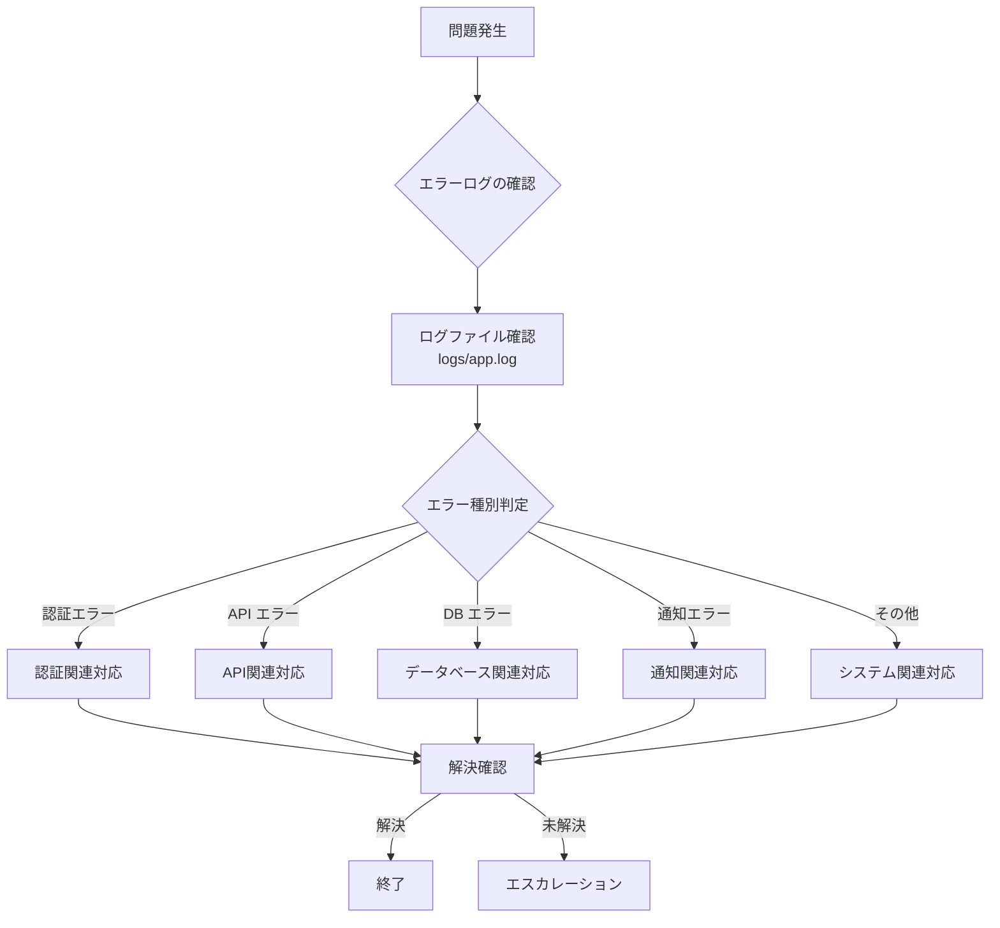

# MangaAnime情報配信システム - トラブルシューティングガイド

## 📋 目次

1. [症状別対応フローチャート](#症状別対応フローチャート)
2. [認証関連の問題](#認証関連の問題)
3. [API関連の問題](#api関連の問題)
4. [データベース関連の問題](#データベース関連の問題)
5. [通知関連の問題](#通知関連の問題)
6. [パフォーマンス関連の問題](#パフォーマンス関連の問題)
7. [システム関連の問題](#システム関連の問題)
8. [ログ分析方法](#ログ分析方法)
9. [予防的メンテナンス](#予防的メンテナンス)

## 症状別対応フローチャート

### 🔄 基本的な対応フロー



### 🚨 緊急度分類

| 緊急度 | 症状 | 対応時間 |
|--------|------|----------|
| **高** | システム完全停止、認証失敗 | 即座 |
| **中** | 一部機能停止、通知失敗 | 1時間以内 |
| **低** | 警告メッセージ、性能低下 | 1日以内 |

## 認証関連の問題

### 🔑 Problem 1: Gmail認証失敗

**症状:**
```
ERROR - Gmail API authentication failed
ERROR - 'Credentials' object has no attribute 'valid'
```

**原因:**
- トークンファイルの破損
- 認証の有効期限切れ
- 権限スコープの不一致

**対応手順:**

#### Step 1: トークンファイル確認
```bash
# トークンファイルの存在・権限確認
ls -la token.json
# 期待値: -rw------- 1 user user サイズ > 0

# トークンファイル内容確認
python3 -c "
import json
try:
    with open('token.json', 'r') as f:
        token = json.load(f)
    print('✅ Token file is valid JSON')
    print('Scopes:', token.get('scopes', 'Not found'))
    print('Expiry:', token.get('expiry', 'Not found'))
except Exception as e:
    print('❌ Token file error:', e)
"
```

#### Step 2: トークン再生成
```bash
# 古いトークン削除
rm token.json

# 新しい認証URL生成
python3 create_token_simple.py

# ブラウザで認証後、コード実行
python3 generate_token.py
```

#### Step 3: 動作確認
```bash
python3 test_notification.py
```

### 🔑 Problem 2: Google Calendar認証失敗

**症状:**
```
ERROR - Google Calendar API has not been used in project before or it is disabled
403 Forbidden: accessNotConfigured
```

**原因:**
- Calendar APIが無効
- OAuth同意画面の設定不足

**対応手順:**

#### Step 1: API有効化確認
1. [Google Cloud Console](https://console.cloud.google.com/) にアクセス
2. 該当プロジェクト選択
3. **APIとサービス** → **ライブラリ**
4. "Google Calendar API" を検索
5. **有効にする** をクリック

#### Step 2: OAuth同意画面確認
```bash
# credentials.json からプロジェクトID確認
grep project_id credentials.json

# OAuth同意画面URL
echo "https://console.cloud.google.com/apis/credentials/consent?project=$(grep -o '"project_id":"[^"]*"' credentials.json | cut -d'"' -f4)"
```

### 🔑 Problem 3: 認証スコープエラー

**症状:**
```
ERROR - insufficient authentication scopes
```

**対応手順:**

#### Step 1: 必要スコープ確認
```python
# config.json 内のスコープ確認
import json
with open('config.json', 'r') as f:
    config = json.load(f)
print("Required scopes:")
for scope in config['google']['scopes']:
    print(f"  - {scope}")
```

#### Step 2: 完全再認証
```bash
# すべての認証情報をリセット
rm token.json

# OAuth同意画面で権限を再確認
python3 create_token_simple.py
```

## API関連の問題

### 🌐 Problem 4: AniList API エラー

**症状:**
```
ERROR - AniList collection failed: HTTP 429
WARNING - Rate limit reached
```

**原因:**
- API レート制限超過（90 requests/minute）
- ネットワーク接続問題

**対応手順:**

#### Step 1: レート制限確認
```bash
# 最近のAPI呼び出しログ確認
grep "AniList\|rate limit" logs/app.log | tail -20

# レート制限設定確認
python3 -c "
import json
with open('config.json', 'r') as f:
    config = json.load(f)
rate_config = config['apis']['anilist']['rate_limit']
print(f'Rate limit: {rate_config[\"requests_per_minute\"]} req/min')
print(f'Retry delay: {rate_config[\"retry_delay_seconds\"]} sec')
"
```

#### Step 2: 手動テスト実行
```bash
# 単発テスト
python3 -c "
import asyncio
from modules.anime_anilist import AniListClient

async def test():
    client = AniListClient()
    try:
        results = await client.get_current_season_anime()
        print(f'✅ API接続成功: {len(results)} 件取得')
    except Exception as e:
        print(f'❌ API接続失敗: {e}')

asyncio.run(test())
"
```

#### Step 3: 設定調整
```json
// config.json のレート制限を緩和
{
  "apis": {
    "anilist": {
      "rate_limit": {
        "requests_per_minute": 60,  // 90 → 60 に削減
        "retry_delay_seconds": 10   // 5 → 10 に増加
      }
    }
  }
}
```

### 🌐 Problem 5: RSS フィード取得失敗

**症状:**
```
WARNING - RSS取得エラー (dアニメストア): HTTPSConnectionPool
ERROR - RSS処理エラー: 'NoneType' object has no attribute 'entries'
```

**対応手順:**

#### Step 1: フィード URL 確認
```bash
# RSS フィード直接確認
curl -I "https://anime.dmkt-sp.jp/animestore/CF/rss/"

# User-Agent 指定でテスト
curl -H "User-Agent: MangaAnimeNotifier/1.0" \
     "https://anime.dmkt-sp.jp/animestore/CF/rss/" | head -20
```

#### Step 2: 設定確認・修正
```python
# RSS設定確認
python3 -c "
import json
with open('config.json', 'r') as f:
    config = json.load(f)
rss_config = config['apis']['rss_feeds']
print('RSS Feeds:')
for feed in rss_config['feeds']:
    print(f'  - {feed[\"name\"]}: {feed[\"url\"]} ({\"enabled\" if feed[\"enabled\"] else \"disabled\"})')
"
```

#### Step 3: 個別フィードテスト
```bash
python3 -c "
import requests
import feedparser

url = 'https://anime.dmkt-sp.jp/animestore/CF/rss/'
headers = {'User-Agent': 'MangaAnimeNotifier/1.0'}

try:
    response = requests.get(url, headers=headers, timeout=20)
    response.raise_for_status()
    feed = feedparser.parse(response.content)
    print(f'✅ RSS解析成功: {len(feed.entries)} エントリ')
except Exception as e:
    print(f'❌ RSS解析失敗: {e}')
"
```

## データベース関連の問題

### 💾 Problem 6: データベース破損

**症状:**
```
ERROR - database disk image is malformed
ERROR - DatabaseManager initialization failed
```

**対応手順:**

#### Step 1: データベース整合性確認
```bash
# SQLite 整合性チェック
sqlite3 db.sqlite3 << EOF
PRAGMA integrity_check;
.quit
EOF
```

#### Step 2: バックアップからの復旧
```bash
# バックアップファイル確認
ls -la *.sqlite3* backups/ 2>/dev/null

# 最新バックアップから復旧
cp db.sqlite3.backup db.sqlite3

# または完全再初期化
rm db.sqlite3
python3 release_notifier.py --dry-run
```

#### Step 3: 予防措置設定
```bash
# 定期バックアップスクリプト作成
cat > backup_db.sh << 'EOF'
#!/bin/bash
DATE=$(date +%Y%m%d_%H%M%S)
cp db.sqlite3 "db.sqlite3.backup.$DATE"
find . -name "db.sqlite3.backup.*" -mtime +7 -delete
EOF

chmod +x backup_db.sh
```

### 💾 Problem 7: データベースロック

**症状:**
```
ERROR - database is locked
ERROR - OperationalError: database is locked
```

**対応手順:**

#### Step 1: ロック状況確認
```bash
# 実行中のプロセス確認
ps aux | grep python3 | grep release_notifier

# データベースファイル確認
ls -la db.sqlite3*
# -wal, -shm ファイルの存在確認
```

#### Step 2: ロック解除
```bash
# プロセス終了（安全な方法）
pkill -f "python3.*release_notifier"

# WALファイル削除（注意: データ損失の可能性）
rm -f db.sqlite3-wal db.sqlite3-shm

# データベース接続テスト
sqlite3 db.sqlite3 << EOF
SELECT COUNT(*) FROM works;
.quit
EOF
```

## 通知関連の問題

### 📧 Problem 8: Gmail通知送信失敗

**症状:**
```
ERROR - Failed to send email: HttpError 400
ERROR - 'raw' field is missing
```

**対応手順:**

#### Step 1: メール形式確認
```python
# テンプレート生成テスト
python3 -c "
from modules.mailer import EmailTemplateGenerator
from modules.config import get_config

config = get_config()
generator = EmailTemplateGenerator(config)

test_releases = [{
    'title': 'テスト作品',
    'number': '1',
    'platform': 'テスト',
    'release_date': '2025-08-09'
}]

try:
    notification = generator.generate_release_notification(test_releases)
    print('✅ メールテンプレート生成成功')
    print(f'Subject: {notification.subject}')
    print(f'Body length: {len(notification.html_body)}')
except Exception as e:
    print(f'❌ テンプレート生成失敗: {e}')
"
```

#### Step 2: Gmail API 直接テスト
```bash
# Gmail API テスト
python3 test_notification.py
```

### 📅 Problem 9: カレンダーイベント作成失敗

**症状:**
```
ERROR - Calendar event creation failed
WARNING - Failed to create event for: 作品名
```

**対応手順:**

#### Step 1: カレンダーアクセス権限確認
```bash
# カレンダーリスト取得テスト
python3 -c "
from modules.calendar_integration import GoogleCalendarManager
from modules.config import get_config

config = get_config()
calendar = GoogleCalendarManager(config)

if calendar.authenticate():
    print('✅ カレンダー認証成功')
    # カレンダー一覧取得のテストコードを追加可能
else:
    print('❌ カレンダー認証失敗')
"
```

#### Step 2: イベント形式確認
```python
# イベントデータ確認
python3 -c "
from modules.calendar_integration import GoogleCalendarManager
from modules.config import get_config

config = get_config()
calendar = GoogleCalendarManager(config)

test_release = {
    'title': 'テスト作品',
    'number': '1',
    'release_date': '2025-08-09',
    'type': 'anime'
}

event_data = calendar._create_event_data(test_release)
print('Event data:', event_data)
"
```

## パフォーマンス関連の問題

### ⚡ Problem 10: 実行時間の異常な増加

**症状:**
```
INFO - 実行時間: 180.5秒  # 通常は15秒程度
```

**対応手順:**

#### Step 1: 処理時間分析
```bash
# 各処理の時間を確認
grep -E "(開始|完了|実行時間)" logs/app.log | tail -20

# 特定処理の詳細確認
grep -A 5 -B 5 "情報収集" logs/app.log | tail -20
```

#### Step 2: リソース使用量確認
```bash
# 実行中のリソース監視
top -p $(pgrep -f release_notifier)

# ディスク I/O 確認
iotop -a -o -p $(pgrep -f release_notifier)
```

#### Step 3: 最適化設定
```json
// config.json でタイムアウト短縮
{
  "apis": {
    "anilist": {
      "timeout_seconds": 15  // 30 → 15
    },
    "rss_feeds": {
      "timeout_seconds": 10  // 20 → 10
    }
  }
}
```

### ⚡ Problem 11: メモリ使用量増加

**症状:**
- システムメモリ不足
- プロセスの強制終了

**対応手順:**

#### Step 1: メモリ使用量確認
```bash
# Python プロセスのメモリ確認
ps -o pid,ppid,cmd,%mem,%cpu --sort=-%mem | grep python3

# システム全体のメモリ確認
free -h
```

#### Step 2: メモリリーク調査
```python
# メモリプロファイリング（開発時）
pip install memory-profiler
python3 -m memory_profiler release_notifier.py --dry-run
```

## システム関連の問題

### 🖥️ Problem 12: cron実行失敗

**症状:**
- 定時実行されない
- cron ログにエラー

**対応手順:**

#### Step 1: cron設定確認
```bash
# crontab設定確認
crontab -l | grep release_notifier

# cron ログ確認
grep release_notifier ./logs/system.log | tail -10
```

#### Step 2: パス・権限確認
```bash
# 実行権限確認
ls -la release_notifier.py

# Python パス確認
which python3

# 仮想環境パス確認
ls -la venv/bin/python3
```

#### Step 3: cron設定修正
```bash
# 完全パス指定のcron設定例
cat > temp_cron << EOF
# MangaAnime情報配信システム（毎朝8:00）
0 8 * * * cd /full/path/to/Manga\&Anime-Info-delivery-system && source venv/bin/activate && python3 release_notifier.py >> logs/cron.log 2>&1
EOF

crontab temp_cron
rm temp_cron
```

## ログ分析方法

### 📊 基本的なログ分析コマンド

#### 実行状況確認
```bash
# 最新実行結果確認
tail -n 100 logs/app.log | grep -E "(開始|完了|エラー|実行時間)"

# 成功率確認（直近10回）
grep "✅ すべての処理が正常に完了" logs/app.log | tail -10

# エラー率確認
grep -c "ERROR" logs/app.log
grep -c "INFO.*実行結果レポート" logs/app.log
```

#### 統計情報抽出
```bash
# データ収集統計
grep "総計.*件" logs/app.log | tail -7

# 処理時間トレンド
grep "実行時間:" logs/app.log | tail -7 | \
awk '{print $1 " " $2 " " $10}' | column -t
```

#### エラーパターン分析
```bash
# エラー種別集計
grep "ERROR" logs/app.log | \
awk -F' - ' '{print $NF}' | sort | uniq -c | sort -nr

# 警告メッセージ集計
grep "WARNING" logs/app.log | \
awk -F' - ' '{print $NF}' | sort | uniq -c | sort -nr
```

### 📈 パフォーマンス分析

#### 処理時間分析
```python
# 処理時間分析スクリプト
import re
from datetime import datetime

def analyze_execution_times():
    times = []
    with open('logs/app.log', 'r') as f:
        for line in f:
            if '実行時間:' in line:
                match = re.search(r'実行時間: ([\d.]+)秒', line)
                if match:
                    times.append(float(match.group(1)))
    
    if times:
        print(f"実行時間統計（最新{len(times)}回）:")
        print(f"  平均: {sum(times)/len(times):.1f}秒")
        print(f"  最小: {min(times):.1f}秒")
        print(f"  最大: {max(times):.1f}秒")
        print(f"  最新: {times[-1]:.1f}秒")

analyze_execution_times()
```

## 予防的メンテナンス

### 🔧 日次チェックリスト

```bash
#!/bin/bash
# daily_check.sh - 毎日の健全性確認

echo "📊 MangaAnime システム日次チェック $(date)"

# 1. 最新実行結果確認
echo "1. 最新実行結果:"
tail -1 logs/app.log | grep "✅ すべての処理が正常に完了" && echo "  ✅ 正常" || echo "  ❌ 異常"

# 2. エラー件数確認
ERROR_COUNT=$(grep -c "ERROR" logs/app.log)
echo "2. エラー件数: $ERROR_COUNT 件"

# 3. データベース件数確認
DB_COUNT=$(sqlite3 db.sqlite3 "SELECT COUNT(*) FROM releases;")
echo "3. データベース: $DB_COUNT 件のリリース"

# 4. ディスク使用量確認
DB_SIZE=$(du -sh db.sqlite3 | cut -f1)
LOG_SIZE=$(du -sh logs/ | cut -f1)
echo "4. ディスク使用量: DB=$DB_SIZE, ログ=$LOG_SIZE"

# 5. 次回実行予定確認
echo "5. 次回cron実行予定:"
crontab -l | grep release_notifier
```

### 🗓️ 週次メンテナンス

```bash
#!/bin/bash
# weekly_maintenance.sh

echo "🔧 週次メンテナンス開始 $(date)"

# ログローテーション
if [ -f logs/app.log ]; then
    gzip logs/app.log.1 2>/dev/null
    cp logs/app.log logs/app.log.1
    > logs/app.log
    echo "✅ ログローテーション完了"
fi

# データベース最適化
sqlite3 db.sqlite3 << EOF
VACUUM;
ANALYZE;
.quit
EOF
echo "✅ データベース最適化完了"

# バックアップ作成
cp db.sqlite3 "db.sqlite3.backup.$(date +%Y%m%d)"
echo "✅ バックアップ作成完了"

echo "🎉 週次メンテナンス完了"
```

---

## 📞 サポート情報

**エスカレーション基準:**
- レベル3エラー（システム停止）
- 24時間以上の継続的な障害
- データ損失の疑い

**必要な情報:**
- エラーログ（logs/app.log）
- 実行環境情報（OS、Python バージョン）
- 設定ファイル（機密情報は除く）
- 実行時のコマンドライン出力

**連絡先:** kensan1969@gmail.com

---

**トラブルシューティングガイド バージョン:** v1.0.0  
**最終更新日:** 2025年8月8日