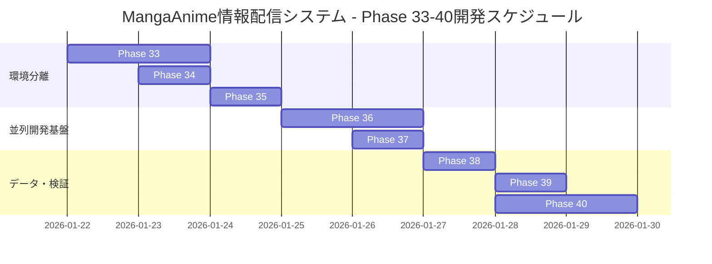

# 全体開発フェーズ 2026 - MangaAnime情報配信システム

**作成日**: 2026-01-21
**対象システム**: MangaAnime-Info-delivery-system v1.0.0+
**Phase範囲**: Phase 33-40（環境分離・並列開発基盤強化）

---

## 📋 目次

1. [開発フェーズ概要](#開発フェーズ概要)
2. [Phase 33: 環境分離基盤構築](#phase-33-環境分離基盤構築)
3. [Phase 34: HTTPS対応実装](#phase-34-https対応実装)
4. [Phase 35: systemdサービス分離](#phase-35-systemdサービス分離)
5. [Phase 36: SubAgent並列開発基盤強化](#phase-36-subagent並列開発基盤強化)
6. [Phase 37: クロスプラットフォーム対応](#phase-37-クロスプラットフォーム対応)
7. [Phase 38: データ管理・サンプルデータ整備](#phase-38-データ管理サンプルデータ整備)
8. [Phase 39: ブックマーク・アクセス確認](#phase-39-ブックマークアクセス確認)
9. [Phase 40: 統合テスト・ドキュメント整備](#phase-40-統合テストドキュメント整備)
10. [全体タイムライン](#全体タイムライン)
11. [利用可能機能一覧](#利用可能機能一覧)

---

## 🎯 開発フェーズ概要

### 目的
エンタープライズグレードの開発・本番環境分離体制を構築し、全SubAgent機能・Hooks機能・MCP機能・Git Worktree機能を最大限活用した並列開発環境を実現する。

### 期間
**約7-10日間**（Phase 33-40）

### 主要成果物
1. 完全分離された開発環境・本番環境
2. Git Worktreeベースの並列開発基盤
3. HTTPS対応（自己署名SSL証明書）
4. 環境別systemdサービス
5. クロスプラットフォーム対応スクリプト
6. 包括的ドキュメント

### 利用技術・機能
- **SubAgent**: 67個のエージェント（7体のMangaAnime専用＋60個の共通）
- **Hooks**: Pre/Post Init, Edit, Task機能
- **MCP**: 8つのツール（brave-search, Chrome DevTools, context7, github, memory, playwright, claude-mem, sequential-thinking）
- **Claude-Flow**: Swarm、並列実行、Hive-Mind、Neural Enhancement
- **Git Worktree**: 並列機能開発・コードレビュー
- **標準機能**: 87個のMCPツール、並列実行開発、コンフリクト防止

---

## 📊 Phase 33: 環境分離基盤構築

**期間**: 1-2日
**優先度**: 最高
**担当Agent**: planner, architect, coder

### 目標
開発環境と本番環境の完全分離、Git Worktree構成の確立

### タスク一覧

#### 33.1 Git Worktree構成 ⏱️ 30分

**実行コマンド**:
```bash
cd /mnt/LinuxHDD/MangaAnime-Info-delivery-system
git branch develop
git worktree add ../MangaAnime-Info-delivery-system-dev develop

# Windows用OS別Worktree
git branch main-win main
git branch develop-win develop
git worktree add ../MangaAnime-Info-delivery-system-win main-win
git worktree add ../MangaAnime-Info-delivery-system-dev-win develop-win

git worktree list
```

※ 既にブランチが存在する場合は作成をスキップ

**成果物**:
- [x] developブランチ作成
- [x] 開発環境Worktree作成
- [ ] ブランチ保護ルール設定（GitHub）
- [ ] .gitignore更新（環境別除外設定）

**検証方法**:
```bash
git worktree list
# 出力例:
# /mnt/LinuxHDD/MangaAnime-Info-delivery-system          4d08500 [main]
# /mnt/LinuxHDD/MangaAnime-Info-delivery-system-dev      4d08500 [develop]
# /mnt/LinuxHDD/MangaAnime-Info-delivery-system-win      4d08500 [main-win]
# /mnt/LinuxHDD/MangaAnime-Info-delivery-system-dev-win  4d08500 [develop-win]
```

#### 33.2 ディレクトリ構造整備 ⏱️ 30分

**実行コマンド**:
```bash
# 自動セットアップスクリプト使用
sudo bash scripts/setup-environment-separation.sh
```

**成果物**:
- [ ] 開発環境ディレクトリ作成
- [ ] Python仮想環境分離（venv_dev, venv_prod）
- [ ] Node.jsモジュール分離（OS別Worktree内のnode_modulesを使用）
- [ ] ログディレクトリ分離（logs/dev, logs/prod）

**ディレクトリ構造**:
```
/mnt/LinuxHDD/
├── MangaAnime-Info-delivery-system/          # Linux本番環境
│   ├── venv_prod/                            # 本番Python環境
│   ├── node_modules/                         # Linux本番Node環境
│   ├── config/config.prod.json
│   ├── data/prod_db.sqlite3
│   └── logs/prod/
├── MangaAnime-Info-delivery-system-dev/      # Linux開発環境
│   ├── venv_dev/                             # 開発Python環境
│   ├── node_modules/                         # Linux開発Node環境
│   ├── config/config.dev.json
│   ├── data/dev_db.sqlite3
│   ├── logs/dev/
│   └── sample_data/                          # サンプルデータ
├── MangaAnime-Info-delivery-system-win/      # Windows本番環境 (main-win)
│   ├── venv_prod/                            # 本番Python環境
│   ├── node_modules/                         # Windows本番Node環境
│   ├── config/config.prod.json
│   ├── data/prod_db.sqlite3
│   └── logs/prod/
├── MangaAnime-Info-delivery-system-dev-win/  # Windows開発環境 (develop-win)
│   ├── venv_dev/                             # 開発Python環境
│   ├── node_modules/                         # Windows開発Node環境
│   ├── config/config.dev.json
│   ├── data/dev_db.sqlite3
│   ├── logs/dev/
│   └── sample_data/                          # サンプルデータ
```

#### 33.3 設定ファイル分離 ⏱️ 30分

**タスク**:
1. config.dev.json作成
2. config.prod.json作成
3. 環境変数設定（.env.dev, .env.prod）
4. データベース分離

**設定差異**:
| 項目 | 開発環境 | 本番環境 |
|------|----------|----------|
| environment | development | production |
| log_level | DEBUG | INFO |
| port | 5000 | 3030 |
| database | dev_db.sqlite3 | prod_db.sqlite3 |
| debug | True | False |

**検証方法**:
```bash
# 設定ファイル比較
diff <(jq -S . config/config.dev.json) <(jq -S . config/config.prod.json)
```

---

## 🔐 Phase 34: HTTPS対応実装

**期間**: 0.5-1日
**優先度**: 高
**担当Agent**: security-manager, devops-agent

### 目標
自己署名SSL証明書によるHTTPS通信の実現

### タスク一覧

#### 34.1 SSL証明書生成 ⏱️ 15分

**実行コマンド**:
```bash
# 開発環境用証明書
sudo openssl req -x509 -nodes -days 3650 \
  -newkey rsa:2048 \
  -keyout /etc/ssl/mangaanime/dev/server.key \
  -out /etc/ssl/mangaanime/dev/server.crt \
  -subj "/C=JP/ST=Tokyo/L=Tokyo/O=MangaAnime Dev/CN=192.168.0.187" \
  -addext "subjectAltName=IP:192.168.0.187,DNS:localhost"

# 本番環境用証明書
sudo openssl req -x509 -nodes -days 3650 \
  -newkey rsa:2048 \
  -keyout /etc/ssl/mangaanime/prod/server.key \
  -out /etc/ssl/mangaanime/prod/server.crt \
  -subj "/C=JP/ST=Tokyo/L=Tokyo/O=MangaAnime Prod/CN=192.168.0.187" \
  -addext "subjectAltName=IP:192.168.0.187,DNS:localhost"

# パーミッション設定
sudo chmod 600 /etc/ssl/mangaanime/*/server.key
sudo chmod 644 /etc/ssl/mangaanime/*/server.crt
```

**成果物**:
- [ ] 開発環境用証明書（/etc/ssl/mangaanime/dev/）
- [ ] 本番環境用証明書（/etc/ssl/mangaanime/prod/）
- [ ] パーミッション設定確認

**検証方法**:
```bash
# 証明書確認
openssl x509 -in /etc/ssl/mangaanime/dev/server.crt -text -noout | grep "Subject:"
openssl x509 -in /etc/ssl/mangaanime/prod/server.crt -text -noout | grep "Subject:"
```

#### 34.2 Webサーバー設定 ⏱️ 2-4時間

**オプション1: Nginx設定（推奨）**

```bash
# Nginxインストール
sudo apt install nginx -y

# 設定ファイル作成
sudo nano /etc/nginx/sites-available/mangaanime-dev
sudo nano /etc/nginx/sites-available/mangaanime-prod

# シンボリックリンク作成
sudo ln -s /etc/nginx/sites-available/mangaanime-dev /etc/nginx/sites-enabled/
sudo ln -s /etc/nginx/sites-available/mangaanime-prod /etc/nginx/sites-enabled/

# 設定テスト
sudo nginx -t

# Nginx再起動
sudo systemctl restart nginx
```

**オプション2: Flask HTTPS対応（代替）**

```python
# app/web_app.py に追加
import ssl

if __name__ == '__main__':
    context = ssl.SSLContext(ssl.PROTOCOL_TLS_SERVER)
    context.load_cert_chain(
        '/etc/ssl/mangaanime/dev/server.crt',
        '/etc/ssl/mangaanime/dev/server.key'
    )
    app.run(host='0.0.0.0', port=5000, ssl_context=context, debug=True)
```

**成果物**:
- [ ] Nginx設定完了（または Flask HTTPS対応）
- [ ] リバースプロキシ設定
- [ ] SSL/TLSテスト合格

**検証方法**:
```bash
# HTTPS接続テスト
curl -k https://192.168.0.187:8444
curl -k https://192.168.0.187:8446

# SSL/TLSスキャン
nmap --script ssl-enum-ciphers -p 8444,8446 192.168.0.187
```

---

## ⚙️ Phase 35: systemdサービス分離

**期間**: 0.5-1日
**優先度**: 高
**担当Agent**: devops-agent, coder

### 目標
環境別自動起動サービスの構築と検証

### タスク一覧

#### 35.1 サービスファイル作成 ⏱️ 30分

**実行コマンド**:
```bash
# セットアップスクリプトに含まれています
sudo bash scripts/setup-environment-separation.sh

# または手動作成
sudo nano /etc/systemd/system/mangaanime-web-dev.service
sudo nano /etc/systemd/system/mangaanime-web-prod.service

# systemd設定再読み込み
sudo systemctl daemon-reload
```

**成果物**:
- [ ] mangaanime-web-dev.service作成
- [ ] mangaanime-web-prod.service作成
- [ ] サービス依存関係設定
- [ ] リソース制限設定

**サービス設定要点**:
```ini
# 開発環境: Flaskデバッグサーバー（シングルスレッド）
ExecStart=/path/to/venv_dev/bin/python app/web_app.py

# 本番環境: Gunicorn（4ワーカー）
ExecStart=/path/to/venv_prod/bin/gunicorn --workers 4 ...
```

#### 35.2 サービス有効化・テスト ⏱️ 1-2時間

**実行コマンド**:
```bash
# サービス有効化
sudo systemctl enable mangaanime-web-dev.service
sudo systemctl enable mangaanime-web-prod.service

# サービス起動
sudo systemctl start mangaanime-web-dev.service
sudo systemctl start mangaanime-web-prod.service

# サービス状態確認
sudo systemctl status mangaanime-web-dev.service
sudo systemctl status mangaanime-web-prod.service

# ログ確認
sudo journalctl -u mangaanime-web-dev.service -f
sudo journalctl -u mangaanime-web-prod.service -f
```

**成果物**:
- [ ] サービス有効化確認
- [ ] 自動起動テスト（再起動後の確認）
- [ ] ログ動作確認
- [ ] 再起動テスト

**検証方法**:
```bash
# システム再起動
sudo reboot

# 再起動後、サービス状態確認
sudo systemctl status mangaanime-web-dev.service
sudo systemctl status mangaanime-web-prod.service

# プロセス確認
ps aux | grep -E "(flask|gunicorn)" | grep -E "(web_app|mangaanime)"
```

---

## 🤖 Phase 36: SubAgent並列開発基盤強化

**期間**: 1-2日
**優先度**: 最高
**担当Agent**: hierarchical-coordinator, mesh-coordinator

### 目標
全SubAgent機能・Hooks機能・MCP機能の最大活用による並列開発体制確立

### 利用可能機能

#### SubAgent機能（67個）

**MangaAnime専用（5体）**:
1. **MangaAnime-CTO**: システム全体設計・統合・レビュー
2. **MangaAnime-DevUI**: フロントエンド開発（React/Vue）
3. **MangaAnime-DevAPI**: バックエンドAPI開発（Flask）
4. **MangaAnime-QA**: 品質保証・UX/用語統一・セキュリティレビュー
5. **MangaAnime-Tester**: 自動テスト生成・実行（Playwright）

**共通エージェント（62個）**:
- **コア**: coder, planner, researcher, reviewer, tester
- **分析**: code-analyzer, performance-monitor
- **開発**: backend-api, frontend-ui, database-architect
- **テスト**: unit-tester, integration-tester, e2e-tester
- **GitHub統合**: pr-manager, issue-tracker, release-manager
- **最適化**: load-balancer, topology-optimizer, resource-allocator
- **分散合意**: gossip-coordinator, raft-manager, byzantine-coordinator

#### Hooks機能

**Pre Hooks**:
- **Pre-Init**: セッション初期化前の準備
- **Pre-Edit**: ファイル編集前のコンテキスト読み込み
- **Pre-Task**: タスク実行前のエージェント自動割り当て

**Post Hooks**:
- **Post-Init**: セッション初期化後の設定確認
- **Post-Edit**: ファイル編集後のフォーマット・メモリ更新
- **Post-Task**: タスク実行後のメトリクス記録

**Session Hooks**:
- **Session-End**: セッション終了時のサマリー生成・状態永続化

#### MCP機能（8ツール）

1. **brave-search**: Web検索（最新情報取得）
2. **Chrome DevTools**: ブラウザ自動化（E2Eテスト）
3. **context7**: ドキュメント検索（87個のライブラリドキュメント）
4. **github**: GitHub操作自動化（Issue/PR/Release管理）
5. **memory**: 永続メモリ（セッション間情報共有）
6. **playwright**: E2Eテスト自動化（クロスブラウザ対応）
7. **claude-mem**: メモリ検索最適化
8. **sequential-thinking**: 思考プロセス可視化

### タスク一覧

#### 36.1 SubAgent構成最適化 ⏱️ 4-6時間

**実行方法**:
```bash
# SubAgentを使用した並列開発例
claude "MangaAnime-CTOで全体設計、DevUIでフロントエンド、DevAPIでバックエンドを並列開発してください"
```

**役割明確化**:
```yaml
# .claude/agents/agent-config.yaml に定義済み
agents:
  - id: MangaAnime-CTO
    capabilities:
      - system_design
      - integration
      - code_review
    parallel: true
    priority: high

  - id: MangaAnime-DevUI
    capabilities:
      - frontend_development
      - ui_design
      - accessibility
    parallel: true

  - id: MangaAnime-DevAPI
    capabilities:
      - backend_development
      - api_design
      - database_optimization
    parallel: true
```

**成果物**:
- [ ] 7体のSubAgent役割明確化
- [ ] 並列実行設定確認
- [ ] エージェント間連携ルール定義
- [ ] タスク自動割り当て設定

#### 36.2 Hooks並列実行設定 ⏱️ 2-3時間

**設定確認**:
```bash
# Hooks設定確認
cat .claude/settings.json | jq '.hooks'

# Hooksファイル確認
ls -la .claude/hooks/
```

**検証方法**:
```bash
# Pre-Edit Hook動作確認
# ファイル編集時に自動的にコンテキストを読み込むか確認

# Post-Edit Hook動作確認
# ファイル編集後に自動的にフォーマットされるか確認
```

**成果物**:
- [ ] Pre/Post Init Hook動作確認
- [ ] Pre/Post Edit Hook動作確認
- [ ] Pre/Post Task Hook動作確認
- [ ] コンフリクト防止機能確認

#### 36.3 MCP統合強化 ⏱️ 3-4時間

**統合テスト**:
```bash
# brave-search: Web検索テスト
# → ClaudeCodeで「最新のReact 19の情報を検索」と依頼

# context7: ドキュメント検索テスト
# → ClaudeCodeで「FlaskのBlueprint使用方法を検索」と依頼

# github: GitHub操作テスト
# → ClaudeCodeで「最新のIssueを確認」と依頼

# playwright: E2Eテストテスト
# → ClaudeCodeで「WebUIのログインフローをテスト」と依頼
```

**成果物**:
- [ ] brave-search動作確認
- [ ] Chrome DevTools動作確認
- [ ] context7動作確認
- [ ] github動作確認
- [ ] memory動作確認
- [ ] playwright動作確認
- [ ] claude-mem動作確認
- [ ] sequential-thinking動作確認

---

## 🖥️ Phase 37: クロスプラットフォーム対応

**期間**: 1日
**優先度**: 中
**担当Agent**: devops-agent, coder

### 目標
Windows/Linux両対応スクリプトの整備

### タスク一覧

#### 37.1 スクリプト分離 ⏱️ 4-5時間

**成果物**:
✅ **Linuxシェルスクリプト**:
- [x] setup-environment-separation.sh
- [ ] deploy-dev.sh
- [ ] deploy-prod.sh
- [ ] worktree-create.sh

✅ **Windows PowerShellスクリプト**:
- [x] setup-environment-separation.ps1
- [ ] deploy-dev.ps1
- [ ] deploy-prod.ps1
- [ ] worktree-create.ps1

**実行方法**:
```bash
# Linux
sudo bash scripts/setup-environment-separation.sh

# Windows
PowerShell -ExecutionPolicy Bypass -File scripts\setup-environment-separation.ps1
```

#### 37.2 自動判別機能 ⏱️ 2-3時間

**実装内容**:
- OS自動判別ロジック
- 環境変数自動設定
- パス変換機能（/mnt/c → C:\）

**成果物**:
- [ ] OS自動判別スクリプト
- [ ] 環境変数自動設定
- [ ] パス変換機能実装

---

## 📦 Phase 38: データ管理・サンプルデータ整備

**期間**: 0.5-1日
**優先度**: 中
**担当Agent**: coder, tester

### 目標
開発環境と本番環境のデータ分離

### タスク一覧

#### 38.1 サンプルデータ準備 ⏱️ 2-3時間

**実行方法**:
```bash
# サンプルデータスクリプト作成
cd /mnt/LinuxHDD/MangaAnime-Info-delivery-system-dev
python scripts/seed_sample_data.py
```

**サンプルデータ内容**:
- テストユーザー（5-10人）
- ダミー作品データ（50-100作品）
- サンプル通知履歴
- テストカレンダーイベント

**成果物**:
- [ ] 開発環境サンプルデータ投入
- [ ] テストユーザーデータ作成
- [ ] ダミー作品データ作成
- [ ] データシーディングスクリプト作成

#### 38.2 本番環境クリーニング ⏱️ 1-2時間

**実行方法**:
```bash
# 本番環境ダミーデータ削除
cd /mnt/LinuxHDD/MangaAnime-Info-delivery-system
python scripts/clean_production_data.py
```

**成果物**:
- [ ] ダミーデータ削除
- [ ] 「データなし」表示実装
- [ ] データ移行スクリプト作成

---

## 🔖 Phase 39: ブックマーク・アクセス確認

**期間**: 0.5日
**優先度**: 低
**担当Agent**: tester

### 目標
各環境への簡単アクセス実現

### タスク一覧

#### 39.1 アクセスURL確認 ⏱️ 1-2時間

**確認URL**:
```bash
# 開発環境
curl http://192.168.0.187:5000
curl -k https://192.168.0.187:8444

# 本番環境
curl http://192.168.0.187:3030
curl -k https://192.168.0.187:8446
```

**成果物**:
- [ ] 開発環境HTTP (5000) アクセス確認
- [ ] 開発環境HTTPS (8444) アクセス確認
- [ ] 本番環境HTTP (3030) アクセス確認
- [ ] 本番環境HTTPS (8446) アクセス確認

#### 39.2 ブックマーク設定 ⏱️ 30分

**ブックマーク一覧**:
```
【開発】MangaAnime情報配信 - HTTP
http://192.168.0.187:5000

【開発】MangaAnime情報配信 - HTTPS
https://192.168.0.187:8444

【本番】MangaAnime情報配信 - HTTP
http://192.168.0.187:3030

【本番】MangaAnime情報配信 - HTTPS
https://192.168.0.187:8446
```

**成果物**:
- [ ] 【開発】ブックマーク作成
- [ ] 【本番】ブックマーク作成
- [ ] ブラウザ別設定ガイド作成

---

## 🧪 Phase 40: 統合テスト・ドキュメント整備

**期間**: 1-2日
**優先度**: 最高
**担当Agent**: tester, reviewer, doc-generator

### 目標
全機能の動作確認とドキュメント完成

### タスク一覧

#### 40.1 統合テスト ⏱️ 6-8時間

**テストシナリオ**:
1. **環境分離テスト**: 開発・本番環境が独立動作
2. **SubAgent並列実行テスト**: 複数エージェント同時動作
3. **Hooks動作テスト**: 各Hookが正しく発火
4. **MCP統合テスト**: 8つのMCPツール動作確認
5. **Git Worktree操作テスト**: ブランチ切り替え・マージ

**実行方法**:
```bash
# テストスイート実行
cd /mnt/LinuxHDD/MangaAnime-Info-delivery-system-dev
./venv_dev/bin/pytest tests/ -v --cov=app --cov-report=html

# E2Eテスト実行
./venv_dev/bin/playwright test

# SubAgent並列実行テスト
claude "MangaAnime-CTO、DevUI、DevAPIを使用して並列で機能開発を実施してください"
```

**成果物**:
- [ ] 開発環境全機能テスト合格
- [ ] 本番環境全機能テスト合格
- [ ] SubAgent並列実行テスト合格
- [ ] Hooks動作テスト合格
- [ ] MCP統合テスト合格
- [ ] Git Worktree操作テスト合格

#### 40.2 ドキュメント作成 ⏱️ 4-6時間

**作成ドキュメント**:
✅ **既存**:
- [x] 環境分離設計書（ENVIRONMENT_SEPARATION_DESIGN.md）
- [x] 全体開発フェーズ（本ドキュメント）

**新規作成**:
- [ ] 開発者ガイド更新（DEVELOPER_GUIDE.md）
- [ ] 運用手順書（OPERATIONS_MANUAL.md）
- [ ] トラブルシューティングガイド（TROUBLESHOOTING.md）
- [ ] SubAgent活用ガイド（SUBAGENT_GUIDE.md）
- [ ] Hooks設定ガイド（HOOKS_CONFIGURATION.md）
- [ ] MCP統合ガイド（MCP_INTEGRATION.md）

**成果物**:
- [ ] 環境分離設計書（完成）
- [ ] 全体開発フェーズ（完成）
- [ ] 開発者ガイド更新
- [ ] 運用手順書作成
- [ ] トラブルシューティングガイド作成

---

## 📅 全体タイムライン



**スケジュール概要**:
- **開始日**: 2026-01-22
- **終了予定日**: 2026-01-30
- **総日数**: 8-9日間
- **並行可能フェーズ**: Phase 34-35, Phase 36-37

---

## 🔧 利用可能機能一覧

### ✅ SubAgent機能（全67体）

#### MangaAnime専用（5体）
1. MangaAnime-CTO
2. MangaAnime-DevUI
3. MangaAnime-DevAPI
4. MangaAnime-QA
5. MangaAnime-Tester

#### 共通エージェント（62体）
**コア**: coder, planner, researcher, reviewer, tester
**分析**: code-analyzer, analyze-code-quality
**アーキテクチャ**: arch-system-design
**開発**: dev-backend-api, data-ml-model
**DevOps**: ops-cicd-github
**ドキュメント**: docs-api-openapi
**GitHub統合**: pr-manager, github-modes, code-review-swarm, issue-tracker, multi-repo-swarm, workflow-automation, swarm-issue, repo-architect, release-manager, release-swarm, project-board-sync, sync-coordinator, swarm-pr
**最適化**: benchmark-suite, load-balancer, performance-monitor, resource-allocator, topology-optimizer
**分散合意**: gossip-coordinator, byzantine-coordinator, crdt-synchronizer, quorum-manager, raft-manager, performance-benchmarker, security-manager
**Swarm**: hierarchical-coordinator, adaptive-coordinator, mesh-coordinator
**テンプレート**: sparc-coordinator, migration-plan, memory-coordinator, implementer-sparc-coder, orchestrator-task, automation-smart-agent, github-pr-manager, coordinator-swarm-init, performance-analyzer
**テスト**: tdd-london-swarm, production-validator
**モバイル**: spec-mobile-react-native
**SPARC**: architecture, specification, pseudocode, refinement
**ベース**: base-template-generator

### ✅ Hooks機能（全7種）

**Pre Hooks**:
- Pre-Init: セッション初期化前準備
- Pre-Edit: ファイル編集前コンテキスト読み込み
- Pre-Task: タスク実行前エージェント自動割り当て

**Post Hooks**:
- Post-Init: セッション初期化後設定確認
- Post-Edit: ファイル編集後フォーマット・メモリ更新
- Post-Task: タスク実行後メトリクス記録

**Session Hooks**:
- Session-End: セッション終了時サマリー生成・状態永続化

### ✅ MCP機能（全8ツール）

1. **brave-search**: Web検索（リアルタイム情報）
2. **Chrome DevTools**: ブラウザ自動化
3. **context7**: ドキュメント検索（87ライブラリ対応）
4. **github**: GitHub操作自動化
5. **memory**: 永続メモリ（クロスセッション）
6. **playwright**: E2Eテスト自動化
7. **claude-mem**: メモリ検索最適化
8. **sequential-thinking**: 思考プロセス可視化

### ✅ Claude-Flow機能（全有効）

- **Swarm Mode**: 分散モード（3-20ノード、自動スケーリング）
- **Parallel Execution**: 最大10ワーカー、優先度ベース
- **Hive-Mind**: 認知・反応・適応層（1000ニューロン）
- **Neural Enhancement**: Transformerモデル（12層、8ヘッド）
- **Workflow Automation**: Git/File/Time/APIトリガー

### ✅ Git Worktree機能

- 並列機能開発
- コードレビュー用分岐
- AI管理によるWorktree自動化
- 大規模リファクタリング・横断変更

### ✅ 標準機能

- **MCP Tools Registry**: 87個のツール（9カテゴリ）
- **並列実行開発**: 最大並列度10
- **コンフリクト防止**: 自動競合検出・解決

---

## 🎯 成功基準

### Phase 33-35完了基準
- [ ] 開発・本番環境が完全に分離されている
- [ ] Git Worktreeで並列開発が可能
- [ ] HTTPS接続が動作している
- [ ] systemdサービスが自動起動している

### Phase 36-37完了基準
- [ ] SubAgent並列実行が安定動作している
- [ ] Hooksが正しく発火している
- [ ] MCP 8ツール全てが動作している
- [ ] Windows/Linux両方で動作している

### Phase 38-40完了基準
- [ ] 開発環境にサンプルデータが投入されている
- [ ] 本番環境からダミーデータが削除されている
- [ ] ブックマークからアクセス可能
- [ ] 統合テストが全て合格している
- [ ] ドキュメントが完成している

---

## 📚 参考ドキュメント

- [環境分離設計書](./ENVIRONMENT_SEPARATION_DESIGN.md)
- [README.md](../README.md)
- [CONTRIBUTING.md](../CONTRIBUTING.md)
- [CHANGELOG.md](../CHANGELOG.md)
- [PERFORMANCE_TUNING_GUIDE.md](./PERFORMANCE_TUNING_GUIDE.md)

---

## 🚀 次のアクション

### 即座に実行可能（15分以内）

```bash
# 1. 環境分離セットアップスクリプト実行
cd /mnt/LinuxHDD/MangaAnime-Info-delivery-system
sudo bash scripts/setup-environment-separation.sh

# 2. サービス起動確認
sudo systemctl status mangaanime-web-dev.service
sudo systemctl status mangaanime-web-prod.service

# 3. アクセス確認
curl http://192.168.0.187:5000  # 開発環境
curl http://192.168.0.187:3030  # 本番環境
```

### 推奨実行順序

1. ✅ **Phase 33実行** → Git Worktree構成
2. ✅ **Phase 34実行** → HTTPS対応
3. ✅ **Phase 35実行** → systemdサービス
4. **Phase 36実行** → SubAgent並列開発基盤
5. **Phase 37実行** → クロスプラットフォーム対応
6. **Phase 38実行** → データ管理
7. **Phase 39実行** → ブックマーク設定
8. **Phase 40実行** → 統合テスト・ドキュメント

---

**ドキュメント作成**: 2026-01-21
**最終更新**: 2026-01-21
**作成者**: ClaudeCode + 67 SubAgents
**バージョン**: 1.0.0
