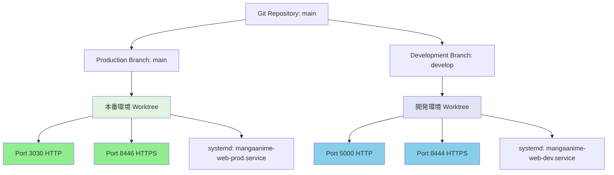
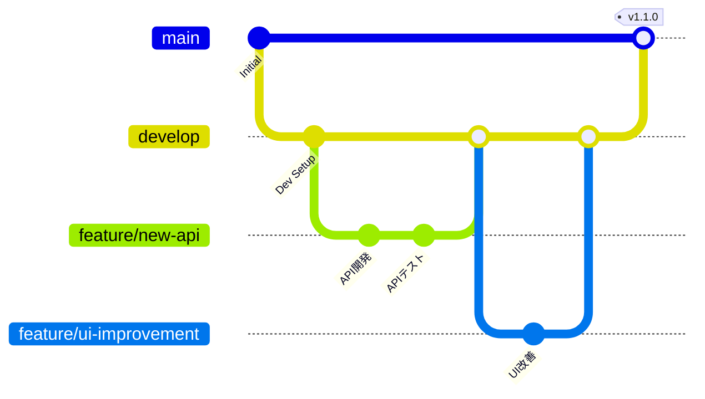

# 環境分離設計書 - MangaAnime情報配信システム

**作成日**: 2026-01-21
**対象システム**: MangaAnime-Info-delivery-system v1.0.0
**プラットフォーム**: Linux (Ubuntu) ネイティブ + Windows版ClaudeCode対応

---

## 📋 目次

1. [現状分析](#現状分析)
2. [環境分離設計](#環境分離設計)
3. [ポート割り当て](#ポート割り当て)
4. [Git Worktree構成](#git-worktree構成)
5. [HTTPS設定](#https設定)
6. [systemdサービス分離](#systemdサービス分離)
7. [全体開発フェーズ](#全体開発フェーズ)
8. [実装チェックリスト](#実装チェックリスト)

---

## 🔍 現状分析

### 稼働状況
- **本番環境**: ポート3030で稼働中（Jan14から161時間51分稼働）
- **IPアドレス**: 192.168.0.187
- **Flaskプロセス**: PID 2118886 (`app/web_app.py`)
- **systemdサービス**: `mangaanime-web.service` 有効

### 機能状況
✅ **SubAgent機能**: 67個のエージェント定義（全7体構成）
- MangaAnime専用: CTO, DevUI, DevAPI, QA, Tester
- 共通エージェント: 62個（分析、開発、テスト、最適化、GitHub統合など）

✅ **Hooks機能**: 完全設定済み
- Pre/Post Init
- Pre/Post Edit
- Pre/Post Task
- Session End

✅ **MCP機能**: 8つのMCPツール利用可能
1. brave-search (Web検索)
2. Chrome DevTools (ブラウザ自動化)
3. context7 (ドキュメント検索)
4. github (GitHub統合)
5. memory (永続メモリ)
6. playwright (E2Eテスト)
7. plugin:claude-mem:mem-search (メモリ検索)
8. sequential-thinking (思考プロセス)

✅ **Claude-Flow機能**: 完全有効化
- Swarm Mode: 分散モード（3-20ノード）
- Parallel Execution: 最大10ワーカー
- Hive-Mind: 認知・反応・適応層
- Neural Enhancement: Transformerモデル
- Workflow Automation: Git/File/Time/APIトリガー

✅ **標準機能**
- MCP Tools Registry: 87個のツール（9カテゴリ）
- 並列実行開発機能
- コンフリクト防止機能

### 使用中ポート
```
22 (SSH), 53 (DNS), 80 (HTTP), 139 (SMB), 443 (HTTPS), 445 (SMB)
3000, 3030 ✓, 4000, 5050, 5100, 5173, 5174, 5432 (PostgreSQL)
6379 (Redis), 8000 ✓, 8001, 8443 ✓, 8445 ✓, 9090, 37777, 44407
```

### 空きポート候補
- **HTTP**: 5000, 5001, 5002, 5555, 6000, 7000
- **HTTPS**: 8444, 8446, 9443

※ 8443/8445 は他サービスで使用中のため、本システムは 8444/8446 を採用

---

## 🏗️ 環境分離設計

### 設計方針



### 環境比較表

| 項目 | 開発環境 | 本番環境 |
|------|----------|----------|
| **Git Branch** | develop | main |
| **Worktree Path** | `/mnt/LinuxHDD/MangaAnime-Info-delivery-system-dev` | `/mnt/LinuxHDD/MangaAnime-Info-delivery-system` |
| **HTTP Port** | 5000 | 3030 |
| **HTTPS Port** | 8444 | 8446 |
| **URL (HTTP)** | http://192.168.0.187:5000 | http://192.168.0.187:3030 |
| **URL (HTTPS)** | https://192.168.0.187:8444 | https://192.168.0.187:8446 |
| **ブックマーク** | 【開発】MangaAnime情報配信 | 【本番】MangaAnime情報配信 |
| **systemd Service** | mangaanime-web-dev.service | mangaanime-web-prod.service |
| **Config File** | config/config.dev.json | config/config.prod.json |
| **Database** | data/dev_db.sqlite3 | data/prod_db.sqlite3 |
| **Logs** | logs/dev/ | logs/prod/ |
| **Python venv** | venv_dev/ | venv_prod/ |
| **Node modules** | node_modules/ (Linux開発Worktree内) | node_modules/ (Linux本番Worktree内) |
| **サンプルデータ** | 保持（多数） | 削除（ダミーなし） |
| **デバッグモード** | ON (DEBUG=True) | OFF (DEBUG=False) |
| **エラー表示** | 詳細表示 | 最小表示 |
| **Auto Reload** | 有効 | 無効 |

---

## 🔌 ポート割り当て

### ポート使用計画

```
┌─────────────────────────────────────────────────────────┐
│ MangaAnime情報配信システム - ポート構成                    │
├─────────────────────────────────────────────────────────┤
│                                                         │
│ 【開発環境】                                             │
│   HTTP  : 5000  ← Flask開発サーバー                      │
│   HTTPS : 8444  ← Nginx/自己署名SSL                      │
│                                                         │
│ 【本番環境】                                             │
│   HTTP  : 3030  ← Flask本番サーバー（Gunicorn）           │
│   HTTPS : 8446  ← Nginx/自己署名SSL                      │
│                                                         │
│ ※ ポート番号は開発途中で変更しない（固定）                  │
│ ※ 他プロジェクトとの重複なし確認済み                       │
└─────────────────────────────────────────────────────────┘
```

### ファイアウォール設定（必要に応じて）

```bash
# 開発環境ポート開放
sudo ufw allow 5000/tcp comment "MangaAnime Dev HTTP"
sudo ufw allow 8444/tcp comment "MangaAnime Dev HTTPS"

# 本番環境ポート開放（既存）
sudo ufw allow 3030/tcp comment "MangaAnime Prod HTTP"
sudo ufw allow 8446/tcp comment "MangaAnime Prod HTTPS"
```

---

## 🌳 Git Worktree構成

### Worktree設計

```
/mnt/LinuxHDD/
├── MangaAnime-Info-delivery-system/          # Linux本番環境 (main)
│   ├── .git/                                 # Git管理ディレクトリ
│   ├── venv_prod/                            # 本番用Python仮想環境
│   ├── node_modules/                         # Linux本番用Nodeモジュール
│   ├── config/config.prod.json               # 本番設定
│   ├── data/prod_db.sqlite3                  # 本番DB
│   └── logs/prod/                            # 本番ログ
│
├── MangaAnime-Info-delivery-system-dev/      # Linux開発環境 (develop)
│   ├── venv_dev/                             # 開発用Python仮想環境
│   ├── node_modules/                         # Linux開発用Nodeモジュール
│   ├── config/config.dev.json                # 開発設定
│   ├── data/dev_db.sqlite3                   # 開発DB
│   ├── logs/dev/                             # 開発ログ
│   └── sample_data/                          # サンプルデータ（多数保持）
│
├── MangaAnime-Info-delivery-system-win/      # Windows本番環境 (main-win)
│   ├── venv_prod/                            # 本番用Python仮想環境
│   ├── node_modules/                         # Windows本番用Nodeモジュール
│   ├── config/config.prod.json               # 本番設定
│   ├── data/prod_db.sqlite3                  # 本番DB
│   └── logs/prod/                            # 本番ログ
│
├── MangaAnime-Info-delivery-system-dev-win/  # Windows開発環境 (develop-win)
│   ├── venv_dev/                             # 開発用Python仮想環境
│   ├── node_modules/                         # Windows開発用Nodeモジュール
│   ├── config/config.dev.json                # 開発設定
│   ├── data/dev_db.sqlite3                   # 開発DB
│   ├── logs/dev/                             # 開発ログ
│   └── sample_data/                          # サンプルデータ（多数保持）
│
└── MangaAnime-Info-delivery-system-feature-*/ # 機能開発用 (feature/*)
    └── （機能別に作成）
```

### Worktree管理コマンド

```bash
# 開発環境Worktreeを作成
cd /mnt/LinuxHDD/MangaAnime-Info-delivery-system
git worktree add ../MangaAnime-Info-delivery-system-dev develop

# Windows用Worktreeを作成（OS別）
git branch main-win main
git branch develop-win develop
git worktree add ../MangaAnime-Info-delivery-system-win main-win
git worktree add ../MangaAnime-Info-delivery-system-dev-win develop-win

# 既にブランチが存在する場合は作成をスキップ

# 機能開発用Worktreeを作成
git worktree add ../MangaAnime-Info-delivery-system-feature-calendar feature/calendar-enhancement

# Worktree一覧表示
git worktree list

# Worktree削除
git worktree remove ../MangaAnime-Info-delivery-system-feature-calendar
```

※ Node.jsモジュールは各OSのWorktree内で `npm install` を実行して分離

### ブランチ戦略（Git Flow）



**ブランチ運用ルール:**
1. **main**: 本番環境専用（リリースのみ）
2. **develop**: 開発環境用（開発作業の統合）
3. **feature/\***: 機能開発用（個別機能ごとに作成）
4. **hotfix/\***: 緊急修正用（mainから分岐）
5. **release/\***: リリース準備用（developから分岐）
6. **main-win**: Windows用OS別Worktree専用（mainの追随のみ）
7. **develop-win**: Windows用OS別Worktree専用（developの追随のみ）

※ main/develop への反映はLinux側で実施し、Windows側は追随運用

---

## 🔐 HTTPS設定

### 自己署名SSL証明書生成

```bash
# SSL証明書ディレクトリ作成
sudo mkdir -p /etc/ssl/mangaanime/{dev,prod}

# 開発環境用証明書生成（10年有効）
sudo openssl req -x509 -nodes -days 3650 \
  -newkey rsa:2048 \
  -keyout /etc/ssl/mangaanime/dev/server.key \
  -out /etc/ssl/mangaanime/dev/server.crt \
  -subj "/C=JP/ST=Tokyo/L=Tokyo/O=MangaAnime Dev/CN=192.168.0.187" \
  -addext "subjectAltName=IP:192.168.0.187,DNS:localhost"

# 本番環境用証明書生成（10年有効）
sudo openssl req -x509 -nodes -days 3650 \
  -newkey rsa:2048 \
  -keyout /etc/ssl/mangaanime/prod/server.key \
  -out /etc/ssl/mangaanime/prod/server.crt \
  -subj "/C=JP/ST=Tokyo/L=Tokyo/O=MangaAnime Prod/CN=192.168.0.187" \
  -addext "subjectAltName=IP:192.168.0.187,DNS:localhost"

# パーミッション設定
sudo chmod 600 /etc/ssl/mangaanime/*/server.key
sudo chmod 644 /etc/ssl/mangaanime/*/server.crt
```

### Nginx設定（推奨）

```nginx
# /etc/nginx/sites-available/mangaanime-dev
server {
    listen 8444 ssl http2;
    server_name 192.168.0.187;

    ssl_certificate /etc/ssl/mangaanime/dev/server.crt;
    ssl_certificate_key /etc/ssl/mangaanime/dev/server.key;

    ssl_protocols TLSv1.2 TLSv1.3;
    ssl_ciphers HIGH:!aNULL:!MD5;

    location / {
        proxy_pass http://127.0.0.1:5000;
        proxy_set_header Host $host;
        proxy_set_header X-Real-IP $remote_addr;
        proxy_set_header X-Forwarded-For $proxy_add_x_forwarded_for;
        proxy_set_header X-Forwarded-Proto $scheme;
    }
}

# /etc/nginx/sites-available/mangaanime-prod
server {
    listen 8446 ssl http2;
    server_name 192.168.0.187;

    ssl_certificate /etc/ssl/mangaanime/prod/server.crt;
    ssl_certificate_key /etc/ssl/mangaanime/prod/server.key;

    ssl_protocols TLSv1.2 TLSv1.3;
    ssl_ciphers HIGH:!aNULL:!MD5;

    location / {
        proxy_pass http://127.0.0.1:3030;
        proxy_set_header Host $host;
        proxy_set_header X-Real-IP $remote_addr;
        proxy_set_header X-Forwarded-For $proxy_add_x_forwarded_for;
        proxy_set_header X-Forwarded-Proto $scheme;
    }
}
```

### Flask HTTPS対応（開発環境）

```python
# app/web_app_dev.py
from flask import Flask
import ssl

app = Flask(__name__)

if __name__ == '__main__':
    context = ssl.SSLContext(ssl.PROTOCOL_TLS_SERVER)
    context.load_cert_chain(
        '/etc/ssl/mangaanime/dev/server.crt',
        '/etc/ssl/mangaanime/dev/server.key'
    )

    app.run(
        host='0.0.0.0',
        port=5000,
        ssl_context=context,
        debug=True
    )
```

---

## ⚙️ systemdサービス分離

### 開発環境サービス

```ini
# /etc/systemd/system/mangaanime-web-dev.service
[Unit]
Description=MangaAnime Information Delivery System - Development Environment
After=network.target postgresql.service redis.service
Wants=postgresql.service redis.service

[Service]
Type=simple
User=kensan
Group=kensan
WorkingDirectory=/mnt/LinuxHDD/MangaAnime-Info-delivery-system-dev

# 環境変数
Environment="FLASK_ENV=development"
Environment="FLASK_DEBUG=1"
Environment="CONFIG_FILE=config/config.dev.json"
Environment="DATABASE_PATH=data/dev_db.sqlite3"
Environment="LOG_PATH=logs/dev/app.log"
Environment="PORT=5000"

# Python仮想環境
Environment="PATH=/mnt/LinuxHDD/MangaAnime-Info-delivery-system-dev/venv_dev/bin:/usr/local/bin:/usr/bin:/bin"

# 実行コマンド
ExecStart=/mnt/LinuxHDD/MangaAnime-Info-delivery-system-dev/venv_dev/bin/python \
    /mnt/LinuxHDD/MangaAnime-Info-delivery-system-dev/app/web_app.py

# 再起動設定
Restart=always
RestartSec=10
StartLimitInterval=200
StartLimitBurst=5

# ログ設定
StandardOutput=append:/mnt/LinuxHDD/MangaAnime-Info-delivery-system-dev/logs/dev/systemd.log
StandardError=append:/mnt/LinuxHDD/MangaAnime-Info-delivery-system-dev/logs/dev/systemd_error.log

# セキュリティ設定（開発環境は緩め）
NoNewPrivileges=true
PrivateTmp=true

# リソース制限
LimitNOFILE=65536
MemoryLimit=2G
CPUQuota=100%

[Install]
WantedBy=multi-user.target
```

### 本番環境サービス

```ini
# /etc/systemd/system/mangaanime-web-prod.service
[Unit]
Description=MangaAnime Information Delivery System - Production Environment
After=network.target postgresql.service redis.service
Wants=postgresql.service redis.service

[Service]
Type=simple
User=kensan
Group=kensan
WorkingDirectory=/mnt/LinuxHDD/MangaAnime-Info-delivery-system

# 環境変数
Environment="FLASK_ENV=production"
Environment="FLASK_DEBUG=0"
Environment="CONFIG_FILE=config/config.prod.json"
Environment="DATABASE_PATH=data/prod_db.sqlite3"
Environment="LOG_PATH=logs/prod/app.log"
Environment="PORT=3030"

# Python仮想環境
Environment="PATH=/mnt/LinuxHDD/MangaAnime-Info-delivery-system/venv_prod/bin:/usr/local/bin:/usr/bin:/bin"

# 実行コマンド（Gunicorn使用）
ExecStart=/mnt/LinuxHDD/MangaAnime-Info-delivery-system/venv_prod/bin/gunicorn \
    --bind 0.0.0.0:3030 \
    --workers 4 \
    --worker-class sync \
    --timeout 120 \
    --keep-alive 5 \
    --max-requests 1000 \
    --max-requests-jitter 50 \
    --access-logfile /mnt/LinuxHDD/MangaAnime-Info-delivery-system/logs/prod/gunicorn_access.log \
    --error-logfile /mnt/LinuxHDD/MangaAnime-Info-delivery-system/logs/prod/gunicorn_error.log \
    --log-level info \
    app.web_app:app

# 再起動設定
Restart=always
RestartSec=10
StartLimitInterval=200
StartLimitBurst=5

# ログ設定
StandardOutput=append:/mnt/LinuxHDD/MangaAnime-Info-delivery-system/logs/prod/systemd.log
StandardError=append:/mnt/LinuxHDD/MangaAnime-Info-delivery-system/logs/prod/systemd_error.log

# セキュリティ設定（本番環境は厳しめ）
NoNewPrivileges=true
PrivateTmp=true
ProtectSystem=strict
ProtectHome=true
ReadWritePaths=/mnt/LinuxHDD/MangaAnime-Info-delivery-system/data /mnt/LinuxHDD/MangaAnime-Info-delivery-system/logs

# リソース制限
LimitNOFILE=65536
MemoryLimit=4G
CPUQuota=200%

[Install]
WantedBy=multi-user.target
```

### サービス管理コマンド

```bash
# サービスファイル再読み込み
sudo systemctl daemon-reload

# サービス有効化
sudo systemctl enable mangaanime-web-dev.service
sudo systemctl enable mangaanime-web-prod.service

# サービス起動
sudo systemctl start mangaanime-web-dev.service
sudo systemctl start mangaanime-web-prod.service

# サービス状態確認
sudo systemctl status mangaanime-web-dev.service
sudo systemctl status mangaanime-web-prod.service

# ログ確認
sudo journalctl -u mangaanime-web-dev.service -f
sudo journalctl -u mangaanime-web-prod.service -f

# サービス再起動
sudo systemctl restart mangaanime-web-dev.service
sudo systemctl restart mangaanime-web-prod.service

# サービス停止
sudo systemctl stop mangaanime-web-dev.service
sudo systemctl stop mangaanime-web-prod.service
```

---

## 📊 全体開発フェーズ

### Phase 33: 環境分離基盤構築（1-2日）

**目標**: 開発環境と本番環境の完全分離

#### タスク33.1: Git Worktree構成
- [ ] developブランチ作成
- [ ] 開発環境Worktree作成
- [ ] ブランチ保護ルール設定（GitHub）
- [ ] .gitignore更新（環境別除外設定）

#### タスク33.2: ディレクトリ構造整備
- [ ] 開発環境ディレクトリ作成
- [ ] Python仮想環境分離（venv_dev, venv_prod）
- [ ] Node.jsモジュール分離（OS別Worktree内のnode_modulesを使用）
- [ ] ログディレクトリ分離

#### タスク33.3: 設定ファイル分離
- [ ] config.dev.json作成
- [ ] config.prod.json作成
- [ ] 環境変数設定（.env.dev, .env.prod）
- [ ] データベース分離

### Phase 34: HTTPS対応実装（0.5-1日）

**目標**: 自己署名SSL証明書によるHTTPS通信実現

#### タスク34.1: SSL証明書生成
- [ ] 開発環境用証明書生成
- [ ] 本番環境用証明書生成
- [ ] パーミッション設定
- [ ] 証明書検証

#### タスク34.2: Webサーバー設定
- [ ] Nginx設定（推奨）
- [ ] Flask HTTPS対応（代替）
- [ ] リバースプロキシ設定
- [ ] SSL/TLSテスト

### Phase 35: systemdサービス分離（0.5-1日）

**目標**: 環境別自動起動サービス構築

#### タスク35.1: サービスファイル作成
- [ ] mangaanime-web-dev.service作成
- [ ] mangaanime-web-prod.service作成
- [ ] サービス依存関係設定
- [ ] リソース制限設定

#### タスク35.2: サービス有効化・テスト
- [ ] サービス有効化
- [ ] 自動起動テスト
- [ ] ログ確認
- [ ] 再起動テスト

### Phase 36: SubAgent並列開発基盤強化（1-2日）

**目標**: 全SubAgent機能・Hooks機能・MCP機能の最大活用

#### タスク36.1: SubAgent構成最適化
- [ ] 7体のSubAgent役割明確化
  - MangaAnime-CTO: システム全体設計・統合
  - MangaAnime-DevUI: フロントエンド開発
  - MangaAnime-DevAPI: バックエンドAPI開発
  - MangaAnime-QA: 品質保証・テスト
  - MangaAnime-Tester: 自動テスト実行
  - code-analyzer: コード分析
  - doc-generator: ドキュメント生成

#### タスク36.2: Hooks並列実行設定
- [ ] Pre/Post Init Hook設定
- [ ] Pre/Post Edit Hook設定
- [ ] Pre/Post Task Hook設定
- [ ] コンフリクト防止機能確認

#### タスク36.3: MCP統合強化
- [ ] brave-search: Web検索機能統合
- [ ] Chrome DevTools: ブラウザ自動テスト統合
- [ ] context7: ドキュメント検索統合
- [ ] github: GitHub操作自動化
- [ ] memory: 永続メモリ活用
- [ ] playwright: E2Eテスト自動化
- [ ] claude-mem: メモリ検索最適化
- [ ] sequential-thinking: 思考プロセス可視化

### Phase 37: クロスプラットフォーム対応（1日）

**目標**: Windows/Linux両対応スクリプト整備

#### タスク37.1: スクリプト分離
- [ ] シェルスクリプト作成（Linux用）
  - setup-dev.sh
  - setup-prod.sh
  - deploy-dev.sh
  - deploy-prod.sh
- [ ] PowerShellスクリプト作成（Windows用）
  - setup-dev.ps1
  - setup-prod.ps1
  - deploy-dev.ps1
  - deploy-prod.ps1

#### タスク37.2: 自動判別機能
- [ ] OS自動判別ロジック実装
- [ ] 環境変数自動設定
- [ ] パス変換機能実装

### Phase 38: データ管理・サンプルデータ整備（0.5-1日）

**目標**: 開発環境と本番環境のデータ分離

#### タスク38.1: サンプルデータ準備
- [ ] 開発環境用サンプルデータ作成
- [ ] テストユーザーデータ作成
- [ ] ダミー作品データ作成
- [ ] データシーディングスクリプト作成

#### タスク38.2: 本番環境クリーニング
- [ ] ダミーデータ削除
- [ ] 「データなし」表示実装
- [ ] データ移行スクリプト作成

### Phase 39: ブックマーク・アクセス確認（0.5日）

**目標**: 各環境への簡単アクセス実現

#### タスク39.1: アクセスURL確認
- [ ] 開発環境URL動作確認
  - http://192.168.0.187:5000
  - https://192.168.0.187:8444
- [ ] 本番環境URL動作確認
  - http://192.168.0.187:3030
  - https://192.168.0.187:8446

#### タスク39.2: ブックマーク設定
- [ ] 【開発】MangaAnime情報配信 - ブックマーク作成
- [ ] 【本番】MangaAnime情報配信 - ブックマーク作成
- [ ] ブラウザ別設定ガイド作成

### Phase 40: 統合テスト・ドキュメント整備（1-2日）

**目標**: 全機能の動作確認とドキュメント完成

#### タスク40.1: 統合テスト
- [ ] 開発環境全機能テスト
- [ ] 本番環境全機能テスト
- [ ] SubAgent並列実行テスト
- [ ] Hooks動作テスト
- [ ] MCP統合テスト
- [ ] Git Worktree操作テスト

#### タスク40.2: ドキュメント作成
- [ ] 環境分離設計書（本ドキュメント）
- [ ] 開発者ガイド更新
- [ ] 運用手順書作成
- [ ] トラブルシューティングガイド作成

---

## ✅ 実装チェックリスト

### 基盤構築

- [ ] **Git Worktree構成完了**
  - [ ] developブランチ作成
  - [ ] 開発環境Worktree作成
  - [ ] ブランチ戦略ドキュメント作成

- [ ] **ディレクトリ構造整備完了**
  - [ ] Python仮想環境分離（venv_dev, venv_prod）
  - [ ] Node.jsモジュール分離（OS別Worktree内のnode_modulesを使用）
  - [ ] ログディレクトリ分離（logs/dev, logs/prod）
  - [ ] データベース分離（dev_db.sqlite3, prod_db.sqlite3）

- [ ] **設定ファイル分離完了**
  - [ ] config.dev.json作成
  - [ ] config.prod.json作成
  - [ ] .env.dev作成
  - [ ] .env.prod作成

### HTTPS対応

- [ ] **SSL証明書生成完了**
  - [ ] 開発環境用証明書（/etc/ssl/mangaanime/dev/）
  - [ ] 本番環境用証明書（/etc/ssl/mangaanime/prod/）
  - [ ] パーミッション設定確認

- [ ] **Webサーバー設定完了**
  - [ ] Nginx設定完了（または）
  - [ ] Flask HTTPS対応完了
  - [ ] SSL/TLSテスト合格

### systemdサービス

- [ ] **サービスファイル作成完了**
  - [ ] mangaanime-web-dev.service作成
  - [ ] mangaanime-web-prod.service作成
  - [ ] サービス有効化確認

- [ ] **自動起動テスト完了**
  - [ ] 開発環境サービス起動確認
  - [ ] 本番環境サービス起動確認
  - [ ] システム再起動後の自動起動確認

### SubAgent・Hooks・MCP

- [ ] **SubAgent機能確認**
  - [ ] 7体のSubAgent動作確認
  - [ ] 並列実行機能確認
  - [ ] 役割分担明確化

- [ ] **Hooks機能確認**
  - [ ] Pre/Post Init Hook動作確認
  - [ ] Pre/Post Edit Hook動作確認
  - [ ] Pre/Post Task Hook動作確認
  - [ ] コンフリクト防止機能確認

- [ ] **MCP機能確認**
  - [ ] brave-search動作確認
  - [ ] Chrome DevTools動作確認
  - [ ] context7動作確認
  - [ ] github動作確認
  - [ ] memory動作確認
  - [ ] playwright動作確認
  - [ ] claude-mem動作確認
  - [ ] sequential-thinking動作確認

### クロスプラットフォーム

- [ ] **スクリプト作成完了**
  - [ ] Linuxシェルスクリプト（4ファイル）
  - [ ] Windows PowerShellスクリプト（4ファイル）
  - [ ] OS自動判別機能実装

### データ管理

- [ ] **サンプルデータ準備完了**
  - [ ] 開発環境サンプルデータ投入
  - [ ] テストユーザーデータ作成
  - [ ] データシーディングスクリプト作成

- [ ] **本番環境クリーニング完了**
  - [ ] ダミーデータ削除
  - [ ] 「データなし」表示実装

### アクセス確認

- [ ] **URL動作確認完了**
  - [ ] 開発環境HTTP (5000) アクセス確認
  - [ ] 開発環境HTTPS (8444) アクセス確認
  - [ ] 本番環境HTTP (3030) アクセス確認
  - [ ] 本番環境HTTPS (8446) アクセス確認

- [ ] **ブックマーク設定完了**
  - [ ] 【開発】ブックマーク作成
  - [ ] 【本番】ブックマーク作成

### ドキュメント

- [ ] **ドキュメント作成完了**
  - [ ] 環境分離設計書（本ドキュメント）
  - [ ] 開発者ガイド更新
  - [ ] 運用手順書作成
  - [ ] トラブルシューティングガイド作成

---

## 🚀 次のアクション

### 即時実行可能タスク

1. **Git Worktree構成** - 15分
   ```bash
   cd /mnt/LinuxHDD/MangaAnime-Info-delivery-system
   git branch develop
   git worktree add ../MangaAnime-Info-delivery-system-dev develop
   ```

2. **SSL証明書生成** - 5分
   ```bash
   sudo mkdir -p /etc/ssl/mangaanime/{dev,prod}
   # 上記の証明書生成コマンド実行
   ```

3. **systemdサービスファイル作成** - 10分
   ```bash
   sudo nano /etc/systemd/system/mangaanime-web-dev.service
   sudo nano /etc/systemd/system/mangaanime-web-prod.service
   ```

### 推奨実行順序

1. Phase 33: 環境分離基盤構築
2. Phase 34: HTTPS対応実装
3. Phase 35: systemdサービス分離
4. Phase 36: SubAgent並列開発基盤強化
5. Phase 37: クロスプラットフォーム対応
6. Phase 38: データ管理・サンプルデータ整備
7. Phase 39: ブックマーク・アクセス確認
8. Phase 40: 統合テスト・ドキュメント整備

---

## 📝 備考

### セキュリティ考慮事項
- 自己署名SSL証明書のため、ブラウザで警告が表示されます（「詳細設定」→「続行」で接続可能）
- 本番環境では認証機能の強化を推奨
- ポート開放は必要最小限に制限

### パフォーマンス考慮事項
- 開発環境はFlask開発サーバー（シングルスレッド）
- 本番環境はGunicorn（4ワーカー）で高速化
- データベースはSQLite（WALモード）で並行アクセス対応

### バックアップ戦略
- 本番データベースは毎日自動バックアップ
- 設定ファイルはGit管理
- ログファイルはローテーション設定

---

**ドキュメント作成**: 2026-01-21
**最終更新**: 2026-01-21
**作成者**: ClaudeCode + SubAgents
