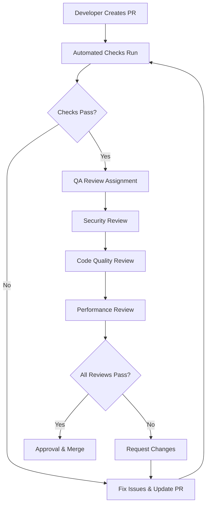

# Quality Assurance Processes - Anime/Manga Information Delivery System

## Table of Contents
1. [Code Review Standards](#code-review-standards)
2. [Data Validation Requirements](#data-validation-requirements)
3. [Error Handling Patterns](#error-handling-patterns)
4. [Performance Standards](#performance-standards)
5. [Testing Requirements](#testing-requirements)
6. [Documentation Standards](#documentation-standards)
7. [Deployment Guidelines](#deployment-guidelines)
8. [Monitoring and Metrics](#monitoring-and-metrics)

## 1. Code Review Standards

### 1.1 Code Review Checklist

#### Security Review
- [ ] All user inputs are validated and sanitized
- [ ] SQL queries use parameterized statements
- [ ] API keys and tokens are not hardcoded
- [ ] OAuth2 tokens are stored securely (encrypted)
- [ ] Rate limiting is implemented for all external API calls
- [ ] Error messages don't expose sensitive information
- [ ] HTTPS is enforced for all external communications
- [ ] Input size limits are enforced
- [ ] NGword filtering is applied correctly

#### Code Quality Review
- [ ] Code follows PEP 8 style guidelines
- [ ] Functions have single responsibility
- [ ] Complex logic is properly commented
- [ ] Magic numbers are replaced with named constants
- [ ] Error handling is comprehensive and consistent
- [ ] Logging is appropriate and doesn't leak sensitive data
- [ ] Type hints are used where appropriate
- [ ] Docstrings follow Google/NumPy style

#### Architecture Review
- [ ] Separation of concerns is maintained
- [ ] Dependencies are properly managed
- [ ] Configuration is externalized
- [ ] Database schema follows best practices
- [ ] API design is RESTful and consistent
- [ ] Module interfaces are well-defined
- [ ] Code is testable and modular

#### Performance Review
- [ ] Database queries are optimized
- [ ] Bulk operations are used where appropriate
- [ ] Caching is implemented for expensive operations
- [ ] Memory usage is reasonable
- [ ] No blocking operations in critical paths
- [ ] Timeouts are set for external API calls
- [ ] Resource cleanup is proper (context managers)

### 1.2 Review Process



### 1.3 Review Criteria Matrix

| Criteria | P0 (Blocker) | P1 (Critical) | P2 (Important) | P3 (Optional) |
|----------|--------------|---------------|----------------|---------------|
| Security vulnerabilities | ✓ | | | |
| Data corruption risks | ✓ | | | |
| Performance regressions | | ✓ | | |
| API breaking changes | | ✓ | | |
| Code style violations | | | ✓ | |
| Documentation updates | | | ✓ | |
| Minor optimizations | | | | ✓ |

## 2. Data Validation Requirements

### 2.1 Input Validation Standards

```python
# Example validation implementation
class DataValidator:
    """Standard data validation for the system"""
    
    @staticmethod
    def validate_anime_data(data: dict) -> ValidationResult:
        """Validate anime data structure and content"""
        errors = []
        
        # Required fields
        required_fields = ['title', 'type', 'release_date']
        for field in required_fields:
            if field not in data or not data[field]:
                errors.append(f"Missing required field: {field}")
        
        # Field-specific validation
        if 'title' in data:
            if len(data['title']) > 500:
                errors.append("Title exceeds maximum length (500 characters)")
            if InputSanitizer.contains_ng_words(data['title']):
                errors.append("Title contains filtered content")
        
        if 'type' in data:
            if data['type'] not in ['anime', 'manga']:
                errors.append(f"Invalid type: {data['type']}")
        
        if 'official_url' in data and data['official_url']:
            if not InputSanitizer.validate_url(data['official_url']):
                errors.append("Invalid official URL format")
        
        return ValidationResult(
            is_valid=len(errors) == 0,
            errors=errors,
            warnings=[]
        )
```

### 2.2 Data Quality Standards

#### Anime/Manga Titles
- Must be non-empty strings
- Maximum length: 500 characters
- No control characters allowed
- Unicode normalization (NFKC) required
- NGword filtering applied

#### Release Dates
- Must be valid ISO 8601 format
- Cannot be more than 2 years in the future
- Historical dates allowed for archive data

#### URLs
- Must be valid HTTP/HTTPS URLs
- Only whitelisted domains allowed
- SSL certificate validation required

#### Platform Information
- Must match predefined platform list
- Case-insensitive matching
- Automatic normalization applied

### 2.3 Data Integrity Checks

```python
class DataIntegrityChecker:
    """Ensures data consistency across the system"""
    
    def check_work_consistency(self, work_id: str) -> IntegrityResult:
        """Verify work data consistency"""
        issues = []
        
        # Check if all releases belong to valid work
        orphaned_releases = self.db.execute("""
            SELECT id FROM releases 
            WHERE work_id = ? AND work_id NOT IN (SELECT id FROM works)
        """, (work_id,)).fetchall()
        
        if orphaned_releases:
            issues.append(f"Found {len(orphaned_releases)} orphaned releases")
        
        # Check for duplicate releases
        duplicates = self.db.execute("""
            SELECT work_id, release_type, number, platform, release_date, COUNT(*) as count
            FROM releases 
            WHERE work_id = ?
            GROUP BY work_id, release_type, number, platform, release_date
            HAVING count > 1
        """, (work_id,)).fetchall()
        
        if duplicates:
            issues.append(f"Found {len(duplicates)} duplicate releases")
        
        return IntegrityResult(
            is_consistent=len(issues) == 0,
            issues=issues
        )
```

## 3. Error Handling Patterns

### 3.1 Standard Error Hierarchy

```python
class MangaAnimeError(Exception):
    """Base exception for the system"""
    pass

class ValidationError(MangaAnimeError):
    """Data validation errors"""
    pass

class APIError(MangaAnimeError):
    """External API related errors"""
    def __init__(self, message, api_name=None, status_code=None):
        super().__init__(message)
        self.api_name = api_name
        self.status_code = status_code

class DatabaseError(MangaAnimeError):
    """Database operation errors"""
    pass

class AuthenticationError(MangaAnimeError):
    """Authentication and authorization errors"""
    pass

class ConfigurationError(MangaAnimeError):
    """Configuration related errors"""
    pass
```

### 3.2 Error Handling Patterns

#### Retry with Exponential Backoff
```python
import time
import random
from functools import wraps

def retry_with_backoff(max_retries=3, base_delay=1, max_delay=60):
    """Decorator for retry logic with exponential backoff"""
    def decorator(func):
        @wraps(func)
        def wrapper(*args, **kwargs):
            last_exception = None
            
            for attempt in range(max_retries + 1):
                try:
                    return func(*args, **kwargs)
                except (APIError, requests.RequestException) as e:
                    last_exception = e
                    
                    if attempt == max_retries:
                        break
                    
                    # Calculate delay with jitter
                    delay = min(base_delay * (2 ** attempt), max_delay)
                    jitter = delay * 0.1 * random.random()
                    time.sleep(delay + jitter)
                    
                    logging.warning(
                        f"Attempt {attempt + 1}/{max_retries + 1} failed: {e}"
                    )
            
            raise last_exception
        return wrapper
    return decorator
```

#### Circuit Breaker Pattern
```python
class CircuitBreaker:
    """Circuit breaker for external service calls"""
    
    def __init__(self, failure_threshold=5, recovery_timeout=60):
        self.failure_threshold = failure_threshold
        self.recovery_timeout = recovery_timeout
        self.failure_count = 0
        self.last_failure_time = None
        self.state = 'CLOSED'  # CLOSED, OPEN, HALF_OPEN
    
    def call(self, func, *args, **kwargs):
        """Execute function with circuit breaker protection"""
        if self.state == 'OPEN':
            if time.time() - self.last_failure_time > self.recovery_timeout:
                self.state = 'HALF_OPEN'
            else:
                raise APIError("Circuit breaker is OPEN")
        
        try:
            result = func(*args, **kwargs)
            self._on_success()
            return result
        except Exception as e:
            self._on_failure()
            raise
    
    def _on_success(self):
        """Handle successful call"""
        self.failure_count = 0
        self.state = 'CLOSED'
    
    def _on_failure(self):
        """Handle failed call"""
        self.failure_count += 1
        self.last_failure_time = time.time()
        
        if self.failure_count >= self.failure_threshold:
            self.state = 'OPEN'
```

### 3.3 Error Logging Standards

```python
class ErrorLogger:
    """Standardized error logging"""
    
    def __init__(self, logger_name: str):
        self.logger = logging.getLogger(logger_name)
    
    def log_api_error(self, api_name: str, error: Exception, context: dict = None):
        """Log API-related errors with context"""
        error_data = {
            'error_type': type(error).__name__,
            'error_message': str(error),
            'api_name': api_name,
            'timestamp': time.time(),
            'context': context or {}
        }
        
        self.logger.error(f"API_ERROR: {json.dumps(error_data)}")
    
    def log_validation_error(self, data_type: str, errors: list, data_sample: dict = None):
        """Log data validation errors"""
        error_data = {
            'error_type': 'ValidationError',
            'data_type': data_type,
            'errors': errors,
            'timestamp': time.time(),
            'data_sample': self._sanitize_data_for_logging(data_sample)
        }
        
        self.logger.warning(f"VALIDATION_ERROR: {json.dumps(error_data)}")
    
    def _sanitize_data_for_logging(self, data: dict) -> dict:
        """Remove sensitive data before logging"""
        if not data:
            return {}
        
        sanitized = {}
        sensitive_keys = ['password', 'token', 'key', 'secret']
        
        for key, value in data.items():
            if any(sensitive in key.lower() for sensitive in sensitive_keys):
                sanitized[key] = '***REDACTED***'
            else:
                sanitized[key] = str(value)[:100] if len(str(value)) > 100 else value
        
        return sanitized
```

## 4. Performance Standards

### 4.1 Response Time Requirements

| Operation Type | Target Response Time | Maximum Response Time |
|----------------|---------------------|----------------------|
| Database Queries | < 100ms | < 500ms |
| API Calls (single) | < 2s | < 5s |
| RSS Feed Processing | < 30s | < 60s |
| Email Sending | < 10s | < 30s |
| Full Data Collection | < 5min | < 10min |

### 4.2 Performance Monitoring

```python
import time
import psutil
from functools import wraps

class PerformanceMonitor:
    """Monitor and log performance metrics"""
    
    def __init__(self):
        self.metrics = defaultdict(list)
    
    def time_function(self, func_name: str = None):
        """Decorator to measure function execution time"""
        def decorator(func):
            name = func_name or f"{func.__module__}.{func.__name__}"
            
            @wraps(func)
            def wrapper(*args, **kwargs):
                start_time = time.time()
                start_memory = psutil.Process().memory_info().rss
                
                try:
                    result = func(*args, **kwargs)
                    return result
                finally:
                    end_time = time.time()
                    end_memory = psutil.Process().memory_info().rss
                    
                    execution_time = end_time - start_time
                    memory_delta = end_memory - start_memory
                    
                    self._record_metrics(name, execution_time, memory_delta)
            
            return wrapper
        return decorator
    
    def _record_metrics(self, function_name: str, execution_time: float, memory_delta: int):
        """Record performance metrics"""
        metric = {
            'function': function_name,
            'execution_time': execution_time,
            'memory_delta': memory_delta,
            'timestamp': time.time()
        }
        
        self.metrics[function_name].append(metric)
        
        # Log slow operations
        if execution_time > 5.0:  # 5 seconds
            logging.warning(f"Slow operation detected: {function_name} took {execution_time:.2f}s")
        
        # Keep only last 100 metrics per function
        if len(self.metrics[function_name]) > 100:
            self.metrics[function_name] = self.metrics[function_name][-100:]
    
    def get_performance_summary(self, function_name: str = None) -> dict:
        """Get performance summary for function or all functions"""
        if function_name:
            metrics = self.metrics.get(function_name, [])
        else:
            metrics = []
            for func_metrics in self.metrics.values():
                metrics.extend(func_metrics)
        
        if not metrics:
            return {}
        
        execution_times = [m['execution_time'] for m in metrics]
        memory_deltas = [m['memory_delta'] for m in metrics]
        
        return {
            'count': len(metrics),
            'avg_execution_time': sum(execution_times) / len(execution_times),
            'max_execution_time': max(execution_times),
            'min_execution_time': min(execution_times),
            'avg_memory_delta': sum(memory_deltas) / len(memory_deltas),
            'max_memory_delta': max(memory_deltas)
        }
```

### 4.3 Database Performance Standards

#### Query Optimization Guidelines
- All queries must have appropriate indexes
- Complex queries should be analyzed with EXPLAIN QUERY PLAN
- Bulk operations preferred over individual inserts
- Connection pooling for concurrent access
- Regular VACUUM operations for SQLite

#### Example Optimized Queries
```sql
-- Index creation for performance
CREATE INDEX IF NOT EXISTS idx_releases_work_date 
ON releases(work_id, release_date);

CREATE INDEX IF NOT EXISTS idx_releases_platform_date 
ON releases(platform, release_date);

CREATE INDEX IF NOT EXISTS idx_works_type_title 
ON works(type, title);

-- Optimized query for recent releases
SELECT w.title, r.release_type, r.number, r.platform, r.release_date
FROM works w
INNER JOIN releases r ON w.id = r.work_id
WHERE r.release_date >= date('now', '-30 days')
  AND r.notified = 0
ORDER BY r.release_date DESC
LIMIT 100;
```

## 5. Testing Requirements

### 5.1 Test Coverage Requirements

| Module Type | Minimum Coverage | Target Coverage |
|-------------|-----------------|----------------|
| Core Business Logic | 90% | 95% |
| API Integration | 80% | 90% |
| Utility Functions | 85% | 95% |
| Security Functions | 95% | 100% |
| Configuration | 70% | 80% |

### 5.2 Test Categories

#### Unit Tests
```python
# Example unit test structure
import pytest
from unittest.mock import Mock, patch
from modules.security_utils import InputSanitizer, ValidationError

class TestInputSanitizer:
    """Unit tests for InputSanitizer"""
    
    def test_sanitize_title_valid(self):
        """Test title sanitization with valid input"""
        title = "進撃の巨人 Season 4"
        result = InputSanitizer.sanitize_title(title)
        assert result == title
    
    def test_sanitize_title_with_html(self):
        """Test title sanitization removes HTML"""
        title = "<script>alert('xss')</script>Attack on Titan"
        result = InputSanitizer.sanitize_title(title)
        assert "<script>" not in result
        assert "Attack on Titan" in result
    
    def test_sanitize_title_too_long(self):
        """Test title sanitization with excessive length"""
        title = "A" * 1000  # Too long
        with pytest.raises(ValueError):
            InputSanitizer.sanitize_title(title)
    
    def test_contains_ng_words(self):
        """Test NG word detection"""
        assert InputSanitizer.contains_ng_words("エロアニメ") is True
        assert InputSanitizer.contains_ng_words("進撃の巨人") is False
    
    @pytest.mark.parametrize("url,expected", [
        ("https://example.com", True),
        ("http://localhost", True),
        ("ftp://example.com", False),
        ("not-a-url", False)
    ])
    def test_validate_url(self, url, expected):
        """Test URL validation with various inputs"""
        result = InputSanitizer.validate_url(url)
        assert result == expected
```

#### Integration Tests
```python
class TestDatabaseIntegration:
    """Integration tests for database operations"""
    
    @pytest.fixture
    def test_db(self):
        """Create test database"""
        import tempfile
        import sqlite3
        
        db_file = tempfile.NamedTemporaryFile(delete=False)
        conn = sqlite3.connect(db_file.name)
        
        # Create test schema
        conn.execute("""
            CREATE TABLE works (
                id INTEGER PRIMARY KEY,
                title TEXT NOT NULL,
                type TEXT NOT NULL
            )
        """)
        
        yield conn
        
        conn.close()
        os.unlink(db_file.name)
    
    def test_work_insertion_and_retrieval(self, test_db):
        """Test work data insertion and retrieval"""
        from modules.db import DatabaseManager
        
        db_manager = DatabaseManager(test_db)
        
        # Insert test data
        work_id = db_manager.insert_work(
            title="Test Anime",
            work_type="anime",
            official_url="https://example.com"
        )
        
        # Retrieve and verify
        work = db_manager.get_work(work_id)
        assert work['title'] == "Test Anime"
        assert work['type'] == "anime"
```

#### Security Tests
```python
class TestSecurityMeasures:
    """Security-focused tests"""
    
    def test_sql_injection_prevention(self, test_db):
        """Test SQL injection attempts are blocked"""
        from modules.db import DatabaseManager
        
        db_manager = DatabaseManager(test_db)
        
        # Attempt SQL injection
        malicious_input = "'; DROP TABLE works; --"
        
        with pytest.raises(ValueError):  # Should be caught by validation
            db_manager.insert_work(
                title=malicious_input,
                work_type="anime"
            )
        
        # Verify table still exists
        cursor = test_db.execute("SELECT name FROM sqlite_master WHERE type='table'")
        tables = [row[0] for row in cursor.fetchall()]
        assert 'works' in tables
    
    def test_token_encryption(self):
        """Test OAuth token encryption"""
        from modules.security_utils import SecureTokenManager
        import tempfile
        
        token_file = tempfile.NamedTemporaryFile(delete=False)
        token_manager = SecureTokenManager(token_file.name)
        
        # Test data
        test_token = {
            'access_token': 'test_access_token',
            'refresh_token': 'test_refresh_token'
        }
        
        # Save and load
        token_manager.save_token(test_token)
        loaded_token = token_manager.load_token()
        
        assert loaded_token['access_token'] == test_token['access_token']
        
        # Verify file is encrypted (not readable as JSON)
        with open(token_file.name, 'r') as f:
            content = f.read()
            assert 'test_access_token' not in content
        
        os.unlink(token_file.name)
```

### 5.3 Test Automation

#### GitHub Actions Workflow
```yaml
name: Quality Assurance Tests

on:
  push:
    branches: [ main, develop ]
  pull_request:
    branches: [ main ]

jobs:
  test:
    runs-on: ubuntu-latest
    
    steps:
    - uses: actions/checkout@v3
    
    - name: Set up Python
      uses: actions/setup-python@v3
      with:
        python-version: '3.9'
    
    - name: Install dependencies
      run: |
        pip install -r requirements.txt
        pip install -r requirements-dev.txt
    
    - name: Run security checks
      run: |
        bandit -r modules/
        safety check
    
    - name: Run linting
      run: |
        flake8 modules/ tests/
        black --check modules/ tests/
        mypy modules/
    
    - name: Run tests with coverage
      run: |
        pytest --cov=modules --cov-report=xml
    
    - name: Upload coverage reports
      uses: codecov/codecov-action@v3
      with:
        file: ./coverage.xml
```

## 6. Documentation Standards

### 6.1 Code Documentation

#### Function Documentation Template
```python
def process_anime_data(raw_data: dict, platform: str) -> ProcessedAnime:
    """Process raw anime data from external API.
    
    Args:
        raw_data (dict): Raw anime data from API response
        platform (str): Platform identifier (e.g., 'anilist', 'syoboi')
        
    Returns:
        ProcessedAnime: Processed and validated anime data
        
    Raises:
        ValidationError: If raw_data is invalid or incomplete
        APIError: If platform is not supported
        
    Example:
        >>> raw_data = {'title': 'Attack on Titan', 'episodes': 25}
        >>> result = process_anime_data(raw_data, 'anilist')
        >>> print(result.title)
        'Attack on Titan'
    """
```

#### Module Documentation Template
```python
"""
anime_collector.py - Anime data collection module

This module handles data collection from various anime information sources
including AniList GraphQL API and Syoboi Calendar. It provides unified
interfaces for fetching, processing, and validating anime data.

Classes:
    AnimeCollector: Main collector class for anime data
    AniListAPI: AniList GraphQL API client
    SyoboiAPI: Syoboi Calendar API client

Functions:
    collect_all_anime_data(): Collect data from all configured sources
    validate_anime_data(): Validate collected anime data

Example:
    >>> collector = AnimeCollector(config)
    >>> anime_list = collector.collect_recent_anime()
    >>> len(anime_list)
    42

Dependencies:
    - requests: HTTP client for API calls
    - gql: GraphQL client library
    - modules.security_utils: Input validation and rate limiting

Created: 2025-01-08
Author: MangaAnime-QA Agent
Version: 1.0
"""
```

### 6.2 API Documentation

#### REST API Documentation Template
```markdown
## GET /api/works/{work_id}/releases

Retrieve releases for a specific work.

### Parameters
- `work_id` (integer, required): Unique identifier of the work
- `limit` (integer, optional): Maximum number of releases to return (default: 20, max: 100)
- `offset` (integer, optional): Number of releases to skip (default: 0)
- `platform` (string, optional): Filter by platform name

### Response Format
```json
{
  "status": "success",
  "data": {
    "work_id": 123,
    "work_title": "進撃の巨人",
    "releases": [
      {
        "id": 456,
        "release_type": "episode",
        "number": "S4E01",
        "platform": "Netflix",
        "release_date": "2025-01-15",
        "source_url": "https://example.com"
      }
    ],
    "total_count": 85,
    "has_more": true
  }
}
```

### Error Responses
- `404`: Work not found
- `400`: Invalid parameters
- `500`: Internal server error
```

## 7. Deployment Guidelines

### 7.1 Pre-deployment Checklist

#### Security Validation
- [ ] All secrets are properly configured in environment
- [ ] OAuth2 credentials are valid and tested
- [ ] API rate limits are configured correctly
- [ ] Database permissions are set to minimum required
- [ ] Log files have appropriate rotation settings
- [ ] SSL certificates are valid and current

#### Functionality Testing
- [ ] All unit tests pass
- [ ] Integration tests pass with real APIs (in staging)
- [ ] Security tests validate input sanitization
- [ ] Performance tests meet requirements
- [ ] Manual smoke testing completed

#### Configuration Validation
- [ ] All configuration files are valid JSON/YAML
- [ ] Required environment variables are set
- [ ] Database schema is up to date
- [ ] Cron jobs are configured correctly
- [ ] Log directories exist and are writable

### 7.2 Deployment Process

```bash
#!/bin/bash
# Production deployment script

set -e  # Exit on any error

echo "Starting deployment process..."

# 1. Backup current state
echo "Creating backup..."
./scripts/backup.sh

# 2. Update code
echo "Updating codebase..."
git pull origin main

# 3. Install dependencies
echo "Installing dependencies..."
pip install -r requirements.txt

# 4. Run database migrations
echo "Running database migrations..."
python scripts/migrate_db.py

# 5. Update configuration
echo "Updating configuration..."
cp config/production.json config.json

# 6. Run post-deployment tests
echo "Running post-deployment tests..."
python -m pytest tests/deployment/

# 7. Restart services
echo "Restarting services..."
sudo systemctl restart manga-anime-notifier

# 8. Health check
echo "Performing health check..."
sleep 10
python scripts/health_check.py

echo "Deployment completed successfully!"
```

## 8. Monitoring and Metrics

### 8.1 Key Performance Indicators (KPIs)

#### System Health Metrics
- API response times (p50, p95, p99)
- Error rates by component
- Database query performance
- Memory and CPU usage
- Disk space utilization

#### Business Metrics
- Number of anime/manga entries processed daily
- Notification delivery success rate
- User engagement with notifications
- Data accuracy and completeness

#### Security Metrics
- Failed authentication attempts
- Rate limiting triggers
- Input validation failures
- Security incident frequency

### 8.2 Monitoring Implementation

```python
import time
import psutil
from dataclasses import dataclass
from typing import Dict, List

@dataclass
class SystemMetrics:
    timestamp: float
    cpu_percent: float
    memory_percent: float
    disk_usage_percent: float
    active_connections: int

@dataclass 
class ApplicationMetrics:
    timestamp: float
    api_calls_count: Dict[str, int]
    response_times: Dict[str, List[float]]
    error_counts: Dict[str, int]
    processed_items: Dict[str, int]

class MetricsCollector:
    """Collect and export system and application metrics"""
    
    def __init__(self):
        self.system_metrics = []
        self.app_metrics = []
    
    def collect_system_metrics(self) -> SystemMetrics:
        """Collect system resource metrics"""
        return SystemMetrics(
            timestamp=time.time(),
            cpu_percent=psutil.cpu_percent(interval=1),
            memory_percent=psutil.virtual_memory().percent,
            disk_usage_percent=psutil.disk_usage('/').percent,
            active_connections=len(psutil.net_connections())
        )
    
    def export_metrics_to_file(self, filepath: str) -> None:
        """Export metrics to JSON file for monitoring systems"""
        metrics_data = {
            'system': [asdict(m) for m in self.system_metrics[-100:]],
            'application': [asdict(m) for m in self.app_metrics[-100:]],
            'export_timestamp': time.time()
        }
        
        with open(filepath, 'w') as f:
            json.dump(metrics_data, f, indent=2)
```

### 8.3 Alerting Configuration

#### Alert Conditions
- Response time > 5 seconds for 3 consecutive checks
- Error rate > 5% over 15 minutes
- Memory usage > 80% for 10 minutes
- Disk space < 10% available
- Authentication failures > 10 per hour
- No successful data collection for 2 hours

#### Alert Channels
- Email notifications for critical issues
- Log file alerts for warning conditions
- System notifications for immediate attention

---

**Quality Assurance Framework Version**: 1.0  
**Last Updated**: 2025-01-08  
**Review Schedule**: Bi-weekly  
**Approval**: QA Team Lead