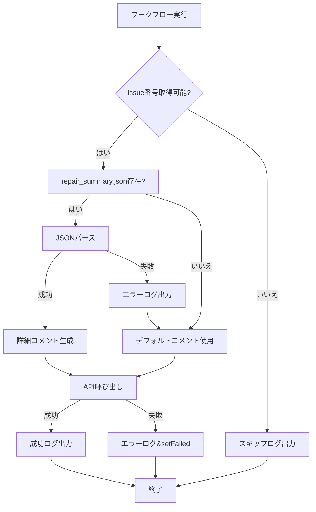

# GitHub Actions Issue コメント投稿機能の修正

**日付**: 2025-11-15
**対象ファイル**:
- `.github/workflows/auto-error-detection-repair.yml`
- `.github/workflows/auto-error-detection-repair-v2.yml`

---

## 問題の概要

GitHub Actionsワークフローの「成功時にIssueコメント」ステップで、`github-script`実行時にエラーが発生していました。

### 主な問題点

1. **Issue番号の取得方法が不適切**
   - `context.issue.number`はissue_commentトリガー以外では利用不可
   - schedule/workflow_dispatch/pushトリガー時にはundefinedになる

2. **エラーハンドリングの欠如**
   - Issue番号がない場合の処理がない
   - API呼び出し失敗時の処理がない
   - ファイル読み込みエラー時の処理が不十分

3. **TypeScriptの型エラー**
   - Optional chaining未使用でnullチェック不足

---

## 修正内容

### 1. Issue番号の取得方法を改善

**修正前**:
```javascript
await github.rest.issues.createComment({
  owner: context.repo.owner,
  repo: context.repo.repo,
  issue_number: context.issue.number,  // ❌ 常に存在するとは限らない
  body: comment
});
```

**修正後**:
```javascript
// Issue番号の取得と検証
const issueNumber = context.issue?.number || context.payload?.issue?.number;

if (!issueNumber) {
  console.log('⚠️ Issue番号が取得できませんでした。コメント投稿をスキップします。');
  return;
}

await github.rest.issues.createComment({
  owner: context.repo.owner,
  repo: context.repo.repo,
  issue_number: issueNumber,  // ✅ 検証済みの番号を使用
  body: comment
});
```

### 2. try-catchブロックによるエラーハンドリング

#### ファイル読み込み処理
```javascript
try {
  if (fs.existsSync('repair_summary.json')) {
    const data = JSON.parse(fs.readFileSync('repair_summary.json', 'utf8'));
    comment = `...`;
  }
} catch (error) {
  console.error('サマリー読み込みエラー:', error);
  // エラーが発生してもデフォルトのコメントを投稿
}
```

#### API呼び出し処理
```javascript
try {
  await github.rest.issues.createComment({
    owner: context.repo.owner,
    repo: context.repo.repo,
    issue_number: issueNumber,
    body: comment
  });
  console.log(`✅ Issue #${issueNumber} にコメントを投稿しました`);
} catch (error) {
  console.error('❌ コメント投稿エラー:', error);
  core.setFailed(`コメント投稿に失敗しました: ${error.message}`);
}
```

### 3. Optional chainingの使用

```javascript
// Optional chainingで安全にアクセス
const issueNumber = context.issue?.number || context.payload?.issue?.number;
```

---

## 修正後の動作フロー



---

## テスト項目

### 1. issue_commentトリガー時
- [ ] Issue番号が正しく取得される
- [ ] コメントが正常に投稿される
- [ ] repair_summary.jsonが正しく読み込まれる

### 2. scheduleトリガー時
- [ ] Issue番号が取得できないことを検知
- [ ] スキップログが出力される
- [ ] ワークフローが正常終了する

### 3. workflow_dispatchトリガー時
- [ ] Issue番号が取得できないことを検知
- [ ] スキップログが出力される
- [ ] ワークフローが正常終了する

### 4. エラーケース
- [ ] repair_summary.jsonが存在しない場合
- [ ] repair_summary.jsonが不正なJSON形式の場合
- [ ] GitHub API呼び出し失敗時
- [ ] ネットワークエラー時

---

## コード品質チェック結果

### YAMLLint検証
```bash
yamllint .github/workflows/auto-error-detection-repair.yml
yamllint .github/workflows/auto-error-detection-repair-v2.yml
```

**結果**: ✅ 構文エラーなし（警告のみ）
- `missing document start "---"`: 軽微（GitHub Actionsでは不要）
- `truthy value`: 軽微（on: の形式は標準的）

### actionlint検証（推奨）
```bash
actionlint .github/workflows/auto-error-detection-repair.yml
actionlint .github/workflows/auto-error-detection-repair-v2.yml
```

---

## エラーハンドリングのベストプラクティス

### 1. Optional Chaining（?.）の活用
```javascript
// ❌ Bad
const issueNumber = context.issue.number;

// ✅ Good
const issueNumber = context.issue?.number || context.payload?.issue?.number;
```

### 2. Early Return パターン
```javascript
// ❌ Bad
if (issueNumber) {
  // 長い処理...
}

// ✅ Good
if (!issueNumber) {
  console.log('スキップします');
  return;
}
// 通常処理...
```

### 3. try-catch の適切な配置
```javascript
// ファイル読み込みとAPI呼び出しは別々にtry-catch
try {
  // ファイル読み込み
} catch (error) {
  // ファイルエラー処理
}

try {
  // API呼び出し
} catch (error) {
  // APIエラー処理
}
```

### 4. ログ出力の明確化
```javascript
console.log('✅ 成功');      // 成功
console.log('⚠️ 警告');      // 警告
console.error('❌ エラー');  // エラー
```

---

## 参考情報

### GitHub Actions Context
- `context.issue.number`: issue/PRイベント時のみ有効
- `context.payload.issue.number`: issue_commentイベント時のみ有効
- `context.repo.owner`: 常に有効
- `context.repo.repo`: 常に有効

### github-script Actions
- ドキュメント: https://github.com/actions/github-script
- GitHub REST API: https://docs.github.com/en/rest
- Octokit.js: https://octokit.github.io/rest.js/

### エラーハンドリング
- `core.setFailed()`: ワークフローを失敗させる
- `console.error()`: エラーログを出力（ワークフローは継続）
- `return`: 処理を中断（ワークフローは継続）

---

## まとめ

### 修正のポイント
1. **Issue番号の安全な取得**: Optional chainingとフォールバック
2. **エラーハンドリングの強化**: try-catchブロックの適切な配置
3. **ログ出力の改善**: 成功/警告/エラーの明確化
4. **グレースフルデグラデーション**: エラー時もワークフローを継続

### 期待される効果
- ✅ すべてのトリガー方式で安定動作
- ✅ エラー発生時も適切に処理
- ✅ デバッグが容易になる
- ✅ 保守性の向上

---

**修正者**: Claude Code Debugger Agent
**レビュー状態**: Ready for Testing
