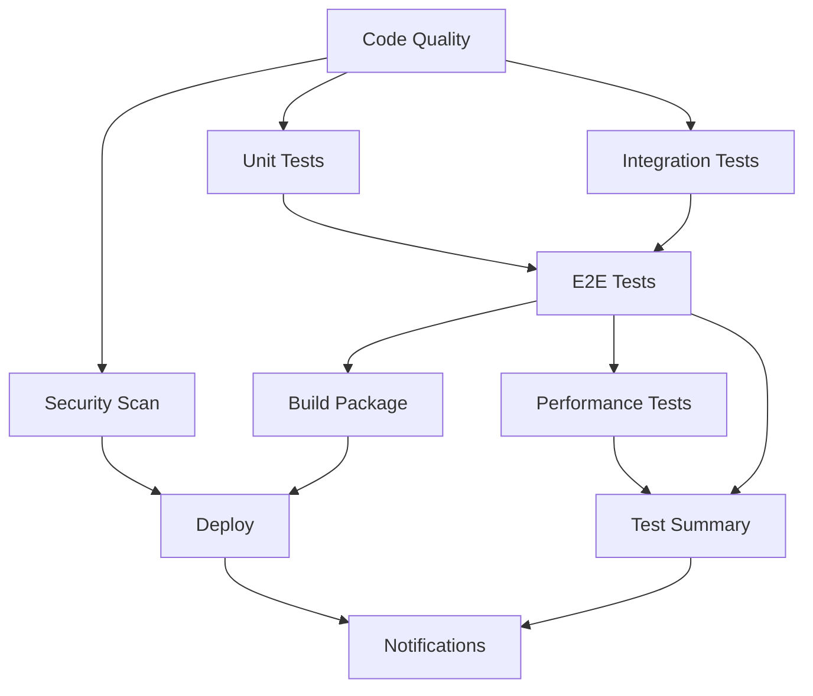
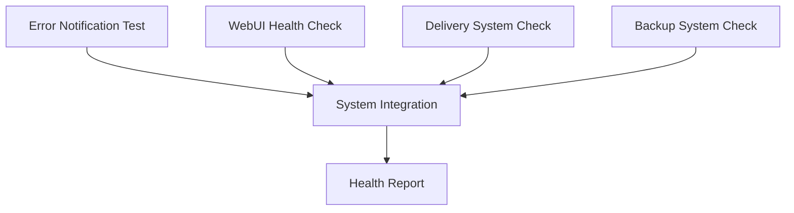
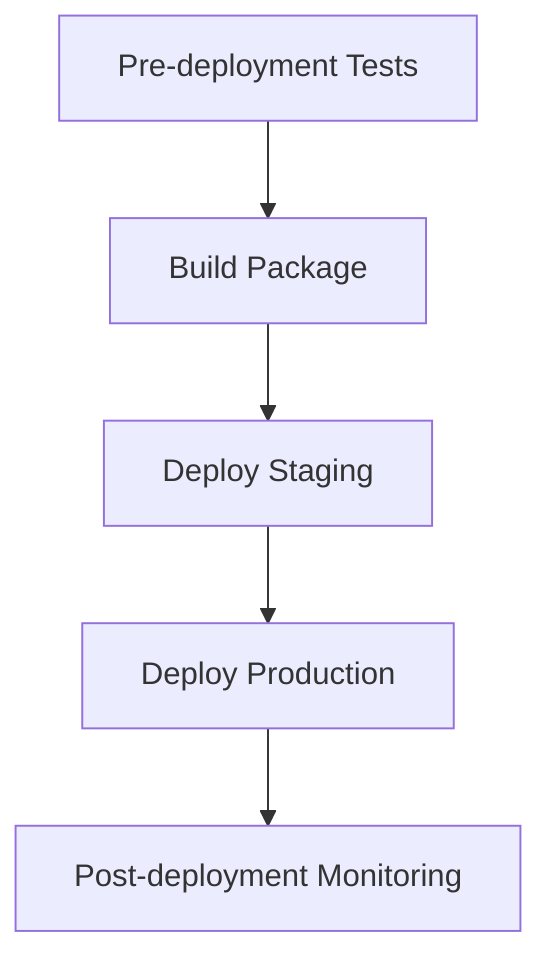

# 🚀 GitHub Actions CI/CD 設定ガイド

## 📊 **設定完了状況**

### ✅ **既存設定（包括的CI/CDパイプライン）**

**ファイル:** `.github/workflows/ci.yml`

**10個の高度なジョブ:**
1. **🔍 Code Quality** - Linting, formatting, type checking
2. **🧪 Unit Tests** - Python 3.9-3.12 マトリックステスト
3. **🔗 Integration Tests** - API連携・外部サービステスト
4. **🎯 End-to-End Tests** - 全体ワークフローテスト
5. **⚡ Performance Tests** - パフォーマンス監視
6. **🔒 Security Scan** - Trivy & CodeQL セキュリティスキャン
7. **📦 Build Package** - パッケージビルド・検証
8. **📋 Test Summary** - 結果サマリー・PR自動コメント
9. **🚀 Deploy** - 本番デプロイメント
10. **📢 Notifications** - 成功・失敗通知

### ✅ **新規追加設定（MangaAnimeシステム特化）**

#### 1. **システムヘルスチェック** - `mangaanime-system-check.yml`
- **🚨 エラー通知システムテスト**
- **🌐 WebUI ヘルスチェック**
- **📧 配信システム確認**
- **💾 バックアップシステム確認**
- **📊 統合レポート生成**

#### 2. **自動デプロイメント** - `auto-deployment.yml`
- **🧪 デプロイ前テスト**
- **📦 デプロイメントパッケージ作成**
- **🎯 ステージング環境デプロイ**
- **🚀 本番環境デプロイ**
- **📊 デプロイ後監視**

#### 3. **セキュリティ監査** - `security-audit.yml`
- **🔍 依存関係脆弱性スキャン**
- **🔐 シークレット検出**
- **📋 コード品質セキュリティ分析**
- **⚙️ 設定セキュリティ監査**
- **📊 包括的セキュリティレポート**

## 🛠️ **初期設定手順**

### Step 1: Gitリポジトリ初期化

```bash
# プロジェクトディレクトリで実行
cd /mnt/Linux-ExHDD/MangaAnime-Info-delivery-system

# Gitリポジトリ初期化
git init

# 初回コミット
git add .
git commit -m "Initial commit: MangaAnime Info Delivery System

🎯 Features:
- Anime/Manga information collection system
- Automated email delivery
- WebUI dashboard
- Error notification system
- Backup automation
- GitHub Actions CI/CD pipeline

🤖 AI Development:
- 12 SubAgents support
- Claude-Flow integration
- Context7 enabled"

# リモートリポジトリ設定（GitHubリポジトリ作成後）
git remote add origin https://github.com/YOUR_USERNAME/MangaAnime-Info-delivery-system.git
git branch -M main
git push -u origin main
```

### Step 2: GitHub リポジトリ作成

1. **GitHub でリポジトリ作成**
   - リポジトリ名: `MangaAnime-Info-delivery-system`
   - 説明: "Automated Manga/Anime information delivery system with AI development support"
   - Public/Private 選択

2. **リポジトリ設定**
   - Settings → Actions → General
   - "Allow all actions and reusable workflows" を選択

### Step 3: GitHub Secrets 設定

**Settings → Secrets and variables → Actions**

```bash
# 必要なシークレット（機密情報は実際の値に置き換え）
GMAIL_APP_PASSWORD=your_gmail_app_password
NOTIFICATION_EMAIL=kensan1969@gmail.com
DEPLOYMENT_KEY=your_deployment_key
CODECOV_TOKEN=your_codecov_token  # オプション
```

### Step 4: Branch Protection Rules

**Settings → Branches → Add rule**

```yaml
Branch name pattern: main
Protection rules:
  ✅ Require a pull request before merging
  ✅ Require status checks to pass before merging
     - Code Quality
     - Unit Tests (Python 3.11)
     - Integration Tests
     - Security Scan
  ✅ Require branches to be up to date before merging
  ✅ Include administrators
```

## 🔄 **ワークフロー実行パターン**

### 自動実行トリガー

```yaml
# メインCI/CD (ci.yml)
- Push to main/develop
- Pull Request to main/develop
- Daily at 2 AM UTC

# システムヘルスチェック (mangaanime-system-check.yml)
- Push to main/develop
- Pull Request to main
- Every 6 hours
- Manual dispatch

# 自動デプロイ (auto-deployment.yml)
- Push to main
- Git tags (v*)
- Manual dispatch

# セキュリティ監査 (security-audit.yml)
- Push to main/develop
- Pull Request to main
- Weekly on Sundays at 2 AM UTC
- Manual dispatch
```

### 手動実行方法

```bash
# GitHub UI から実行
Actions → Select Workflow → Run workflow

# 選択可能オプション:
# - システムヘルスチェック: all/error-notification/webui/delivery/backup
# - デプロイメント: staging/production, skip_tests
# - セキュリティ監査: full/dependencies/secrets/code-quality/configuration
```

## 📊 **CI/CD パイプライン詳細**

### メインパイプライン (ci.yml)



### システムチェックパイプライン



### デプロイメントパイプライン



## 🔍 **監視・レポート機能**

### 自動生成レポート

1. **テストサマリー** - PR自動コメント
2. **カバレッジレポート** - Codecov連携
3. **セキュリティレポート** - 脆弱性・品質分析
4. **デプロイメントレポート** - デプロイ状況
5. **システムヘルスレポート** - 全体健全性

### 通知機能

```yaml
成功通知:
  - 全テスト合格時
  - デプロイ成功時
  - セキュリティ監査クリア時

失敗通知:
  - テスト失敗時
  - デプロイ失敗時
  - セキュリティ問題検出時
  - システムヘルス異常時
```

## 🚨 **エラー対応ガイド**

### よくある問題と解決方法

#### 1. **テスト失敗**
```bash
# ローカルでテスト実行
python -m pytest tests/ -v

# 特定テストのみ
python -m pytest tests/test_config.py -v
```

#### 2. **依存関係エラー**
```bash
# 依存関係更新
pip install -r requirements.txt --upgrade

# セキュリティアップデート
pip-audit --fix
```

#### 3. **セキュリティ問題**
```bash
# セキュリティチェック
bandit -r modules/
safety check

# 設定確認
python -c "import json; print(json.load(open('config.json')))"
```

#### 4. **デプロイエラー**
```bash
# 設定検証
python -c "import modules.config; print('Config OK')"

# サービス状態確認
systemctl status mangaanime-web
```

## 📈 **最適化のヒント**

### パフォーマンス改善

1. **キャッシュ活用**
   ```yaml
   - uses: actions/cache@v3
     with:
       path: ~/.cache/pip
       key: ${{ runner.os }}-pip-${{ hashFiles('**/requirements.txt') }}
   ```

2. **並列実行**
   ```yaml
   strategy:
     matrix:
       python-version: ['3.9', '3.10', '3.11', '3.12']
   ```

3. **条件付き実行**
   ```yaml
   if: github.event_name == 'push' && github.ref == 'refs/heads/main'
   ```

### コスト最適化

```yaml
# 不要な実行を避ける
paths-ignore:
  - 'docs/**'
  - '*.md'
  - '.gitignore'

# タイムアウト設定
timeout-minutes: 30
```

## 🎯 **ベストプラクティス**

### 1. **セキュリティ**
- 機密情報はGitHub Secretsに保存
- 定期的なセキュリティ監査実行
- 依存関係の脆弱性チェック

### 2. **品質管理**
- コードレビュー必須
- 自動テスト実行
- カバレッジ閾値設定

### 3. **デプロイメント**
- ステージング環境での事前テスト
- ロールバック計画準備
- デプロイ後監視

### 4. **監視・ログ**
- 包括的ログ収集
- アラート設定
- 定期的なヘルスチェック

---

**🎉 GitHub Actions CI/CD パイプラインで高品質・高セキュリティな開発環境を実現！**