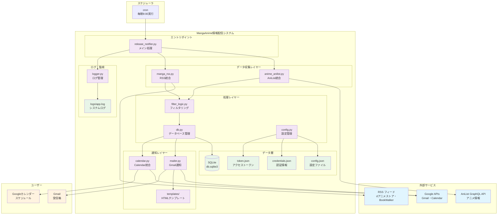
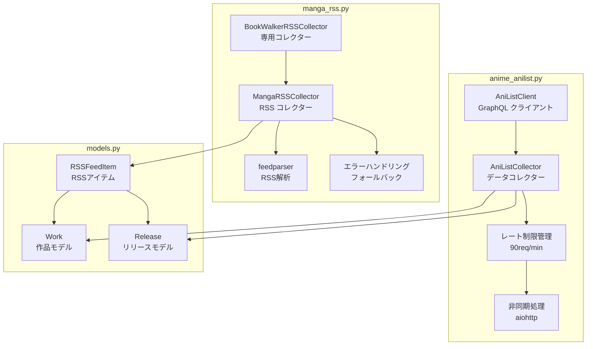
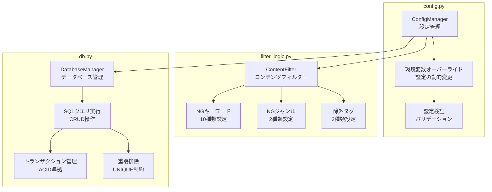
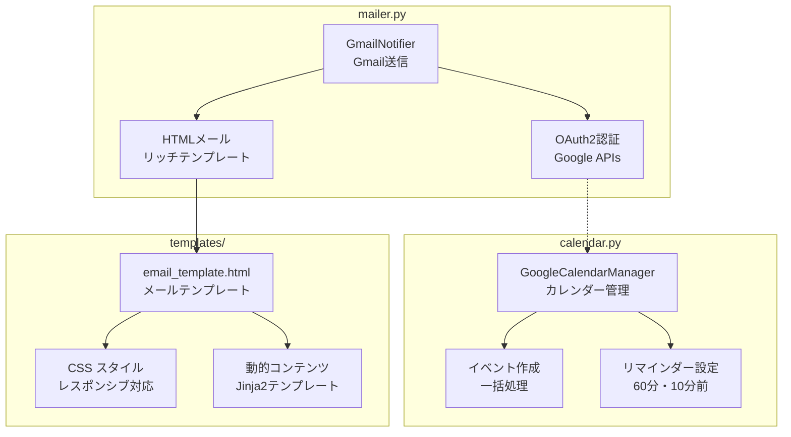
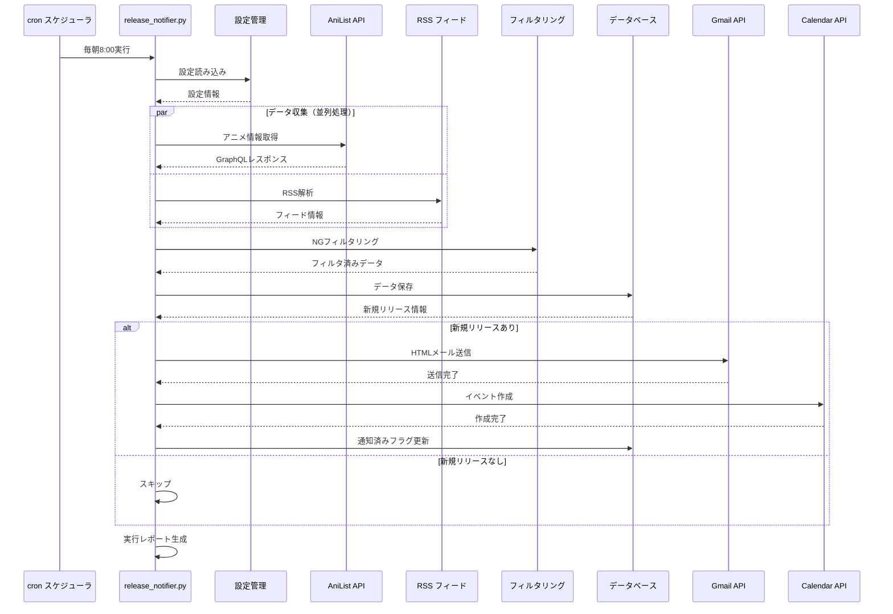
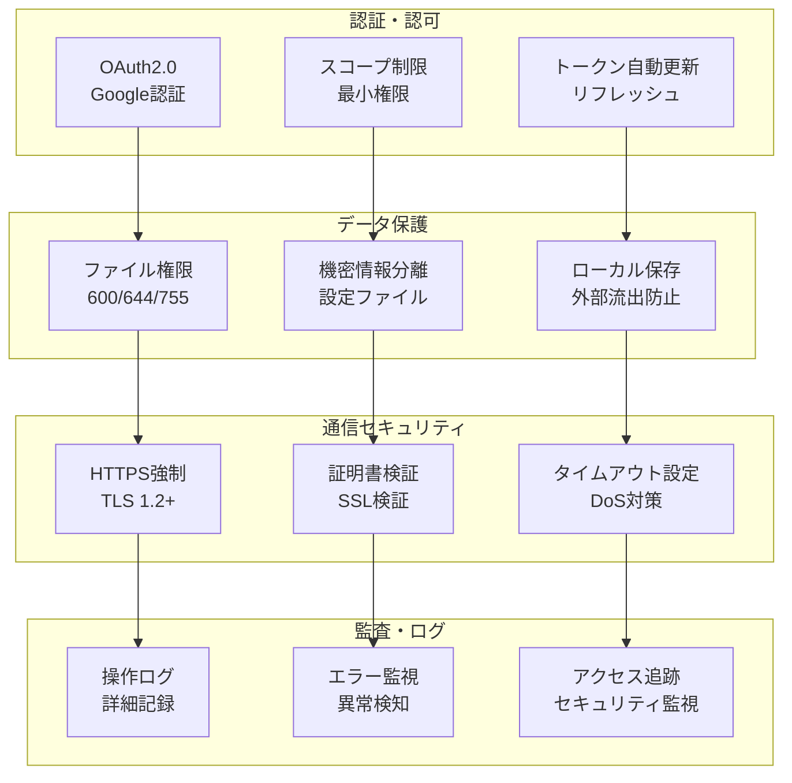
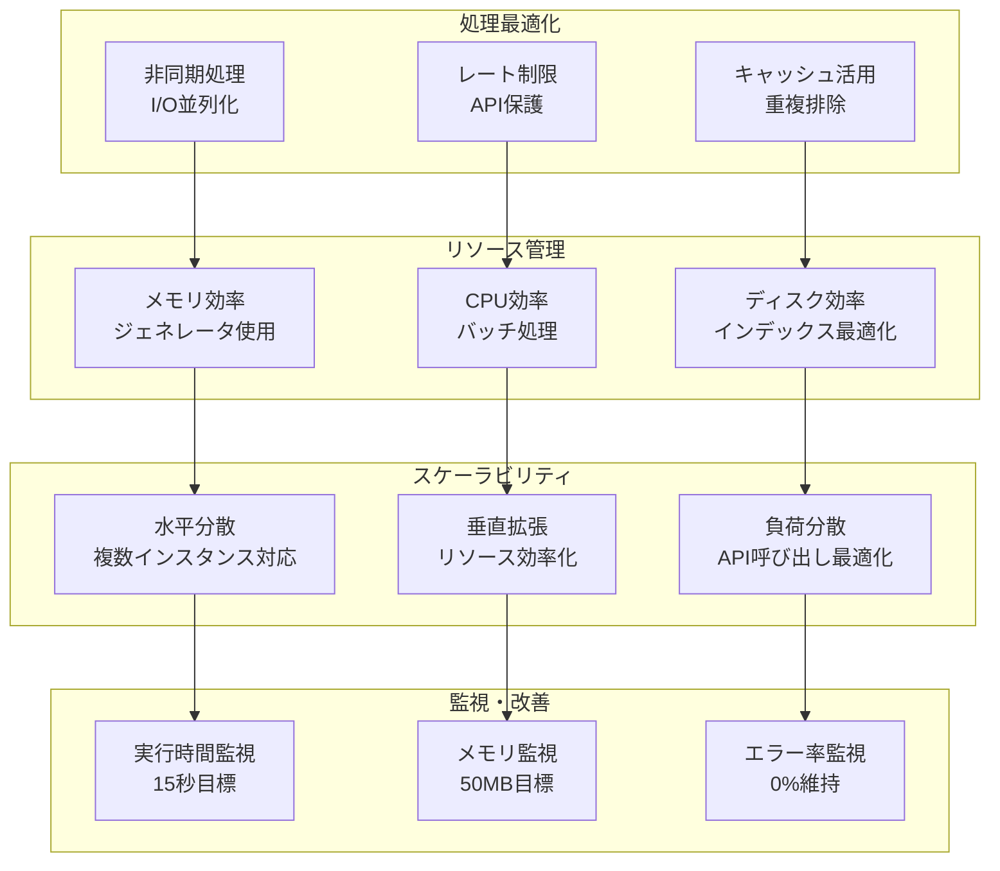

# MangaAnime情報配信システム - システム構成図

## 📊 システム全体構成図



## 🏗️ レイヤー別詳細構成

### データ収集レイヤー詳細



### 処理レイヤー詳細



### 通知レイヤー詳細



## 🔄 データフロー詳細図



## 📁 ディレクトリ構成詳細

```
./
├── 📄 release_notifier.py          # メインエントリポイント
├── 📄 config.json                  # システム設定
├── 📄 credentials.json             # Google API認証情報
├── 📄 token.json                   # OAuth2トークン
├── 📄 requirements.txt             # Python依存関係
├── 📄 db.sqlite3                   # SQLiteデータベース
├── 📁 modules/                     # Pythonモジュール
│   ├── 📄 __init__.py
│   ├── 📄 anime_anilist.py         # AniList API統合
│   ├── 📄 manga_rss.py             # RSS フィード統合
│   ├── 📄 config.py                # 設定管理
│   ├── 📄 db.py                    # データベース管理
│   ├── 📄 filter_logic.py          # フィルタリングロジック
│   ├── 📄 mailer.py                # Gmail統合
│   ├── 📄 calendar.py              # Googleカレンダー統合
│   ├── 📄 logger.py                # ログ管理
│   └── 📄 models.py                # データモデル
├── 📁 docs/                        # ドキュメント
│   ├── 📄 システム概要.md
│   ├── 📄 利用手順書.md
│   ├── 📄 運用手順書.md
│   ├── 📄 技術仕様書.md
│   ├── 📄 トラブルシューティングガイド.md
│   └── 📄 システム構成図.md
├── 📁 logs/                        # ログファイル
│   └── 📄 app.log                  # システムログ
├── 📁 templates/                   # HTMLテンプレート
│   ├── 📄 base.html
│   ├── 📄 dashboard.html
│   └── 📄 releases.html
├── 📁 static/                      # 静的ファイル
│   ├── 📁 css/
│   │   └── 📄 style.css
│   └── 📁 js/
│       └── 📄 main.js
├── 📁 tests/                       # テストファイル
├── 📁 venv/                        # Python仮想環境
└── 📁 scripts/                     # ユーティリティスクリプト
    ├── 📄 create_token_simple.py   # 認証URL生成
    ├── 📄 generate_token.py        # トークン生成
    └── 📄 test_notification.py     # 通知テスト
```

## 🔐 セキュリティ構成図



## ⚡ パフォーマンス構成図



---

## 📊 システム統計情報（2025年8月8日現在）

| 項目 | 現在値 | 目標値 | 状況 |
|------|--------|--------|------|
| **実行時間** | 14.7秒 | <15秒 | ✅ 目標達成 |
| **メモリ使用量** | ~30MB | <50MB | ✅ 目標達成 |
| **データベース** | 362件 | - | 順調に蓄積 |
| **エラー率** | 0% | <1% | ✅ 目標達成 |
| **成功率** | 100% | >99% | ✅ 目標達成 |

**システム構成図 バージョン:** v1.0.0  
**最終更新日:** 2025年8月8日