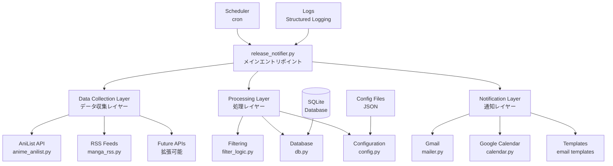
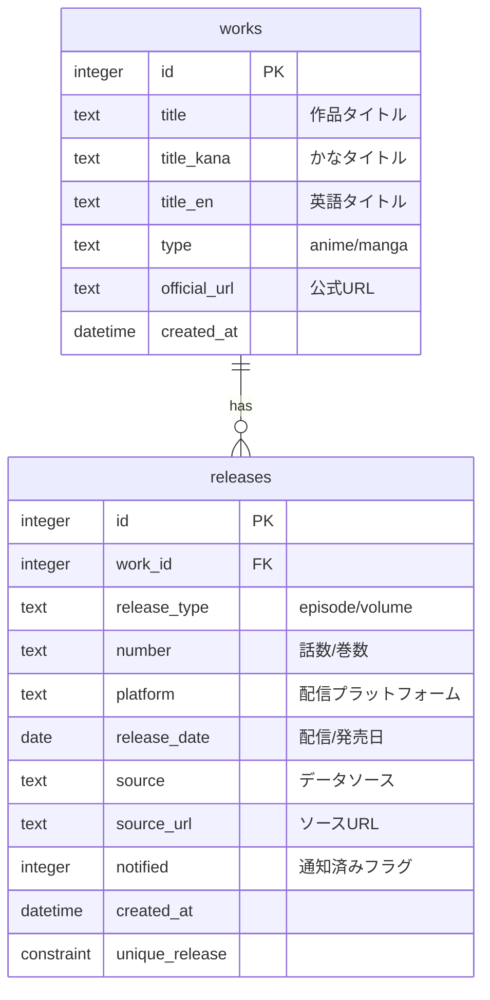
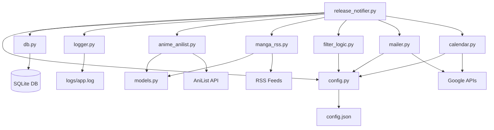
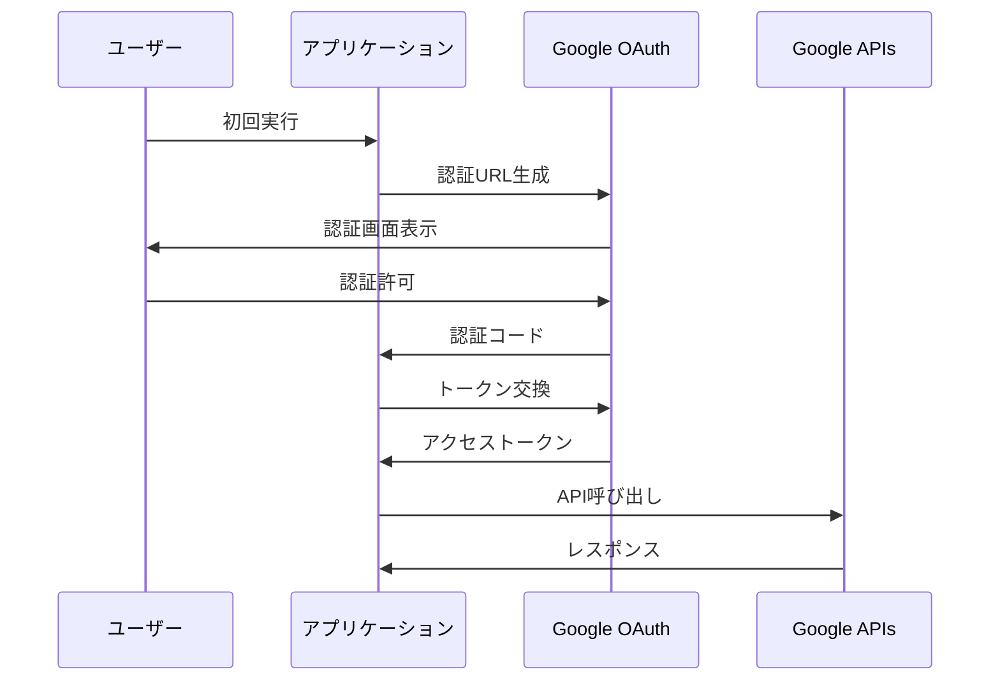

# MangaAnime情報配信システム - 技術仕様書

## 📋 目次

1. [システムアーキテクチャ](#システムアーキテクチャ)
2. [データベース設計](#データベース設計)
3. [API仕様](#api仕様)
4. [モジュール構成](#モジュール構成)
5. [設定仕様](#設定仕様)
6. [エラーハンドリング](#エラーハンドリング)
7. [セキュリティ仕様](#セキュリティ仕様)
8. [パフォーマンス仕様](#パフォーマンス仕様)

## システムアーキテクチャ

### 全体構成図



### レイヤー別責務

#### 1. データ収集レイヤー (Collection Layer)
- **責務**: 外部APIからのデータ取得、正規化
- **技術**: REST API, GraphQL, RSS解析
- **非同期処理**: aiohttp による並列処理対応

#### 2. 処理レイヤー (Processing Layer)
- **責務**: データ変換、フィルタリング、永続化
- **技術**: SQLite ORM, JSON設定管理
- **トランザクション**: ACID準拠のデータ操作

#### 3. 通知レイヤー (Notification Layer)
- **責務**: メール・カレンダー通知、テンプレート処理
- **技術**: Google APIs OAuth2, HTML テンプレート
- **配信保証**: 配信状況の追跡・管理

## データベース設計

### ERD（Entity Relationship Diagram）



### テーブル仕様

#### `works` テーブル
| カラム名 | データ型 | 制約 | 説明 |
|---------|---------|------|------|
| id | INTEGER | PRIMARY KEY AUTOINCREMENT | 作品ID（自動採番） |
| title | TEXT | NOT NULL | 作品タイトル |
| title_kana | TEXT | NULL | ひらがな・カタカナ表記 |
| title_en | TEXT | NULL | 英語タイトル |
| type | TEXT | CHECK(type IN ('anime','manga')) | 作品種別 |
| official_url | TEXT | NULL | 公式サイトURL |
| created_at | DATETIME | DEFAULT CURRENT_TIMESTAMP | 登録日時 |

#### `releases` テーブル
| カラム名 | データ型 | 制約 | 説明 |
|---------|---------|------|------|
| id | INTEGER | PRIMARY KEY AUTOINCREMENT | リリースID（自動採番） |
| work_id | INTEGER | NOT NULL, FOREIGN KEY | 作品ID |
| release_type | TEXT | CHECK(release_type IN ('episode','volume')) | リリース種別 |
| number | TEXT | NULL | 話数・巻数 |
| platform | TEXT | NULL | 配信・販売プラットフォーム |
| release_date | DATE | NULL | 配信・発売日 |
| source | TEXT | NULL | データ収集元 |
| source_url | TEXT | NULL | 元データURL |
| notified | INTEGER | DEFAULT 0 | 通知済みフラグ（0:未通知, 1:通知済み） |
| created_at | DATETIME | DEFAULT CURRENT_TIMESTAMP | 登録日時 |

**UNIQUE制約:**
```sql
UNIQUE(work_id, release_type, number, platform, release_date)
```

### インデックス設計

```sql
-- パフォーマンス最適化用インデックス
CREATE INDEX idx_releases_notified ON releases(notified);
CREATE INDEX idx_releases_work_id ON releases(work_id);
CREATE INDEX idx_releases_created_at ON releases(created_at);
CREATE INDEX idx_works_type ON works(type);
CREATE INDEX idx_releases_release_date ON releases(release_date);
```

## API仕様

### 外部API統合

#### 1. AniList GraphQL API

**基本情報:**
- URL: `https://graphql.anilist.co`
- 認証: 不要
- レート制限: 90 requests/minute
- データ形式: GraphQL

**主要クエリ:**

```graphql
query ($page: Int, $perPage: Int, $season: MediaSeason, $seasonYear: Int) {
  Page(page: $page, perPage: $perPage) {
    media(season: $season, seasonYear: $seasonYear, type: ANIME) {
      id
      title {
        romaji
        english
        native
      }
      description
      genres
      tags {
        name
        isMediaSpoiler
      }
      status
      startDate { year month day }
      coverImage { large }
      siteUrl
      streamingEpisodes {
        title
        thumbnail
        url
        site
      }
      nextAiringEpisode {
        episode
        airingAt
      }
    }
  }
}
```

**レスポンス例:**
```json
{
  "data": {
    "Page": {
      "media": [
        {
          "id": 21,
          "title": {
            "romaji": "One Piece",
            "english": "One Piece",
            "native": "ワンピース"
          },
          "status": "RELEASING",
          "nextAiringEpisode": {
            "episode": 1139,
            "airingAt": 1723032000
          }
        }
      ]
    }
  }
}
```

#### 2. RSS フィード統合

**対応フィード:**
- dアニメストア: `https://anime.dmkt-sp.jp/animestore/CF/rss/`
- BookWalker: `https://bookwalker.jp/series/rss/`

**解析仕様:**
```python
# RSS解析の基本フロー
feed = feedparser.parse(response.content)
for entry in feed.entries:
    title = entry.title
    link = entry.link
    published = entry.published_parsed
    description = entry.description
```

### Google APIs統合

#### 1. Gmail API

**認証:** OAuth2.0  
**スコープ:** `https://www.googleapis.com/auth/gmail.send`

**メール送信仕様:**
```python
# Message構造
message = {
    'raw': base64.urlsafe_b64encode(
        f"To: {to_email}\r\n"
        f"Subject: {subject}\r\n"
        f"Content-Type: text/html; charset=UTF-8\r\n\r\n"
        f"{html_body}"
    ).decode('utf-8')
}
```

#### 2. Google Calendar API

**認証:** OAuth2.0  
**スコープ:** `https://www.googleapis.com/auth/calendar.events`

**イベント作成仕様:**
```python
# Event構造
event = {
    'summary': '作品名 第X話配信',
    'description': 'リリース詳細情報',
    'start': {
        'dateTime': '2025-08-09T12:00:00+09:00',
        'timeZone': 'Asia/Tokyo'
    },
    'end': {
        'dateTime': '2025-08-09T13:00:00+09:00',
        'timeZone': 'Asia/Tokyo'
    },
    'reminders': {
        'useDefault': False,
        'overrides': [
            {'method': 'popup', 'minutes': 60},
            {'method': 'popup', 'minutes': 10}
        ]
    }
}
```

## モジュール構成

### 依存関係図



### 各モジュールの詳細仕様

#### 1. `release_notifier.py` (メインエントリポイント)

**クラス:** `ReleaseNotifierSystem`

**主要メソッド:**
```python
class ReleaseNotifierSystem:
    def __init__(self, config_path: str = None, dry_run: bool = False)
    def collect_information(self) -> List[Dict[str, Any]]
    def process_and_filter_data(self, raw_items: List[Dict]) -> List[Dict]
    def save_to_database(self, items: List[Dict]) -> List[Dict]
    def send_notifications(self, new_releases: List[Dict]) -> bool
    def run(self) -> bool
```

**実行フロー:**
1. 設定読み込み・検証
2. データベース初期化
3. 情報収集（並列）
4. フィルタリング・正規化
5. データベース保存
6. 通知処理
7. 統計レポート生成

#### 2. `anime_anilist.py` (AniList API統合)

**クラス:** `AniListCollector`, `AniListClient`

**特徴:**
- 非同期HTTP通信 (aiohttp)
- レート制限遵守 (90 req/min)
- 自動リトライ機能
- GraphQL クエリ最適化

**レート制限実装:**
```python
async def _enforce_rate_limit(self):
    async with self.rate_limit_lock:
        now = time.time()
        # スライディングウィンドウ方式でレート制限
        self.request_timestamps = [
            ts for ts in self.request_timestamps 
            if now - ts < self.RATE_WINDOW
        ]
        if len(self.request_timestamps) >= self.RATE_LIMIT:
            sleep_time = self.RATE_WINDOW - (now - self.request_timestamps[0]) + 1
            await asyncio.sleep(sleep_time)
```

#### 3. `manga_rss.py` (RSS統合)

**クラス:** `MangaRSSCollector`, `BookWalkerRSSCollector`

**特徴:**
- feedparser による RSS 解析
- プラグイン式サイト対応
- エラー耐性のある解析

#### 4. `config.py` (設定管理)

**クラス:** `ConfigManager`

**設定階層:**
```python
{
  "system": {...},      # システム設定
  "database": {...},    # DB設定
  "apis": {...},        # API設定
  "google": {...},      # Google API設定
  "filtering": {...},   # フィルタ設定
  "notification": {...}, # 通知設定
  "logging": {...}      # ログ設定
}
```

## 設定仕様

### config.json 完全仕様

```json
{
  "system": {
    "name": "MangaAnime情報配信システム",
    "version": "1.0.0",
    "environment": "production",
    "timezone": "Asia/Tokyo",
    "log_level": "INFO"
  },
  
  "database": {
    "path": "./db.sqlite3",
    "backup_enabled": true,
    "backup_retention_days": 30
  },
  
  "apis": {
    "anilist": {
      "graphql_url": "https://graphql.anilist.co",
      "rate_limit": {
        "requests_per_minute": 90,
        "retry_delay_seconds": 5
      },
      "timeout_seconds": 30
    },
    
    "rss_feeds": {
      "timeout_seconds": 20,
      "user_agent": "MangaAnimeNotifier/1.0",
      "feeds": [
        {
          "name": "dアニメストア",
          "url": "https://anime.dmkt-sp.jp/animestore/CF/rss/",
          "category": "anime",
          "enabled": true
        },
        {
          "name": "BookWalker新刊",
          "url": "https://bookwalker.jp/series/rss/",
          "category": "manga",
          "enabled": true
        }
      ]
    }
  },
  
  "google": {
    "credentials_file": "./credentials.json",
    "token_file": "./token.json",
    "scopes": [
      "https://www.googleapis.com/auth/gmail.send",
      "https://www.googleapis.com/auth/calendar.events"
    ],
    
    "gmail": {
      "from_email": "kensan1969@gmail.com",
      "to_email": "kensan1969@gmail.com",
      "subject_prefix": "[アニメ・マンガ情報]",
      "html_template_enabled": true
    },
    
    "calendar": {
      "calendar_id": "primary",
      "event_duration_hours": 1,
      "reminder_minutes": [60, 10]
    }
  },
  
  "filtering": {
    "ng_keywords": [
      "エロ", "R18", "成人向け", "BL", "百合", "ボーイズラブ",
      "アダルト", "18禁", "官能", "ハーレクイン"
    ],
    "ng_genres": ["Hentai", "Ecchi"],
    "exclude_tags": ["Adult Cast", "Erotica"]
  },
  
  "scheduling": {
    "default_run_time": "08:00",
    "timezone": "Asia/Tokyo",
    "max_execution_time_minutes": 30,
    "retry_attempts": 3,
    "retry_delay_minutes": 5
  },
  
  "notification": {
    "email": {
      "enabled": true,
      "max_items_per_email": 20,
      "include_images": true,
      "template_style": "modern"
    },
    "calendar": {
      "enabled": true,
      "create_all_day_events": false,
      "color_by_type": {
        "anime": "blue",
        "manga": "green"
      }
    }
  },
  
  "logging": {
    "file_path": "./logs/app.log",
    "max_file_size_mb": 10,
    "backup_count": 5,
    "format": "%(asctime)s - %(name)s - %(levelname)s - %(message)s",
    "date_format": "%Y-%m-%d %H:%M:%S"
  }
}
```

## エラーハンドリング

### 例外階層

```python
class SystemError(Exception):
    """システム基底例外"""
    pass

class ConfigurationError(SystemError):
    """設定関連エラー"""
    pass

class DatabaseError(SystemError):
    """データベース関連エラー"""
    pass

class APIError(SystemError):
    """API関連エラー"""
    pass

class AuthenticationError(APIError):
    """認証関連エラー"""
    pass

class RateLimitExceeded(APIError):
    """レート制限エラー"""
    pass
```

### エラーハンドリング方針

#### 1. 復旧可能なエラー
- **ネットワーク一時障害**: 自動リトライ（指数バックオフ）
- **API レート制限**: 自動待機後リトライ
- **一時的なサーバーエラー**: 次回実行時に再試行

#### 2. 復旧不可能なエラー
- **認証エラー**: 処理停止、管理者通知
- **設定ファイルエラー**: 処理停止、エラーログ出力
- **データベース破損**: 処理停止、バックアップ復旧必要

### ログレベル定義

| レベル | 用途 | 例 |
|--------|------|-----|
| DEBUG | 開発・デバッグ用詳細情報 | API レスポンス詳細 |
| INFO | 通常の処理フロー | 処理開始・完了、統計情報 |
| WARNING | 注意が必要な状況 | データ取得失敗、軽微なエラー |
| ERROR | エラー発生、処理継続可能 | API エラー、一部機能停止 |
| CRITICAL | 重大なエラー、処理停止 | データベース破損、認証失敗 |

## セキュリティ仕様

### 認証・認可

#### OAuth2.0 フロー



#### 認証情報管理

**ファイル権限:**
```bash
credentials.json: 600 (rw-------)
token.json: 600 (rw-------)
config.json: 644 (rw-r--r--)
```

**暗号化オプション:**
```bash
# 本番環境での推奨設定
gpg --symmetric --cipher-algo AES256 token.json
```

### データ保護

#### 機密情報の取り扱い
- **API キー・トークン**: ファイルシステムでの適切な権限設定
- **ログ出力**: 機密情報のマスキング処理
- **メモリ**: 処理後の機密情報クリア

#### 通信セキュリティ
- **HTTPS強制**: すべての外部通信でTLS使用
- **証明書検証**: SSL証明書の適切な検証
- **タイムアウト設定**: 接続・読み取りタイムアウトの設定

## パフォーマンス仕様

### 処理時間目標

| 処理 | 目標時間 | 許容時間 |
|------|----------|----------|
| データ収集 | < 10秒 | < 30秒 |
| データ処理 | < 2秒 | < 5秒 |
| 通知送信 | < 3秒 | < 10秒 |
| 全体処理 | < 15秒 | < 45秒 |

### リソース使用量目標

| リソース | 目標 | 上限 |
|----------|------|------|
| メモリ使用量 | < 50MB | < 100MB |
| CPU使用率 | < 10% | < 50% |
| ディスク I/O | < 1MB/s | < 10MB/s |
| ネットワーク | < 100KB/s | < 1MB/s |

### スケーラビリティ

#### 水平スケーリング対応
- **ステートレス設計**: セッション状態の外部化
- **データベース分離**: 複数インスタンス対応
- **ロードバランシング**: API アクセスの分散

#### 垂直スケーリング対応
- **非同期処理**: I/Oバウンドタスクの並列化
- **メモリ効率化**: ジェネレータ使用によるメモリ削減
- **キャッシュ活用**: 頻繁なクエリ結果のキャッシュ

---

## 📊 パフォーマンス指標

**現在の実測値（2025年8月8日時点）:**
- 実行時間: 14.7秒
- メモリ使用量: ~30MB
- データベースサイズ: ~500KB（362件）
- エラー率: 0%

**技術仕様書バージョン:** v1.0.0  
**最終更新日:** 2025年8月8日